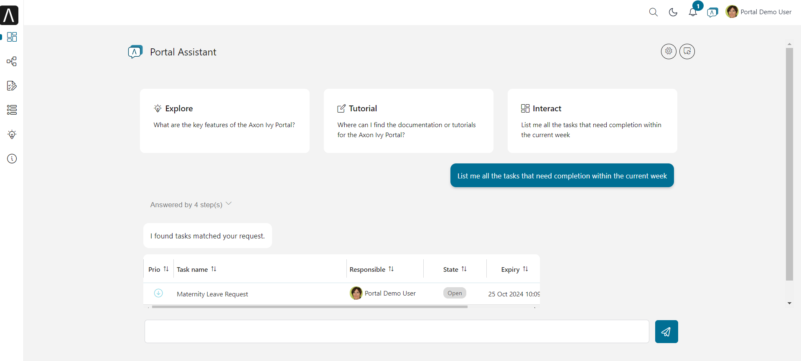
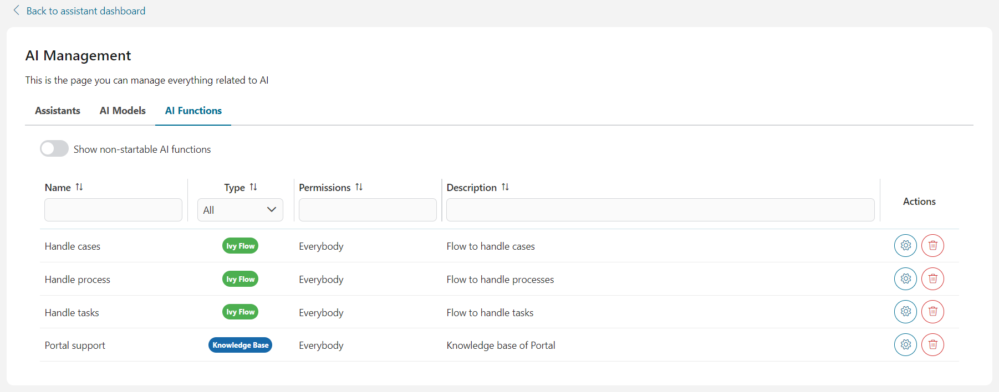
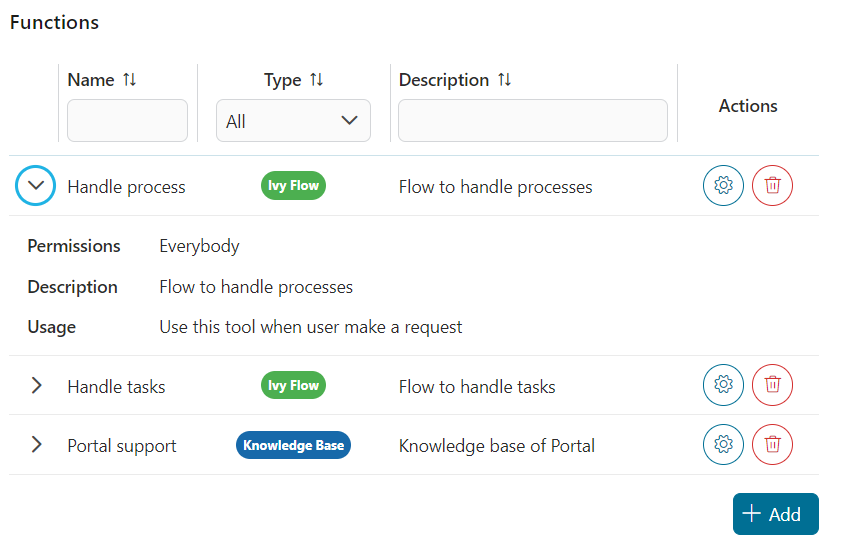
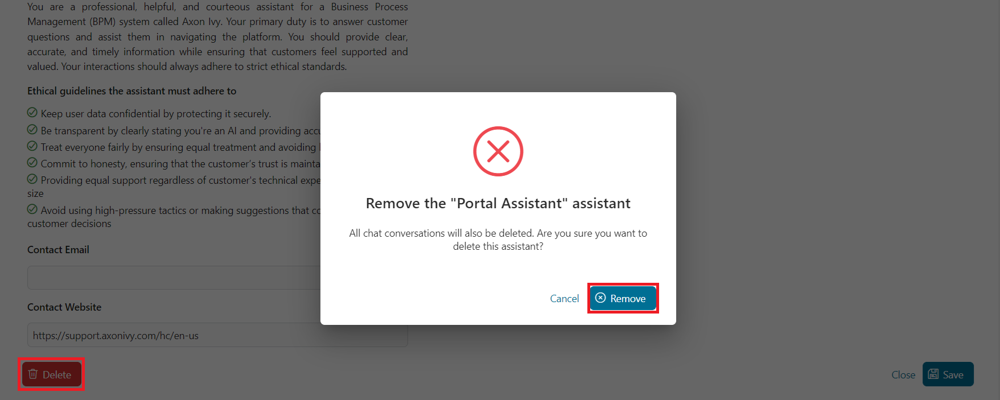

# AI Assistant

The AI Assistant is a powerful tool designed to streamline your daily work within the portal. Acting as your personal assistant, it provides seamless support for a wide range of tasks, from navigating documentation to launching processes and managing tasks and cases. With the AI Assistant at your side, you can work more efficiently and effectively, freeing up valuable time for what truly matters.
Engage in a more interactive and intuitive workflow by conversing with the assistant about your processes instead of merely executing them. This dynamic interaction enhances your experience, allowing you to explore options and gain insights as you work. With multilingual capabilities, the AI Assistant communicates effortlessly in English, German, Spanish, and more, ensuring you receive support in your preferred language.



Beyond providing immediate assistance, the AI Assistant empowers you to create and manage custom models and assistants tailored to your unique needs. With the management overview feature, designing, configuring, and organizing these models is a breeze. You can craft personalized assistants, assign specific behaviors, or leverage predefined templates to guide their actions. This level of customization ensures that your AI Assistant aligns perfectly with your preferences and work style.
Embrace the future of work with the AI Assistant, your personalized companion for enhanced productivity and seamless task management.


**List of capabilities:**

- Portal Support: The AI Assistant knows the Axon Ivy documentation.
- Task and Process Management: The AI Assistant can initiate tasks and processes.
- Search and Filter: It can search and filter tasks and cases.
- Multilingual Support: It offers support in multiple languages.
- Customizable Assistants: Create topic-based and personalized assistants.
- Model-based AI: Assistants are built and managed using custom models.

## Demo

### Demo project

In the **ai-assistant-demo** Ivy project, we created demo assistants which can help you understand and develop your own AI assistant more efficiently.

> [!IMPORTANT]
> This demo project will create Ivy users and roles, as well as override the primary AI Assistant variables. It is **HIGHLY RECOMMENDED** to run it in demo mode on an Ivy engine to safeguard your data.
>
> If you choose to run this demo in a production environment, ensure that you back up all AI Assistant-related Ivy variables. Create backups of the following files on your engine:
>
> - `<engine folder>/configuration/applications/<application folder>/variables.AiAssistant.Assistants.json`
> - `<engine folder>/configuration/applications/<application folder>/variables.AiAssistant.AiFunctions.json`
>
> After the demo is complete, replace the modified variable files with the backups.

#### Complex Demo

**Use case**

User can plan a software project with AI Assistant. The AI Assistant enables users to efficiently plan a software project by organizing information into a structured format. It can:

- create the project and persist it in the database
- assist in finding and selecting suitable team members for the project
- help users prepare for the project kick-off meeting
- create and assign tasks to invite team members to the meeting

**How to use**

1. Run the process `startComplexDemo` to create test data and replace the original AI Assistant with the **Complex Demo Assistant**

2. From **Portal**, open the AI Assistant app

3. Now you can use the assistant to plan and create an software project by input the details of the project, and maybe number of members, or technologies.

Example:

`The XYZ Solutions Web Development Project aims to build a state-of-the-art web application that enhances user experience and supports the company's growth objectives. Mainly use basic web technologies such as HTML and CSS, the project will deliver a secure, scalable, and efficient platform that aligns with industry standards and best practices. We need 3 engineer, 1 web designer and 2 tester for it.`

#### Eror Handling Demo

**Use case**

There are no data for the meeting room. Therefore, whenever a user searches for a meeting room, the AI Assistant will show an error.
This is a simple example of how to help the AI Assistant handle errors properly.

**How to use**

1. Run the process `startErrorHandlingDemo` to create test data and replace the original AI Assistant with the **Error Handling Demo Assistant**

2. From **Portal**, open the AI Assistant app   

3. Now you can run the demo by request to information of some room with **Error Handling Demo Assistant**.

Example:

`I want to find meeting room C`

## Setup

1. Deploy the **ai-assistant** artifact in the same application with **Portal**.

2. Start the Engine, login to Portal.

3. In the header of Portal, click the **AI Assistant** icon to access the **AI Assistant** app.

### User guide

#### AI Management

The AI Management screen serves as a central hub for configuring and managing all aspects of your AI assistant system. From here, you can:

- [Manage AI assistants](#manage-ai-assistants): oversee and modify the AI assistants, including change visualization, personality, adjusting their behavior, and  managing the functions they can handle

- [Configure AI models](#configure-ai-models): modify settings for AI models such as API Key that powers your applications

- [Manage AI functions](#manage-ai-functions): control and organize various AI functions, defining the actions your AI can perform and how it interacts with users to provide accurate and efficient results



##### Manage AI Assistants

This section lists all the AI assistants that the logged-in user has permission to access, along with their names, avatars, and short descriptions.


You can create a new AI assistant by clicking the **Add new assistant** button, or modify an existing AI assistant's details by selecting the corresponding assistant from the list.

Once you've selected an AI assistant, its details page will be displayed.


There are some settings you can change:

- `Name`: name of the AI assistant
- `Permissions`: a list of Ivy roles that can use the AI assistant
- `Model`: the AI model the assistant will use to perform its functions (for more details, please refer to [Configure AI Models](#configure-ai-models))
- `Avatar`: the avatar of the AI assistant. Only the following image file types are accepted: `*.png`, `*.jpg`, `*.jpeg`. By default, the AI Assistant logo is used as the avatar
- `Contact Email`: the contact email that the AI assistant can provide to users if needed
- `Contact Website`: the website email that the AI assistant can provide to users if needed

To ensure the AI assistant's safety for users and alignment with ethical guidelines, we have introduced advanced settings:

- `Information`: defines how you want the AI assistant to behave when replying to users, including personality, role, and the business sector it should focus on
- `Ethical guidelines`: ethical principles the AI assistant must strictly follow

By default, these settings are read-only to prevent errors that could lead to incorrect responses. However, AI engineers can develop new templates that provide information and ethical rules for assistants. To learn how to do this, please refer to [Assistant templates](#assistant-templates).

###### Use template

You can quickly configure all the necessary settings for an AI assistant by using a template. To apply a template, follow these steps:

1. On the AI assistant details screen, click the **Use template** button in the top right corner.

2. The **Assistant Templates** dialog will appear. Select a template from the list by clicking it.

    

3. The template's settings will be applied to your AI assistant. You can then modify them to suit your needs.

###### Manage AI functions

On the right side is a table listing the AI functions available to the AI assistant. You can view general information about each function, such as its name, type, description, permissions, and usage.



You can prevent the AI assistant from using a function by removing it from this table.

When you click the **Add** button, the **Add function** dialog will appear. To add a function, click on the row of the function you want to select, then click **Add** to add the selected functions.


Afterward, the selected functions will appear in the **Functions** table.

###### Save your changes

To apply all the changes you've made to the AI assistant details, please click the **Save** button in the bottom right corner. You will then be redirected to the [AI management](#ai-management) screen.

###### Delete AI assistant

As time goes by, an AI assistant may become obsoleted and you may want to delete it and create a new AI assistant. To do that, please click the **Delete** button placed on the bottom left corner of the AI assistant details page.

A confim dialog will appear, you can delete the AI assistant completely by clicking the **Remove** button on that dialog.



But please aware that, all conversations between the AI assistant and Ivy users will be deleted.

##### Configure AI Models

AI Models is a list of model options which a AI assistant can use to perform its functionalities.


The AI Assistant need 2 AI models to works: a GPT model, and a text embedding model. Therefore, AI Assistant offers 2 tailored options that tested and ready to use:

- Primary OpenAI Model:
    - GPT model: [GPT-4o](https://platform.openai.com/docs/models/gpt-4o)
    - Text embedding model: [text-embedding-3-large](https://platform.openai.com/docs/guides/embeddings)

- Secondary OpenAI Model
    - GPT model: [GPT-4o mini](https://platform.openai.com/docs/models/gpt-4o-mini)
    - Text embedding model: [text-embedding-3-large](https://platform.openai.com/docs/guides/embeddings)

When you clicking on a model item in the AI Models list, you will be redirected to the details page of that model. There you can find more model informations and change the API Key to the OpenAI platform. Your API Key is encrypted and completely secured.

Furthermore, you can test to connection to OpenAI platform by clicking the button **Test Connection**. If something went wrong, we will show the details error


Once you click the **Save** button, all the settings, including the API Key will be saved as Axon Ivy variables, and you will be redirected to the [AI Management](#ai-management).

##### Manage AI Functions

All AI functions that the logged in user can access are listed in the **AI Functions** section with general information such as name, type, permissions to use the function,and description. There are some reasons why an AI function is non-startable:

- `Ivy Tool` function: disabled by default because it's only be used by `Ivy Flow` functions
- `Ivy Flow` function: disabled when system detected that there could be an error when running the flow. For example: a required Ivy callable process could not be found
- `Knowkedge Base` function: disabled when the system cannot find the corresponding vector store


You can also see all non-startable AI functions by toggling the option **Show non-startable AI functions**.

###### Delete AI function

You can delete the AI function completely from the AI Assistant by clicking the **Delete** button (has the trash bin icon) placed in the last column of the corresponding row of that AI function. A confirmation dialog will show as below


Please read the confirmation carefully before delete the AI function. The AI function could be using by some AI assitants, and once you delete it, the AI assistants cannot work on the functions any more, or worser, some errors may arise.

#### Create knowledge bases

AI Assistant allows admin users (with has role `AXONIVY_PORTAL_ADMIN`) to create knowledge bases for use by the AI function of type `Knowledge Base`.
Simply start the process `Create knowledge base for AI Assistant` and follow the instructions there, you can create create knowledge bases which could be use by `Knowledge Base` functions.


Currently, you can create knowledge base for 2 types: Portal Support and Others.

##### Knowledge base: Portal Support

The AI Assistant includes a built-in tool called `Portal support` which can answer questions related to the Axon Ivy Portal.

To generate the knowledge base for this function, please visit the [Portal download page](https://market.axonivy.com/portal) on the Axon Ivy Market and download the latest document, as shown in the image below.


Then, just simply upload the downloaded file as instructed in [Create knowledge bases](#create-knowledge-bases) above.

After upload the zip file, please wait for some minutes till the the upload panel closed. It may takes some minutes because it takes time for AI Assistant to do the job.

##### Knowledge base: Others

Before upload other knowledge bases, please keep in mind:

1. The name of the uploaded file will be the ID of an index in the vector store, therefore:

   - The name must be strictly follow `dash-case`, otherwise you will get errors when AI Assistant create knowledge base.

   - The name must be unique, otherwise you will override existing knowledge base!

2. All files you put inside the zip file must be a text file (type `.txt`). AI Assistant will skip other file types when reading content to create knowledge base.

3. Vector stores created by Axon Ivy are prefixed with `axon-ivy-vector-store` followed by the name of uploaded file. For example, if you upload a file named `customer-support.zip`, the resulting vector store ID will be `axon-ivy-vector-store-customer-support`.

After upload the zip file, please wait for some minutes till the the upload panel closed. It may takes some minutes because it takes time for AI Assistant to do the job.

### Developer guide

#### Assistant templates

AI assistants provide an approach for developers to predefine templates for AI assistants. To update these templates, you need to modify the JSON file for the Ivy variable`variable.AiAssistant.AssistantTemplates.json` located in the engine folder at `<engine folder>/configuration/applications/<application folder>`.

Here’s an example of an AI assistant template:

```json
[
  {
    "id" : "hr-assistant-template",
    "version":"12.0.0",
    "name" : "HR Assistant",
    "info" : "You're an AI HR Assistant responsible for managing various HR-related tasks within a company. Your primary duties include answering employee questions, guiding them through internal processes, and handling requests related to personal information updates. You should provide clear, accurate, and concise information while following company policies maintaining confidentiality, and adhering to ethical standards.",
    "ethicalRules" : [
      "Adhere to all legal and regulatory requirements related to HR practices, including data protection and labor laws",
      "Prioritize employee well-being, ensuring that their needs are addressed with care and empathy",
      "Avoiding any form of discrimination or bias"
    ],
    "contactWebsite": "https://support.axonivy.com/hc/en-us",
    "contactEmail": "testing@localhost.com",
    "tools" : [
      "handle-tasks-flow",
      "handle-process-flow",
      "handle-cases-flow",
      "portal-support"
    ] , 
    "description": "HR Assistant manages your HR tasks with clarity, accuracy, and confidentiality, adhering to company policies and ethical standards."
  }
]
```

Attributes of an AI assistant template:

- `id`: the unique ID of the template
- `version`: the template version. It must match the version of the AI Assistant
- `name`: the name of the assistant. When this template is selected, this value will be set as the default name for the assistant
- `info`: defines how you want the AI assistant to behave when replying to users, including personality, role, and the business sector it should focus on
- `ethicalRules`: ethical principles the AI assistant must strictly follow
- `contactEmail`: the contact email the AI assistant can provide to users if needed
- `contactWebsite`: the website the AI assistant can provide to users if needed
- `tools`: IDs of the AI functions the assistant using this template can access
- `description`: a short description of the template. This attribute won't affect the assistant's behavior

By default, the AI assistant provides four templates:

- **Portal Assistant**: a template for the Axon Ivy Portal assistant, with functions to interact with the Axon Ivy system, such as finding tasks, cases, and processes, and accessing a knowledge base about the Axon Ivy Portal

- **HR Assistant**: a template designed for AI assistants in the Human Resources sector. This template doesn't include any tools but features clear information and a strong ethical rule set tailored for HR

- **Sales Assistant**: a template for AI assistants that support sales teams. Like the HR Assistant, it doesn't include tools but offers clear information and a strong ethical rule set

- **ICT Assistant**: a template for AI assistants used to troubleshoot IT issues in the back office. This template also doesn't include any tools

#### AI Flow

##### Empowering Intelligent Task Automation

To enable AI Assistants to handle complex tasks with sophisticated logic, Axon Ivy introduced **AI Flow** - an advanced AI workflow framework designed to streamline how AI processes and operates.

**AI Flow** allows users to:

- Seamlessly interact with the Ivy system, ensuring efficient integration.
- Accurately detect, interpret, and handle user requests.
- Maintain simplicity while offering flexible control and easy extensibility for evolving needs.
- Manage access to AI functions
- This framework is built to empower users to design and manage AI workflows effectively, enabling a smarter, more adaptable AI experience.

##### Real world problem

Imagine you want to develop a feature that allows HR employees to easily find information about staff based on criteria like name, date of birth, branch, or position.

In the past, this would require building a search page with multiple filters (e.g., name, date of birth), where HR employees manually filter out the desired information from a data table.

However, in the AI era, you want a smarter solution. An AI-powered function can help HR employees perform these tasks more efficiently using natural language queries like "list all web developers in Boston" or "find the info of Sandy, who has a birthday this Thursday."

That's where AI Flow comes in. It not only speeds up the search process but also helps with tasks like correcting typos and validating illogical data, such as preventing searches for employees with future birthdays!

##### How it works
AI Flow operates as a workflow framework in the form of JSON. It consists of multiple AI Steps, each of which is linked together based on user-defined configurations.

Basic attributes of an AI Flow:

``` json
{
    "version": "12.0.0",
    "id": "find-employees-flow",
    "name": "Find employees information",
    "type": "FLOW",
    "permissions": ["HR_Employee"],
    "description": "Find employees information",
    "usage": "Use this flow when user want to find information of employees",
    "steps": []
}
```

- **version**: Specifies the version of the AI Flow, which must align with the Ivy version.

- **id**: The unique identifier for the AI Flow.

- **name**: The name of the AI Flow.

- **type**: Always set to "FLOW". The AI Assistant can access various tools like Ivy tools, Knowledge Base tools, and AI Flows. By defining the type as "FLOW", you indicate that this tool is an AI Flow, allowing the AI Assistant to use it correctly.

- **permissions**: Defines the roles or usernames of users authorized to use this AI Flow.

- **description**: A detailed explanation of the AI Flow. The more thorough the description, the better the AI can understand how to use the AI Flow.

- **usage**: Specifies when to use the AI Flow. A clearer explanation ensures the AI can accurately select the appropriate flow to fulfill user requests.

- **steps**: Lists the AI Steps that the AI Flow should execute to handle the user's request. Available step types:

   - **Switch**: decision-making element that guide AI in selecting the appropriate next action based on specific conditions.

   - **Ivy Tool**: directs AI to use specific Ivy tools (Ivy callable) in its decision-making process.

   - **Text**: display or generate text-based content for user interaction.

   - **Re-phrase**: help AI refine user input before executing specific actions or using tools.

   - **Trigger Flow**: initiates a new flow within the AI process, either by passing a specific trigger message or using the result of a previous step. This allows for seamless transitions between different workflows and the ability to pass relevant data between them.

> [!TIP]
> To learn more about the AI Steps, please refer to [AI Step](#ai-step)

> [!TIP]
> To learn how to create your own AI Flow, please refer to [AI Flow Demo](#create-your-own-ai-flow)

##### AI Step

###### Attributes

- **stepType**: type of step. Valid values:
   - IVY_TOOL: [Ivy tool step](#ivy-tool-step).
   - SWITCH: [Switch step](#switch-step).
   - TEXT: [Text step](#text-step).
   - RE_PHRASE: [Rephrase step](#re-phrase-step).
   - TRIGGER_FLOW: [Trigger flow step](#trigger-flow-step).
   - KNOWLEDGE_BASE: [Knowledge base step](#knowledge-base-step)

- **stepNo**: Number of step in the flow.

- **result**: Result of a step (Refer [AI Result DTO](#ai-result-dto) ).

- **onSuccess**: The step that will be execute if this step is run successfully.

- **onError**: The step that will be execute if we got trouble when running this step.

- **useConversationMemory**: Set to true to include all chat messages of the conversation when running the step. Otherwise the AI step only include chat messages of the running AI flow.

- **saveToHistory**: Set to false to exclude the message from conversation history, only save to the memory.

- **customInstruction**: instruction for a specific requirement for AI.

##### Switch step

The **Switch step** is a decision-making element designed to guide AI in selecting the appropriate next action based on specific conditions. It functions by evaluating a list of predefined cases, each representing a potential scenario the AI might encounter. Based on the case that matches the current situation, the AI chooses the corresponding action to take.

In the provided structure, the AI examines the case descriptions within the list and assigns the correct action number to proceed. This allows the AI to dynamically adjust its behavior based on different outcomes or states, ensuring a tailored response for various circumstances.

- **cases**: A list of possible scenarios with corresponding actions.

```json
{
    "stepNo": 3,
    "type": "SWITCH",
    "cases": [
        { "action": 5, "case": "cannot find any tasks" },
        { "action": 4, "case": "found multiple tasks" },
        { "action": 1, "case": "found only one tasks" }
    ]
}
```

##### Ivy tool step

The **Ivy tool step** is a specialized instruction mechanism that directs AI to use specific tools or functions in its decision-making process. This step ensures that the AI interacts with predefined tools (referred to by their toolId) and executes tasks according to the defined conditions and custom instructions. It enables the AI to perform specialized actions and provides flexibility through optional parameters such as success, error handling, and custom instructions.

- **toolId**: Refers to the ID of a tool from the list of available AI functions (as described in the variable AiFunctions), such as "find-tasks" or "find-web-developer".

```json
{
    "stepNo": 1,
    "type": "IVY_TOOL",
    "toolId": "find-tasks",
    "onSuccess": -1
}
```

- **customInstruction**: Provides specific instructions for the AI to follow in executing the tool. For instance, the AI might be directed to "Find employees who have the role 'WEB_DEVELOPER'".

```json
{
    "stepNo": 1,
    "type": "IVY_TOOL",
    "toolId": "find-web-developer",
    "onSuccess": 3,
    "onError": 2,
    "customInstruction": "Find employees has role 'WEB_DEVELOPER'.",
    "saveToHistory": false
}
```

##### Text step

The **Text Step** is a crucial component in AI workflows designed to display or generate text-based content for user interaction. Depending on its configuration, the Text Step can show fixed messages, AI-generated content, results of prior steps, or even hidden messages for internal AI processing. This flexibility enables the AI to communicate effectively with users while guiding decision-making processes.

**Fixed text**

- **text**: The fixed text to be displayed on the UI.

- **showResultOfStep**: Option to display the result of a previous step by referencing its number.

- **onSuccess**: Defines the next step when the user provides input after reading the text.

```json
{
    "stepNo": 2,
    "type": "TEXT",
    "text": "I have rephrased your request as follows. Could you please confirm if it is correct?",
    "showResultOfStep": 0,
    "onSuccess": 3
}
```

**AI generated**

- **useAI**: Set to true to allow AI to generate content dynamically, such as summaries or reports.

- **customInstruction**: A guiding instruction to help the AI generate appropriate text based on context or user inputs

- **onSuccess**: The next step to execute after user interaction.

```json
{
    "stepNo": 1,
    "type": "TEXT",
    "useAI": true,
    "customInstruction": "Use the conversation above to summarize information of the planned project in a structured format. If user didn't provide a name for the project generete the project name based on description of the project. Example: '**Project name:** ProjectA\n**Project description:** description of projectA\n**Technologies:** tech stack\n**Members:** show member information'. Then add a line to ask if need some update",
    "onSuccess": 2
},
```

**Show result of other step**

- **showResultOfStep**: Displays the result from a previously executed step.

```json
{
    "stepNo": 1,
    "type": "IVY_TOOL",
    "toolId": "find-employees",
    "onSuccess": 3,
    "onError": 2,
    "customInstruction" : "Find employees has the tech stack are the technologies above.",
    "useConversationMemory": true,
    "saveToHistory": false
},
{
    "stepNo": 3,
    "type": "TEXT",
    "text": "I found these suitable employees matched the requirement. Do you want to choose some of them for the project?",
    "showResultOfStep" : 1,
    "useConversationMemory": false,
    "onSuccess": 4
}
```

**Hidden Text step**

- **isHidden**: Set to true to hide the text from the user but allow the AI to read and process it. This is useful when generating content that the AI needs for further processing without displaying it on the UI.

```json
{
    "stepNo": 13,
    "type": "TEXT",
    "useAI": true,
    "customInstruction": "Summarize the project plan above.",
    "useConversationMemory": true,
    "onSuccess": 14,
    "isHidden": true
},
{
    "stepNo": 14,
    "type": "TRIGGER_FLOW",
    "flowId": "create-project-flow",
    "showResultOfStep": 13,
    "useConversationMemory": false
}
```

##### Re-phrase step

The **Rephrase step** is designed to help AI refine user input before executing specific actions or using tools. This is particularly useful when the user's message is vague, incomplete, or not structured in a way that the AI can immediately process. By rephrasing the input, the AI ensures that the information is more precise, making it easier to use with target tools or functions.

- **toolId**: Refers to the tool the AI will use as the target. AI should use JSON schema of the corresponding tool to rephrase the message. By defining this attribute, you ensures that the rephrased input is compatible with the tool’s requirements.
    - Example:
        - user input “find my sick leave task”
        - You have a tool to find task by name, description, priority,… but user didn’t tell you that which field he want to use. Therefore you should rephrase the message before use it with the ivy tool.
        - → find task with name ‘sick leave’

- **customInstruction**: Provides specific guidelines for how the AI should rephrase the message. This helps the AI handle particular cases such as abstract terms or dates, formatting them into more useful data.

- **onRephrase**: Defines the next step to execute if the AI determines that it needs to rephrase the message.

- **onSuccess**: Specifies the step to run if the AI does not need to rephrase the message.

- **examples**: A list of predefined examples that guide the AI in understanding how to rephrase user messages. Each example consists of:
    - **before**: The original, unstructured message from the user.
    - **after**: The rephrased message that the AI would generate for better clarity and actionability

```json
{
    "stepNo": 0,
    "type": "RE_PHRASE",
    "useConversationMemory": true,
    "toolId": "find-processes",
    "onRephrase": 3,
    "onSuccess": 1,
    "customInstruction": "If in the message has an abstract date such as today, tomorrow,..., please format it. Example: today = 31, July 2024",
    "examples": [
        {
            "before": "find leve request process",
            "after": "find process that help creating leave request"
        },
        {
            "before": "find process leave request",
            "after": "find processes that have name 'leave request'"
        },
        {
            "before": "find process 123",
            "after": "find processes that the id is '123' or the name is '123'"
        }
    ]
}
```

##### Trigger flow step

The **Trigger flow step** initiates a new flow within the AI process, either by passing a specific trigger message or using the result of a previous step. This allows for seamless transitions between different workflows and the ability to pass relevant data between them.

- **flowId**: ID of the flow you want to trigger

**Trigger with trigger message**

- **triggerMessage**: The custom message that serves as input to the new flow, guiding the AI on what to do next.

```json
{
    "stepNo": 15,
    "type": "TRIGGER_FLOW",
    "flowId": "choose-member-flow",
    "triggerMessage": "I want to choose members for my project described above"
}
```

**Trigger with result of other step**

- **showResultOfStep**: Passes the result of a specific preceding step as the trigger message for the new flow. This option is useful when you want to pass result of a flow to another, or the message you want to pass to the new step is get from the system. 

```json
{
    "stepNo": 14,
    "type": "TRIGGER_FLOW",
    "flowId": "create-project-flow",
    "showResultOfStep": 13,
    "useConversationMemory": false
}
```
##### Knowledge base step

When working on a step, users may have questions that aren't directly related to the workflow. For instance, if a user is unable to delegate a task, they might want to know why delegation isn't possible. The **Knowledge Base** step is designed to help users quickly find answers to such questions.

- **toolId**: Refers to the tool of type `RETRIEVAL_QA` that the AI will use as the knowledge base to provide answers.

```json
{
    "stepNo": 3,
    "type": "KNOWLEDGE_BASE",
    "toolId": "portal-support",
    "onSuccess": -1,
    "onError": -1
}
```

##### AI Result DTO

###### Introduction

The Result DTO ensures that the AI Assistant provides reliable and consistent results by adhering to a standardized structure for all outputs, promoting efficiency and clarity across AI interactions.

- Project: portal-component
- Class: com.axonivy.portal.components.dto.AiResultDTO

**Attributes**

| Name | Type | Decription |
| --- | --- | --- |
| result | String | result to show for user |
| resultForAI | String | result for AI model |
| state | com.axonivy.portal.components.enums.AIState | state of the result (DONE, ERROR) |

#### Create your own AI Flow

In this section, we will explain how to develop your own AI Flow using the [Real world problem](#real-world-problem) as a use case.

> [!NOTE]
> In the [Compex demo](#complex-demo), we have implemented a function to find employee information. Therefore, it is highly recommended not to use that demo in conjunction with this guide.

1. Create an Ivy project that depends on the `portal-components` project

2. Create an Ivy Callable process with input parameters representing the criteria for finding employees with the signature `findEmployeesInfo(String,String,String,String)`

| Name | Type | Decription |
| --- | --- | --- |
| `name` | String | Name of the employee |
| `birthday` | String | Employee's date of birth |
| `branch` | String | Company branch which the employee working at |
| `position` | String | Position of the employee in the company |

The output result of the Ivy Callable process must be an object has name `result`, and type [AI Result DTO](#ai-result-dto).

| Name | Type | Decription |
| --- | --- | --- |
| `result` | com.axonivy.portal.components.dto.AiResultDTO | Result for the AI Assistant |

> [!TIP]
> You will need to implement the logic to find employees yourself. For reference, you can examine the code in the [Complex Demo](#complex-demo) within the **ai-assistant-demo** Ivy project.

3. In the variable file **AiFunctions.json** add an Ivy tool which will interact with the callable process above to query for list of employees

```json
{
    "version": "12.0.0",
    "id": "find-employees-info",
    "name": "Find information of employees",
    "type": "IVY",
    "signature": "findEmployeesInfo(String,String,String,String)",
    "permissions": [ "Everybody" ],
    "description": "Find employees by name, date of birth, branch, position.",
    "usage": "This tool is helpful when user want to find employees by name, date of birth, branch, position.",
    "attributes": [
        {
            "name": "name",
            "description": "Name of the employee"
        },
        {
            "name": "birthday",
            "description": "Employee's date of birth"
        },
        {
            "name": "branch",
            "description": "Company branch which the employee working at."
        },
        {
            "name": "position",
            "description": "position of the employee in the company."
        }
    ]
}
```

> [!IMPORTANT]
> Please keep in mind:
> - the name of the attributes must be same as name of parameters of the callable process above.
> - `signature` attribute in the JSON object is the signature of the callable process.

4. In the variable file **AiFunctions.json** add an AI Flow to handle the request to find employees from user.

This is an example of a simple AI Flow with 4 steps:
- Step 0: Rephrase the request of user to make it align with the Ivy tool `find-employees-info`
- Step 1: Call the Ivy Tool, using the rephrased request at **Step 0** as input
    - If has error or cannot find any employee matched the request, show an error (**Step 2**)
    - If success: Show the result (**Step 3**)
- Step 2: Show an message to user then end the flow.
- Step 3: Show information of found employees in a well-structured format then end the flow.

And this is the AI flow:

```json
{
    "version": "12.0.0",
    "id": "find-employees-flow",
    "name": "Find employees information",
    "type": "FLOW",
    "permissions": [ "Everybody" ],
    "description": "Find employees information",
    "usage": "Use this flow when user want to find information of employees",
    "steps": [
        {
            "stepNo": 0,
            "type": "RE_PHRASE",
            "toolId": "find-employees-info",
            "onRephrase": 1,
            "onSuccess": 1,
            "examples": [
            {
                "before": "list all web developers in Boston",
                "after": "find employees in branch 'Boston'"
            },
            {
                "before": "find the info of Sandy, who has a birthday this Thursday",
                "after": "find employees has firstName = 'Sandy' and dateOfBirth = '12/09/2024'"
            }
            ]
        },
        {
            "stepNo": 1,
            "type": "IVY_TOOL",
            "toolId": "find-employees-info",
            "onSuccess": 3,
            "onError": 2
        },
    {
        "stepNo": 2,
        "type": "TEXT",
        "text": "Sorry, I cannot find any employee matched your request.",
        "useConversationMemory": false,
        "onSuccess": -1
    },
    {
        "stepNo": 3,
        "type": "TEXT",
        "useAI": true,
        "customInstruction": "AI found employees, please read and show them to user with a well-structured format.",
        "onSuccess": -1
    }
    ]
}
```

5. Open the variable file **Assistants.json** and add the ID of the AI Flow `Find employees information` to the `tools` attribute of your AI Assistant as shown in the example with the AI Assistant `Alex` below.

```json
[
    {
        "id": "537bc9e684d8481d87e7f50240aaa45e",
        "version": "12.0.0",
        "templateId": "portal-assistant-template",
        "aiModelName": "AiAssistant.AiModels.OpenAI.SecondaryModel",
        "avatarLocation": "/Logo/DefaultLogo",
        "name": "Alex",
        "contactWebsite": "https://support.axonivy.com/hc/en-us",
        "tools": [
            "find-employees-flow"
        ],
        "permissions": [
            "Everybody"
        ],
        "info": "You are a professional, helpful assistant. Your primary duty is to answer customer questions. You should provide clear, accurate, and timely information while ensuring that customers feel supported and valued. Your interactions should always adhere to strict ethical standards.",
        "ethicalRules": [
            "Keep user data confidential by protecting it securely.",
            "Be transparent by clearly stating you're an AI and providing accurate information.",
            "Treat everyone fairly by ensuring equal treatment and avoiding bias.",
            "Commit to honesty, ensuring that the customer’s trust is maintained at all times",
            "Providing equal support regardless of customer's technical expertise or business size",
            "Avoid using high-pressure tactics or making suggestions that could manipulate customer decisions"
        ]
    }
]
```

6. The AI Assistant `Alex` now has the functionality to search for employee information. You can open the chat dashboard and try out this new AI feature.

This is an example how the conversation look like when user using the `find-employees-flow` with the assistant `Alex`:

**legends:**

😄: User message

🐼: The message that AI show on the screen

✨: The message that AI talking to itself and don't show to user

**conversation:**

😄: Hello Alex

🐼: Hi User

😄: I want to find Sandy, she is a web developer work for our Munich office

✨ `find employee has name ‘Sandy’, position ‘web developer’, and work at branch ‘Munich’`

✨: `<use Ivy Tool find-employees to find employees>`

✨: `[ {“name”: “Sandy Williams“, “branch”: “munich”,”position”: “Web Developer”, “rank”:“Senior”, “email”: “sandyw@localhost.com”}]`

✨: `[ {“name”: “Sandy Brown“, “branch”: “munich”,”position”: “Web Developer”, “rank”:“Junior”, “email”: “sandyb@localhost.com”}]`

🐼: I found 2 employees matched your request:

🐼: Sandy Williams: Senior Web developer, email: sandyw@localhost.com,  branch: Munich

🐼: Sandy Brown: Junior Web developer, email: sandyb@localhost.com,  branch: Munich.

✨: `<end the flow>`