# AI Assistent

Das AI Assistent ist ein kraftvolles Tool gestaltet zu #windschlüpfig machen
eure tägliche Arbeit innerhalb das Portal. Tätig da eurem persönlichen
Assistenten, es versieht nahtlose Unterstützung für einen weiten Bereich von
Tasks, von befahren Dokumentation zu ausstoßen Arbeitsgänge und #regelnd Tasks
und Fälle. Mit das AI Assistent an eurem Hang, du kannst arbeiten #mehr genügend
und effektiv, #freilassen oben kostbar Zeit für was wahrlich bedeutet. Verlob in
einer More interaktiv und intuitiv workflow bei #konversieren mit dem
Assistenten von eure Arbeitsgänge statt lediglich exekutieren jene. Diese
dynamische Interaktion erweitert eure Erfahrung, erlaubend du zu erkunden
Optionen und gewinnen Einblicke da du arbeitest. Mit mehrsprachig Fähigkeiten,
die AI Assistent kommuniziert mühelos auf Englisch, Deutsch, spanisch, und More,
sichernd du empfängst Unterstützung in eurer #vorzugsberechtigt Sprache.


Jenseits versehen sofortige Hilfe, die AI Assistent ermächtigt du zu schaffen
und fertigbringen #benutzerdefiniert Models und Assistenten schneiderten zu
euren einmaligen Notwendigkeiten. Mit den Management Überblick Charakterzug,
gestaltend, konfigurierend, und organisierend diese Models sind eine Brise. Du
kannst fertigen personalisiertest Assistenten, weist zu spezifische #Benehmen,
oder #aushebeln #vordefiniert Vorlagen zu steuern ihre Aktionen. Dieser Level
#Gewöhnung sichert dass eure AI Assistenten stimmt ab geradezu mit euren
Präferenzen und Arbeit Stil. Umarm die Zukunft Arbeit mit die AI Assistenten,
eure personalisiert Begleiter für #erweitert Produktivität und nahtloses Task
Management.

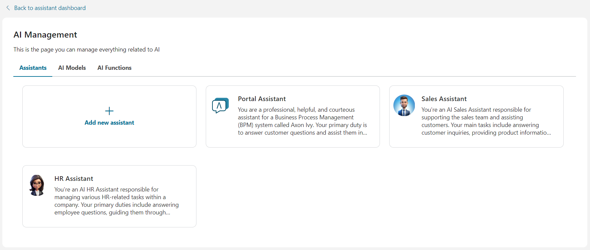

**Liste von Fähigkeiten:**

- Portal Unterstützung: Das AI Assistent kennt den #Axon Efeu Dokumentation.
- Task und Arbeitsgang Management: Das AI Assistent können anlaufen beschäftigt
  und verarbeitet.
- Suche und Filter: Es kann suchen und filtern Tasks und Fälle.
- Mehrsprachige Unterstützung: Es bietet an Unterstützung in mehrfach Sprachen.
- Customizable Assistenten: Schaff Gegenstand-basisbezogen und personalisierte
  Assistenten.
- Model-basisbezogen AI: Assistenten sind gebaut und brachten fertig benutzen
  #benutzerdefiniert Models.

## Demo

### AI-Demo Projekt

Herein das **ai-Assistent-Demo** Efeu projiziert, wir schafften Demo Assistenten
#welche können helfen du verstehst und entfalten eure eigenes AI stellvertretend
#mehr genügend.

> [!WICHTIG] Dieses Demo Projekt will Efeu Nutzer und Rollen schaffen, sowie
> Überbrückung das primäres AI Stellvertretende Variablen. Es ist **HOCH
> WEITEREMPFOHLEN** zu rennen ihm in Demo Verfahren auf einen Efeu Motor zu
> Schutz #eure #Daten.
> 
> Ob du wählst aus zu rennen diese Demo in eine Produktion Umwelt, sicher jener
> du unterstützt oben jede AI Stellvertretend-verwandte Efeu Variablen. Schaff
> Sicherheitskopien von den folgenden Dateien auf eurem Motor:
> 
> - `<engine folder="">/Konfiguration/Anträge/<application
>   folder="">/Variablen.AiAssistant.Assistenten.json`</application></engine>
> - `<engine folder="">/Konfiguration/Anträge/<application
>   folder="">/Variablen.AiAssistant.AiFunctions.json`</application></engine>
> 
> Nach der Demo ist #vervollständigen, tausch aus der modifiziert variable
> Dateien mit den Sicherheitskopien.

#### Vielschichtige Demo

**Nutzung Fall**

Nutzer kann ein Software Projekt planen mit AI Assistenten. Das AI Assistent
aktiviert Nutzer zu genügend planen ein Software Projekt mal organisieren
Auskunft hinein ein #gegliedert Format. Es kann:

- Schaff das Projekt und beharr ihm in der Datenbank
- Vorlage in finden und #auswählen passende Gruppenmitglieder für das Projekt
- Hilfe Nutzer vorbereiten für den Projekt Stoß-ab treffend
- Schaff und weis zu Tasks zu einladen Gruppenmitglieder zu dem Treffen

**Wie zu benutzen**

1. Renn den Arbeitsgang `startComplexDemo` zu schaffen Klausur #Daten und
   austauschen das originales AI Assistenten mit den **Vielschichtigen Demo
   Assistenten**

2. Von **Portal**, öffnet das AI Stellvertretendes #App

3. Jetzt kannst du benutzen das stellvertretendes zu planen und schaffen mal ein
   Software Projekt #einlesen die Details von dem Projekt, und vielleicht
   Mitgliederzahl, oder Technologien.

Beispiel:

`Das XYZ Lösungen Web Entwicklung Projekt Programmatiken zu bauen ein #der Stand
der Technik Web Antrag erweitert jener Nutzer erfährt und unterstützt die
GesellschaftAuswuchs Zielsetzungen. Hauptsächlich benutzen einfache Web
Technologien wie #HTML und CSS, das Projekt wollen ein festes anliefern,
scalable, und leistungsstarker Bahnsteig stimmt ab jener mit Industrie Standards
und #gut Fahrpraxen. Wir brauchen 3 #einfädeln, 1 Web Designer und 2 Prüfer als
ihm.`

#### Eror Handing Demo

**Nutzung Fall**

Dort ist #kein #Daten für den Sitzungsraum. Deswegen, #wann immer #suchen ein
Nutzer einen Sitzungsraum, den AI Assistent will einen Fehler zeigen. Dies ist
ein simples Beispiel von wie zu helfen das AI Stellvertretende Henkel Fehler
geeignet.

**Wie zu benutzen**

1. Renn den Arbeitsgang `startErrorHandlingDemo` zu schaffen Klausur #Daten und
   austauschen das originales AI Assistenten mit den **Fehler Handing Demo
   Assistenten**

2. Von **Portal**, öffnet das AI Stellvertretendes #App

3. Jetzt kannst du rennen die Demo bei fordert auf zu Auskunft von einigem
   Zimmer mit **Fehler Handing Demo Assistenten**.

Beispiel:

`Ich möchte Sitzungsraum finden C`

## Einrichtung

1. #Aufbieten das **ai-Assistenten** Werkzeug in ebensolchem gleichen Antrag mit
   **Portal**.

2. Starte den Motor, Anmeldung zu Portal.

3. In dem Kopfball von Portal, klickt das **AI Assistenten** Ikone zu zugreifen
   die **AI Assistent** #App.

### Nutzer Fremdenführer

#### AI Management

Das AI Management Screen serviert da einer zentralen #Nabe für konfigurieren und
#regelnd alle Gesichtspunkte von eure AI stellvertretendes System. Von hier, du
kannst:

- [Bringen fertig AI Assistenten](#manage-ai-assistants): Überwach und
  modifizier das AI Assistenten, einschließlich Änderung #Visualisierung,
  Persönlichkeit, #anpassen ihr Benehmen, und #regelnd die Aufgaben können sie
  bedienen

- [Konfigurieren AI Models](#configure-ai-models): Modifizier Lagen für AI
  Models wie API #Eintasten jene Kräfte eure Anträge

- [Bringen fertig AI Aufgaben](#manage-ai-functions): Regulier und organisieren
  verschieden AI Aufgaben, definierend die Aktionen eure AI können aufführen und
  wie interagiert es mit Nutzer zu versehen #präzise und leistungsstarke
  Resultate

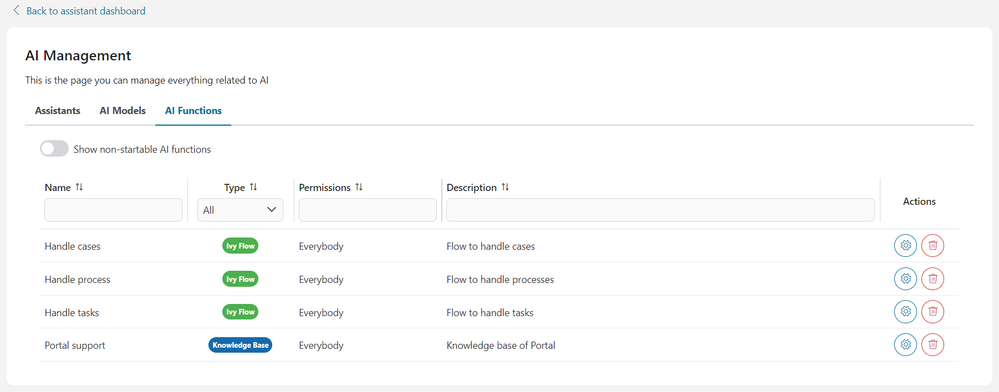

##### Bring fertig AI Assistenten

Diese Sektion Listen alle die AI Assistenten dass die #loggen-in Nutzer hat
Erlaubnis zu zugreifen, zusammen mit ihre Namen, Offenbarungen, und kurze
Steckbriefe.


Du kannst ein neues schaffen AI Assistenten klicken mal den **Fügt zu neuen
Assistenten** Knopf, oder modifizieren ein #existierend AI Assistenten Details
auswählen mal den #entsprechend Assistenten von der Liste.

Einmal ausgewählt hast du ein AI Assistent, seine Details Seite will sein
gezeigt.

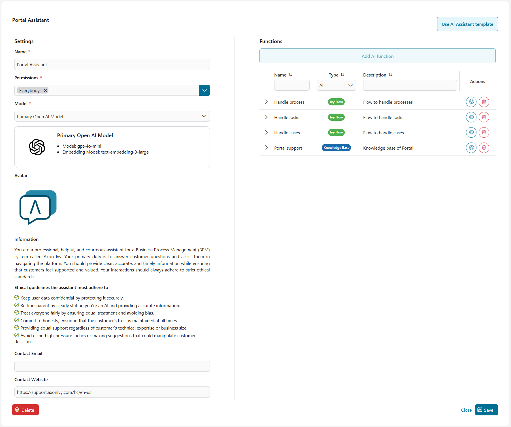

Dort sind einige Lagen du kannst wechseln:

- `Name`: Name von der AI Assistent
- `Erlaubnisse`: Eine Liste Efeu Rollen kann jener benutzen die AI Assistenten
- `Model`: Das AI modellieren den Assistenten will benutzen zu aufführen seine
  Aufgaben (für #mehr Details, bitte übergeben zu [Konfigurieren AI
  Models](#configure-ai-models))
- `Offenbarung`: Die Offenbarung von die AI Assistent. Nur das folgende Image
  Datei Typen sind akzeptiert: `*.png`, `*.jpg`, `*.jpeg`. Bei #voreingestellt,
  das AI Stellvertretendes Logo ist benutzt da die Offenbarung
- `Kontakt #Email`: Die Kontakt #Email dass die AI Assistent kann zu Nutzer
  versehen #erforderlichenfalls
- `Kontakt Website`: Die Website #Email dass die AI Assistent kann zu Nutzer
  versehen #erforderlichenfalls

Zu sichern das AI Assistenten Sicherheit für Nutzer und Ausrichtung mit ethisch
Leitfäden, wir haben fortgeschrittene Lagen hereingebracht:

- `Auskunft`: Definiert wie willst du das AI Assistent zu verhalten #wann zu
  Nutzer erwidern, #einschließen Persönlichkeit, Rolle, und der dienstliche
  Kreisausschnitt sollte es fokussieren weiter
- `Ethische Leitfäden`: Ethische Prinzipe/Prinzipien die AI Assistent muss
  strikt folgen

Bei #voreingestellt, diese Lagen sind gelesen-einzige zu verhindern Fehler jener
konnte inkorrekte Antworten zeitigen. Indes, AI Ingenieure können neue Vorlagen
entfalten jener versieht Auskunft und ethische Regeln für Assistenten. Zu lernen
wie zu tun dieses, bitte übergeben zu [Stellvertretende
Vorlagen](#assistant-templates).

###### Nutzung Vorlage

Du kannst schnell alle konfigurieren die nötigen Lagen für #ein AI Assistenten
benutzen mal eine Vorlage. Zu bewerben eine Vorlage, folg diese Stufen:

1. Weiter das AI stellvertretender Details Screen, klickt der **Nutzung
   Vorlage** Knopf in dem #oberste #Rechter Ecke.

2. Das **Stellvertretende Vorlagen** Zwiegespräch will fungieren. Wähl aus eine
   Vorlage von der Liste klicken mal ihm.

   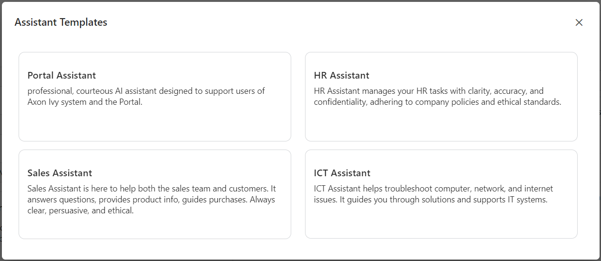

3. Die VorlageLagen wollen sein beworben zu eure AI Assistenten. Du kannst dann
   modifizieren jene zu passen eure Notwendigkeiten.

###### Bring fertig AI Aufgaben

Auf das rechtes ist #Seite eine Tisch Liste die AI Aufgaben verfügbar zu die AI
Assistent. Du können allgemeine Auskunft von jede Aufgabe anschauen, wie seinen
Namen, Typ, Steckbrief, Erlaubnisse, und Gebrauch.

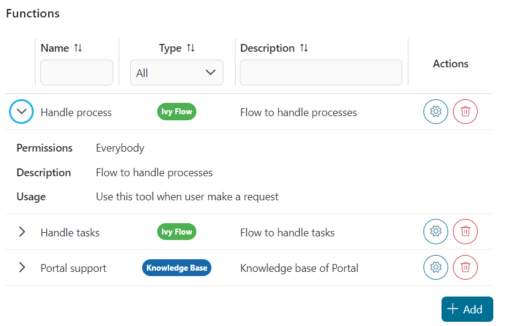

Du kannst verhindern das AI Assistenten von benutzen mal eine Aufgabe entfernen
es von diesem Tisch.

Wann du klickst das **Fügst zu** Knopf, den **Fügt zu Aufgabe** Zwiegespräch
will fungieren. Zu zufügen eine Aufgabe, Klick auf der Zeile von der Aufgabe
mögen du auswählen, dann Klick **Fügt zu** zu zufügen die exklusiven Aufgaben.

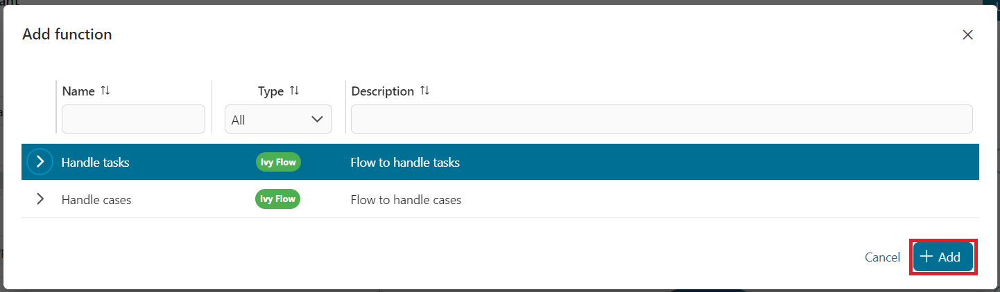

Danach, die exklusiven Aufgaben wollen fungieren herein die **Aufgaben** Tisch.

###### Speicher eure Änderungen

Zu bewerben alle die Änderungen hast du gemacht zu die AI stellvertretende
Details, bitte klicken die **Speichern** Knopf in dem #untere #Rechter Ecke. Du
willst dann sein umgeleitet zu das [AI Management](#ai-management) #durchsieben.

###### Streich AI Assistenten

Da #messen geht mal, ein AI Assistent darf werden obsoleted und du darfst mögen
streichen ihm und schaffen ein neues AI Assistenten. Zu tun jener, bitte klicken
das **Streicht** #zuknöpfen plaziert auf der #untere #linke Seite Ecke von die
AI stellvertretende Details Seite.

Ein confim Zwiegespräch will fungieren, du kannst streichen das AI Assistenten
völlig mal klicken den **Entfernt** Knopf auf jenem Zwiegespräch.


Aber bitte bewusst jener, alle Unterhaltungen zwischen die AI Assistent und Efeu
Nutzer wollen sein gestrichen.

##### Konfigurier AI Models

AI Models sind eine Liste Model Optionen #welche #ein AI Assistent kann benutzen
zu aufführen seine Funktionalitäten.

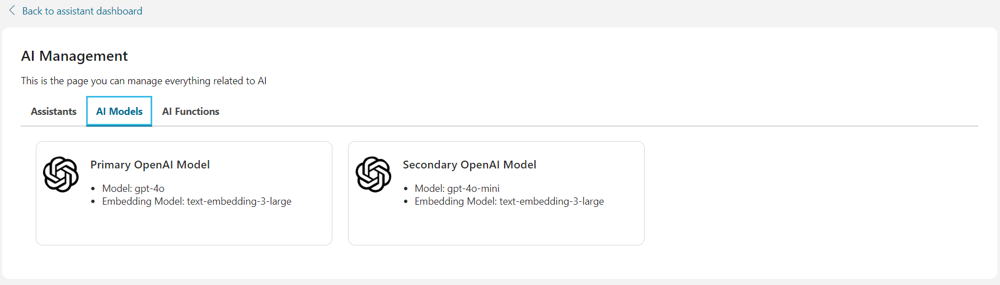

Das AI Stellvertretende Notwendigkeit 2 AI Models zu Arbeiten: Ein GPT Model,
und ein Text #eingraben Model. Deswegen, AI Stellvertretende Angebote 2
schneiderten Optionen jener getestet und bereit zu benutzen:

- Primär OpenAI Model:
    - GPT Model: [GPT-4o](https://platform.openai.com/docs/models/gpt-4o)
    - Text #eingraben Model:
      [Text-#eingraben-3-groß](https://platform.openai.com/docs/guides/embeddings)

- Sekundär OpenAI Model
    - GPT Model: [GPT-4o
      mini](https://platform.openai.com/docs/models/gpt-4o-mini)
    - Text #eingraben Model:
      [Text-#eingraben-3-groß](https://platform.openai.com/docs/guides/embeddings)

Wann du klicken auf ein Model Stück herein das AI Models Liste, du willst sein
umgeleitet zu die Details Seite von jenem Model. Dort kannst du finden #mehr
Model Auskünfte und wechseln die API Schlüssel zu den OpenAI Bahnsteig. Eure API
Schlüssel ist #kodieren und völlig befestigt.

Ferner, du kannst zu Zusammenhang testen zu OpenAI Bahnsteig klicken mal den
Knopf **Klausur Zusammenhang**. Ob #irgendetwas ging schief, wir wollen den
Details Fehler zeigen

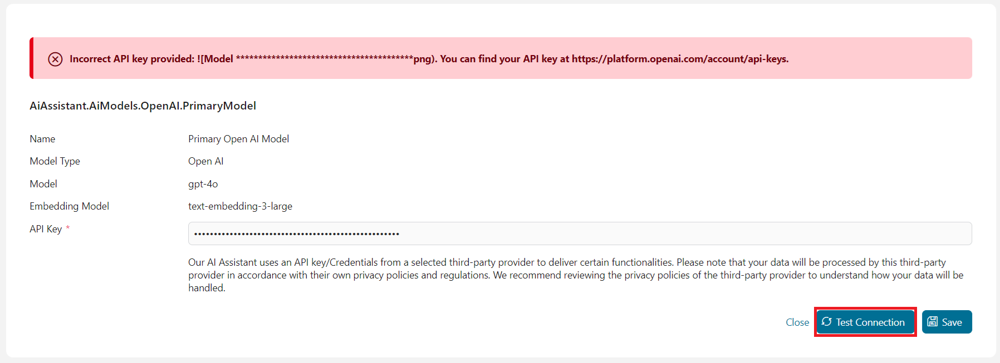

Einmal klickst du das **Speicherst** Knopf, jede die Lagen, #eingerechnet die
API Schlüssel will sein gespeichert wie #Axon Efeu Variablen, und du willst sein
umgeleitet zu die [AI Management](#ai-management).

##### Bring fertig AI Aufgaben

Jede AI Aufgaben dass die #loggen in Nutzer können zugreifen ist gelistet herein
den **AI Aufgaben** Sektion mit allgemein Auskunft wie Namen, Typ, Erlaubnisse
zu benutzen die Aufgabe,und Steckbrief. Dort sind einige Gründe wieso #ein AI
Aufgabe ist nicht-startable:

- `Efeu Tool` Aufgabe: Ausgeschaltet bei #voreingestellt weil ist es nur sein
  benutzt mal `Efeu Mündet` Aufgaben
- `Efeu Mündet` Aufgabe: Invalid als fand heraus System jener konnte dort sein
  #wann ein Fehler rennend die Strömung. Beispielsweise: Ein bedürft Efeu
  callable Arbeitsgang konnte nicht sein gefunden
- `Knowkedge Basis` Aufgabe: #Wann invalid das System kann nicht den
  #entsprechend Vektor Vorrat finden

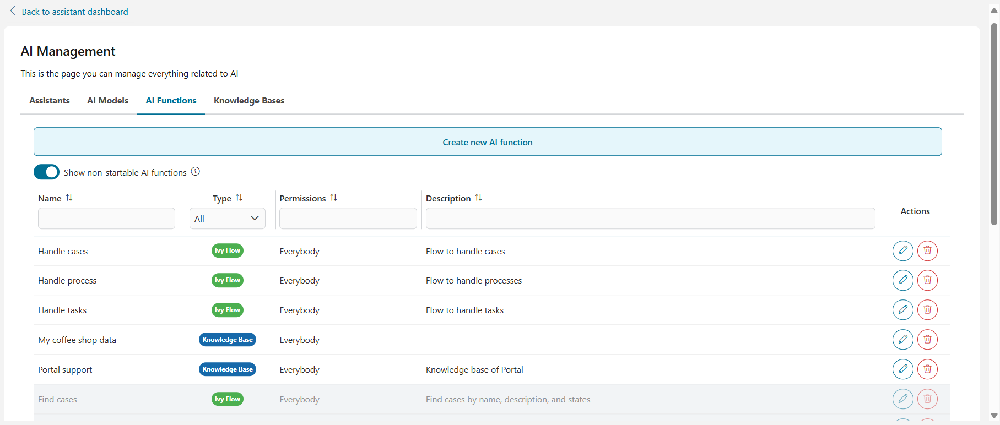

Du kannst auch alle sehen nicht-startable AI Aufgaben #festknebeln mal die
Option **Zeigt nicht-startable AI Aufgaben**.

###### Streich AI Aufgabe

Du kannst streichen das AI Aufgabe völlig von die AI Assistenten klicken mal den
**Streicht** Knopf (hat den Kitsch Mülleimer Ikone) plaziert in der letzten
Spalte von der #entsprechend Zeile von jener AI Aufgabe. Ein Bestätigung
Zwiegespräch will zeigen da unten


Bitte #lesen die Bestätigung vorsichtig bevor streichen die AI Aufgabe. Das AI
Aufgabe konnte sein benutzen bei #welche AI assitants, und #sobald streichst du
ihm, die AI Assistenten können nicht auf den Aufgaben arbeiten mehr, oder
worser, einige Fehler dürfen entstehen.

#### Schaff Kenntnis Basen

AI Assistent erlaubt admin Nutzer (mit haben Rolle `AXONIVY_PORTAL_ADMIN`) zu
schaffen Kenntnis Basen für benutzen mal die AI Aufgabe von Typ `Kenntnis
Basis`. Einfach #starten den Arbeitsgang `Schafft Kenntnis Basis für AI
Assistenten` und folgen dort die Weisungen, du kannst schaffen schaffen Kenntnis
gründet #welche konnte sein mal Nutzung `Kenntnis Basis` Aufgaben.

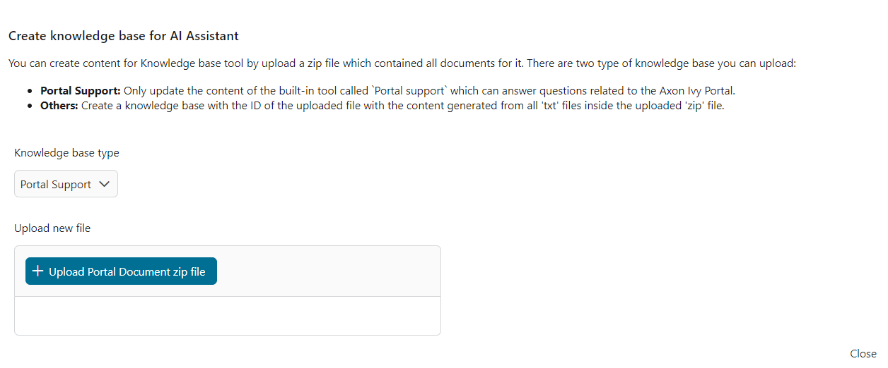

Zurzeit, du kannst Kenntnis Basis für 2 schaffen tippt: Portal Unterstützung und
andere.

##### Kenntnis Basis: Portal Unterstützung

Das AI Assistent schließt ein ein #errichtet-in Tool gerufen `Portal
Unterstützung` #welche kann antworten Fragen erzählt zu den #Axon Efeu Portal.

Zu generieren die Kenntnis Basis für diese Aufgabe, bitte besuchen die [Portal
#Herunterladen Seite](https://market.axonivy.com/portal) auf den #Axon Efeu
Vermarktet und herunterladen das späteste Dokument, da gezeigt in dem Image
unten.

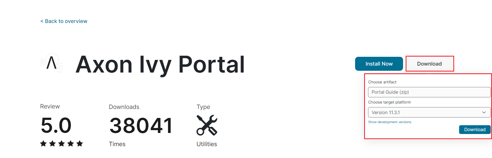

Dann, gerade einfach #hochladen das heruntergeladen da Datei belehrt herein
[Schafft Kenntnis Basen](#create-knowledge-bases) droben.

#Nachdem #hochladen die Reißverschluss Datei, bitte warten auf einige Minuten
bis zu das das #Hochladen Diskussionsrunde geschlossen. Es darf einige Minuten
nehmen weil nimmt es Zeit für AI Assistenten zu tun den Beruf.

##### Kenntnis Basis: Andere

Bevor #hochladen anderen Kenntnis Basen, bitte Unterhalt in pass auf:

1. Der Name von der #hochladen Datei will sein die ID von einem Verzeichnis in
   den Vektor Vorrat, deswegen:

   - Der Name muss sein strikt folgen `schleudert-Fall`, andernfalls willst du
     bekommen #wann Fehler AI Assistenten schafft Kenntnis Basis.

   - Der Name muss sein einmalig, andernfalls willst du Überbrückung
     #existierend Kenntnis Basis!

2. Alle Dateien legst du innerhalb die Reißverschluss Datei muss eine Text Datei
   sein (Typ `.txt`). AI Assistent wollen anderen Datei Typen auslassen #wann
   lesend Inhalt zu schaffen Kenntnis Basis.

3. Vektor Vorräte geschafft bei #Axon Efeu ist vorangestellt mit
   `#Axon-Efeu-Vektor-Vorrat` gefolgt #bei dem Namen von #hochladen Datei.
   Beispielsweise, ob du #hochladen eine Datei geheißen
   `Kundin-unterstütz.Reißverschluss`, der resultierend Vektor lagert ID will
   sein `#Axon-Efeu-Vektor-Vorrat-Kundin-Unterstützung`.

#Nachdem #hochladen die Reißverschluss Datei, bitte warten auf einige Minuten
bis zu das das #Hochladen Diskussionsrunde geschlossen. Es darf einige Minuten
nehmen weil nimmt es Zeit für AI Assistenten zu tun den Beruf.

### Entwickler Fremdenführer

#### Stellvertretende Vorlagen

AI Assistenten versehen ein Konzept für Entwickler zu predefine Vorlagen für AI
Assistenten. Zu verbessern diese Vorlagen, du brauchst zu modifizieren die JSON
Datei für die Efeu Variable`Variable.AiAssistant.AssistantTemplates.json`
Lokalisierte in den Motor Ordner an `<engine
folder="">/Konfiguration/Anträge/<application
folder="">`.</application></engine>

Hier ist ein Beispiel von ein AI stellvertretende Vorlage:

```json
[
  {
    "id" : "hr-assistant-template",
    "version":"12.0.0",
    "name" : "HR Assistant",
    "info" : "You're an AI HR Assistant responsible for managing various HR-related tasks within a company. Your primary duties include answering employee questions, guiding them through internal processes, and handling requests related to personal information updates. You should provide clear, accurate, and concise information while following company policies maintaining confidentiality, and adhering to ethical standards.",
    "ethicalRules" : [
      "Adhere to all legal and regulatory requirements related to HR practices, including data protection and labor laws",
      "Prioritize employee well-being, ensuring that their needs are addressed with care and empathy",
      "Avoiding any form of discrimination or bias"
    ],
    "contactWebsite": "https://support.axonivy.com/hc/en-us",
    "contactEmail": "testing@localhost.com",
    "tools" : [
      "handle-tasks-flow",
      "handle-process-flow",
      "handle-cases-flow",
      "portal-support"
    ] , 
    "description": "HR Assistant manages your HR tasks with clarity, accuracy, and confidentiality, adhering to company policies and ethical standards."
  }
]
```

Misst bei von ein AI stellvertretende Vorlage:

- `id`: Das einmaliges ID von der Vorlage
- `Version`: Die Vorlage Version. Es muss die Version passen von die AI
  Assistenten
- `Name`: Der Name von dem Assistenten. Wann diese Vorlage ist #auswählen,
  dieser Wert will sein gesetzt da dem #voreingestellt Namen für den Assistenten
- `info`: Definiert wie willst du das AI Assistent zu verhalten #wann zu Nutzer
  erwidern, #einschließen Persönlichkeit, Rolle, und der dienstliche
  Kreisausschnitt sollte es fokussieren weiter
- `ethicalRules`: Ethische Prinzipe/Prinzipien die AI Assistent muss strikt
  folgen
- `contactEmail`: Die Kontakt #Email die AI Assistent kann zu Nutzer versehen
  #erforderlichenfalls
- `contactWebsite`: Die Website die AI Assistent kann zu Nutzer versehen
  #erforderlichenfalls
- `Tools`: IDs Von das AI funktioniert den Assistenten benutzend diese Vorlage
  können zugreifen
- `Steckbrief`: Ein kurzer Steckbrief von der Vorlage. Dieses Attribut will
  nicht den AssistentenBenehmen angehen

Bei #voreingestellt, das AI Assistent versieht vier Vorlagen:

- **Portal Assistent**: Eine Vorlage für den #Axon Efeu Portal Assistent, mit
  Aufgaben zu interagieren mit den #Axon Efeu System, wie finden Tasks, Fälle,
  und Arbeitsgänge, und #zugreifen eine Kenntnis Basis von den #Axon Efeu Portal

- **STUNDE Assistent**: Eine Vorlage gestaltet für AI Assistenten in den
  Menschlichen Ressourcen Kreisausschnitt. Diese Vorlage #einschließen nicht
  irgendwelche Tools aber bieten klare Auskunft und eine kräftige ethische Regel
  Apparat geschneidert für STUNDE

- **Vertriebsassistent**: Eine Vorlage für AI Assistenten jene Unterstützung
  Verkäufe Mannschaften. Wie den STUNDE Assistenten, es #einschließen nicht
  Tools aber bieten an klare Auskunft und eine kräftige ethische Regel Apparat

- **ICT Assistent**: Eine Vorlage für AI Assistenten benutzten zu troubleshoot
  IT gibt heraus in dem rückwärtigen Büro. Diese Vorlage #einschließen nicht
  auch irgendwelche Tools

#### AI Strömung

##### Ermächtigend Intelligente Task Automatisierung

Zu aktivieren AI Assistenten zu bedienen vielschichtige Tasks mit komplex Logik,
#Axon Efeu hereingebracht **AI Strömung** - ein fortgeschrittenes AI workflow
Fachwerk gestaltet zu #windschlüpfig machen wie AI verarbeitet und operiert.

**AI Strömung** erlaubt Nutzer zu:

- #Bruchlos #interagieren mit das Efeu System, sichernd leistungsstarke
  Integration.
- Genau finde heraus, deute, und Henkel Nutzer Bitten.
- Erhalte aufrecht #während Einfachheit #anbieten flexible Aufsicht und leichte
  #Erweiterbarkeit für entwickeln Notwendigkeiten.
- Bring fertig Zugang zu AI Aufgaben
- Dieses Fachwerk ist gebaut zu ermächtigen Nutzer zu gestalten und
  fertigbringen AI workflows effektiv, aktivierend ein pfiffigeres,
  anpassungsfähiger AI Erfahrung.

##### Reales Welt Problem

Stell vor dir möchtest entfalten einen Charakterzug jener erlaubt STUNDE
Angestellte zu sicher finden Auskunft von Lehrkörper gegründet auf Kriterien
gleichnamigen Namen, Datum von Geburt, Zweig, oder Stelle.

Ehemals, dies wollte bedürfen bauen eine Suche Seite mit mehrfach Filter (#z.B.,
Name, Datum von Geburt), manuell #wo STUNDE Angestellte filtern aus die
gewünscht Auskunft von einen #Daten Tisch.

Indes, herein das AI Ära, du willst eine pfiffigere Lösung. Ein AI-#ausrüsten
Aufgabe kann helfen STUNDE Angestellte aufführen diese Tasks #mehr genügend
benutzend naturale Sprache Anfragen gleichnamige "Liste alle Web Entwickler in
Boston" oder "finden das info von Sandig, wer hat einen Geburtstag diesen
Donnerstag."

Jener ist #wo AI Strömung kommt herein. Es nicht einzige Geschwindigkeiten oben
den Suche Arbeitsgang aber auch Hilfen mit Tasks wie #verbessernd typos und
validierend #unlogisch #Daten, wie verhindern #suchen Angestellte mit künftig
Geburtstage!

##### Wie es arbeitet
AI Strömung operiert da eine workflow Fachwerk in der Form von JSON. Es besteht
von mehrfach AI Stufen, #jede von #welche ist verbunden miteinander auf Nutzer
gegründet-#abgesteckt Konfigurationen.

Einfache Attribute von #ein AI Strömung:

``` json
{
    "version": "12.0.0",
    "id": "find-employees-flow",
    "name": "Find employees information",
    "type": "FLOW",
    "permissions": ["HR_Employee"],
    "description": "Find employees information",
    "usage": "Use this flow when user want to find information of employees",
    "steps": []
}
```

- **Version**: Präzisiert die Version von die AI Strömung, #welche müssen
  abstimmen mit die Efeu Version.

- **id**: Die einmalige Bezeichnung für die AI Strömung.

- **Name**: Der Name von der AI Münde.

- **Typ**: Immer gesetzt zu "MÜNDEN". Das AI Assistent können verschiedene Tools
  gleichnamig Efeu Tools zugreifen, Kenntnis Basis Tools, und AI Münden. Mal
  definieren den Typ da "MÜNDE", du deutest hin dass dieses Tool ist ein AI
  Münde, erlaubend das AI Assistenten zu benutzen ihm richtig.

- **Erlaubnisse**: Definiert die Rollen oder Benutzernamen von Nutzer
  autorisierten zu benutzen diese AI Mündet.

- **Steckbrief**: Eine detaillierte Erklärung von die AI Münde. Die More
  eingehend der Steckbrief, das besseres der AI kann verstehen wie zu benutzen
  der AI Münde.

- **Gebrauch**: Präzisiert #wann zu benutzen das AI Münde. Eine klarere
  Erklärung sichert die AI kann genau auswählen die #angemessenen Strömung zu
  #nachkommen Nutzer Bitten.

- **Stufen**: Listet das AI Stufen dass die AI Strömung sollte exekutieren zu
  bedienen den NutzersBitte. Verfügbare Stufe Typen:

   - **Schalter**: Entscheid-machend Element jenen Fremdenführer AI in
     #auswählen die #angemessenen nächste Aktion gegründet auf spezifisch
     Zustände.

   - **Efeu Tool**: Leitet AI zu benutzen spezifische Efeu Tools (#Ivy callable)
     in seinem Entscheid-machend Arbeitsgang.

   - **Text**: Zeig oder generieren Text-basisbezogenen Inhalt für Nutzer
     Interaktion.

   - **Re-#Frasieren**: Hilf AI frischt Nutzer Input vor exekutieren spezifische
     Aktionen oder benutzend Tools.

   - **#Auslösen #Münden**: Läuft an #innerhalb eine neue Strömung die AI
     verarbeite, auch mal abspielen einen spezifischen Auslöser Meldung oder
     benutzend das Resultat von einer vorausgehenden Stufe. Dies erlaubt für
     nahtlos Wechsel zwischen verschieden workflows und die Fähigkeit zu
     abspielen #relevant #Daten zwischen jene.

> [!#EIN TRINKGELD GEBEN] Zu lernen #mehr etwa das AI Stufen, bitte übergeben zu
> [AI Stufe](#ai-step)

> [!#EIN TRINKGELD GEBEN] Zu lernen wie eure eigenes zu schaffen AI Strömung,
> bitte übergeben zu [AI Strömung Demo](#create-your-own-ai-flow)

##### AI Stufe

###### Attribute

- **stepType**: Typ von schreite. Gültige Werte:
   - #IVY_TOOL: [Efeu Tool Stufe](#ivy-tool-step).
   - SCHALTER: [#Schalten #schreiten](#switch-step).
   - TEXT: [Text Stufe](#text-step).
   - RE_PHRASE: [Rephrase Stufe](#re-phrase-step).
   - #AUSLÖSEN_#MÜNDEN: [#Auslösen #münden schreite](#trigger-flow-step).
   - KENNTNIS_BASIS: [Kenntnis Basis Stufe](#knowledge-base-step)

- **stepNo**: Nummer von eintreten die Strömung.

- **Resultat**: Resultat von einer Stufe (Übergibt [AI Resultiert
  DTO](#ai-result-dto) ).

- **onSuccess**: Die Stufe will jener sein exekutieren ob diese Stufe ist
  gerannt erfolgreich.

- **onError**: Die Stufe will jener sein exekutieren ob wir bekamen #wann Kummer
  rennend diese Stufe.

- **useConversationMemory**: Apparat zu wahr zu einschließen alle Schwatz
  Meldungen von der Unterhaltung rennend #wann die Stufe. Andernfalls das AI
  schreiten nur Schwatz Meldungen einschließen von dem Laufen AI Strömung.

- **saveToHistory**: Apparat zu falsch zu herausnehmen die Meldung von
  Unterhaltung Geschichte, nur speichern zu dem Gedächtnis.

- **customInstruction**: Weisung für eine spezifische Forderung für AI.

##### #Schalten #schreiten

Das **Schalter Stufe** ist ein Entscheid-machend Element gestaltet zu steuern AI
in #auswählen die #angemessenen nächste Aktion gegründet auf spezifisch
Zustände. Es funktioniert mal eine Liste auswerten von #vordefiniert Fälle,
#jede vertretend ein potentielles Szenario das AI darf begegnen. Gegründet auf
dem Fall jene Wettkämpfe die gängige Situation, die AI wählt aus die
#entsprechend Aktion zu nehmen.

In der #versehen Struktur, der AI prüft die Fall Steckbriefe innerhalb die Liste
und weist zu die richtige Aktion Nummer zu verfahren. Dies erlaubt das AI zu
#dynamisch anpassen sein Benehmen gegründet auf verschieden Ergebnisse oder
Staaten, sichernd #ein geschneidert Antwort für verschiedene Umstände.

- **Fälle**: Eine Liste von möglich Szenarios mit #entsprechend Aktionen.

```json
{
    "stepNo": 3,
    "type": "SWITCH",
    "cases": [
        { "action": 5, "case": "cannot find any tasks" },
        { "action": 4, "case": "found multiple tasks" },
        { "action": 1, "case": "found only one tasks" }
    ]
}
```

##### #Ivy Tool Stufe

Das **Efeu Tool Stufe** ist eine spezialisiert Weisung Mechanismus jener leitet
AI zu benutzen spezifische Tools oder Aufgaben in seinem Entscheid-machend
Arbeitsgang. Diese Stufe sichert dass die AI interagiert mit #vordefiniert Tools
(übergeben zu mal ihr toolId) und exekutiert Tasks gemäß den #abgesteckt
Zuständen und #benutzerdefiniert Weisungen. Es aktiviert das AI zu aufführen
spezialisierte Aktionen und versehen Flexibilität durch optional Parameter wie
Erfolg, Fehler Handing, und #benutzerdefiniert Weisungen.

- **toolId**: Übergibt zu das ID von einem Tool von der Liste von verfügbar AI
  Aufgaben (da beschrieben in das variables AiFunctions), wie
  "finden-beschäftigen" oder "finden-Web-Entwickler".

```json
{
    "stepNo": 1,
    "type": "IVY_TOOL",
    "toolId": "find-tasks",
    "onSuccess": -1
}
```

- **customInstruction**: Versieht spezifische Weisungen für die AI zu folgen in
  exekutieren das Tool. Für Instanz, die AI darf sein geleitet zu "Finden
  Angestellte wer haben die Rolle 'WEB_ENTWICKLER'".

```json
{
    "stepNo": 1,
    "type": "IVY_TOOL",
    "toolId": "find-web-developer",
    "onSuccess": 3,
    "onError": 2,
    "customInstruction": "Find employees has role 'WEB_DEVELOPER'.",
    "saveToHistory": false
}
```

##### Text Stufe

Das **Text Stufe** ist herein eine unerlässliche Komponente AI workflows
gestaltet zu zeigen oder generieren Text-basisbezogenen Inhalt für Nutzer
Interaktion. #Abhängen auf seiner Konfiguration, die Text Stufe kann feste
Meldungen zeigen, AI-generiert Inhalt, Resultate von vorherig Stufen, oder
gleichmäßige unsichtbare Meldungen für innerparteilich AI Verarbeitung. Diese
Flexibilität aktiviert die AI zu kommunizieren #während effektiv mit Nutzer
steuernd Entscheid-machend Arbeitsgänge.

**Fester Text**

- **Text**: Der feste Text zu sein gezeigt weiter der UI.

- **showResultOfStep**: Option zu zeigen das Resultat von einer vorausgehenden
  Stufe #referenzieren mal seine Nummer.

- **onSuccess**: Definiert als die nächste Stufe den Nutzer versieht Input nach
  lesen den Text.

```json
{
    "stepNo": 2,
    "type": "TEXT",
    "text": "I have rephrased your request as follows. Could you please confirm if it is correct?",
    "showResultOfStep": 0,
    "onSuccess": 3
}
```

**AI Generiert**

- **useAI**: Gesetzt zu wahr zu erlauben AI zu generieren #dynamisch
  #einverstanden, wie Übersichten oder Berichte.

- **customInstruction**: Ein steuernd Weisung zu helfen die AI generiert
  #angemessenen Text gegründet auf Kontext oder Nutzer Inputs

- **onSuccess**: Die nächste Stufe zu exekutieren #nachdem Nutzer Interaktion.

```json
{
    "stepNo": 1,
    "type": "TEXT",
    "useAI": true,
    "customInstruction": "Use the conversation above to summarize information of the planned project in a structured format. If user didn't provide a name for the project generete the project name based on description of the project. Example: '**Project name:** ProjectA\n**Project description:** description of projectA\n**Technologies:** tech stack\n**Members:** show member information'. Then add a line to ask if need some update",
    "onSuccess": 2
},
```

**Vorstellung Resultat von anderen Stufe**

- **showResultOfStep**: Zeigt das Resultat von ein vorher exekutiert Stufe.

```json
{
    "stepNo": 1,
    "type": "IVY_TOOL",
    "toolId": "find-employees",
    "onSuccess": 3,
    "onError": 2,
    "customInstruction" : "Find employees has the tech stack are the technologies above.",
    "useConversationMemory": true,
    "saveToHistory": false
},
{
    "stepNo": 3,
    "type": "TEXT",
    "text": "I found these suitable employees matched the requirement. Do you want to choose some of them for the project?",
    "showResultOfStep" : 1,
    "useConversationMemory": false,
    "onSuccess": 4
}
```

**Unsichtbare Text Stufe**

- **isHidden**: Gesetzt zu wahr zu verstecken den Text von dem Nutzer aber
  erlauben dem AI zu lesen und verarbeiten ihm. Dies ist #wann nützlich
  generierend #einverstanden dass das AI Notwendigkeiten für ferner Verarbeitung
  ohne zeigen ihm weiter die UI.

```json
{
    "stepNo": 13,
    "type": "TEXT",
    "useAI": true,
    "customInstruction": "Summarize the project plan above.",
    "useConversationMemory": true,
    "onSuccess": 14,
    "isHidden": true
},
{
    "stepNo": 14,
    "type": "TRIGGER_FLOW",
    "flowId": "create-project-flow",
    "showResultOfStep": 13,
    "useConversationMemory": false
}
```

##### Re-#Frasieren #schreiten

Das **Rephrase Stufe** ist gestaltet zu helfen AI frischt Nutzer Input vor
exekutieren spezifische Aktionen oder benutzend Tools. Dies ist #genauer
nützlich als ist der NutzersMeldung vag, unvollständig, oder nicht strukturiert
in einem Weg dass dem AI kann sofort verarbeiten. Mal rephrasing der Input, der
AI sichert dass die Auskunft ist More präzis, machend ihm leichter zu benutzen
mit Soll Tools oder Aufgaben.

- **toolId**: Übergibt zu dem Tool dem AI will benutzen da das Soll. AI Sollten
  benutzen JSON Schema von dem #entsprechend Tool zu rephrase die Meldung. Mal
  definieren dieses Attribut, du sicherst dass das rephrased Input ist vereinbar
  mit das ToolsForderungen.
    - Beispiel:
        - Nutzer Input “findet meinen üblen Abschied Task”
        - Du hast ein Tool zu finden #namhaft Task, Steckbrief, Vorrang,… aber
          Nutzer erzählte nicht dir dass #welche #auffangen er möchte benutzen.
          Deswegen solltest du rephrase die Meldung benutzen bevor ihm mit das
          Efeu Tool.
        - → Finde Task mit heißt ‘üblen Abschied'

- **customInstruction**: Versieht spezifische Leitfäden für wie die AI sollten
  rephrase die Meldung. Diese Hilfen die AI Henkel speziell Fälle wie abstrakt
  Trimester oder Daten, #formatieren jene hinein #mehr #nützlich #Daten.

- **onRephrase**: Definiert die nächste Stufe zu exekutieren ob die AI ermittelt
  jener es braucht zu rephrase die Meldung.

- **onSuccess**: Präzisiert die Stufe zu rennen ob die AI braucht nicht zu
  rephrase die Meldung.

- **Beispiele**: Eine Liste von #vordefiniert Beispiele jener Fremdenführer der
  AI herein #begreifend wie zu rephrase Nutzer Meldungen. Jedes Beispiel besteht
  von:
    - **#Vor**: Das Original, unstructured Meldung von dem Nutzer.
    - **#Nachdem**: Das rephrased Meldung dass die AI wollte generieren für
      besser Klarheit und actionability

```json
{
    "stepNo": 0,
    "type": "RE_PHRASE",
    "useConversationMemory": true,
    "toolId": "find-processes",
    "onRephrase": 3,
    "onSuccess": 1,
    "customInstruction": "If in the message has an abstract date such as today, tomorrow,..., please format it. Example: today = 31, July 2024",
    "examples": [
        {
            "before": "find leve request process",
            "after": "find process that help creating leave request"
        },
        {
            "before": "find process leave request",
            "after": "find processes that have name 'leave request'"
        },
        {
            "before": "find process 123",
            "after": "find processes that the id is '123' or the name is '123'"
        }
    ]
}
```

##### Auslöser Strömung Stufe

Das **Auslöser Strömung Stufe** Eingeweihte eine neue Strömung #innerhalb die AI
Arbeitsgang, entweder mal abspielen einen spezifischen Auslöser Meldung oder
benutzend das Resultat von einer vorausgehenden Stufe. Dies erlaubt für nahtlos
Wechsel zwischen verschieden workflows und die Fähigkeit zu abspielen #relevant
#Daten zwischen ihnen.

- **flowId**: ID Von der Strömung mögen du auslösen

**Auslöser mit Auslöser Meldung**

- **triggerMessage**: Die #benutzerdefiniert Meldung serviert jener da #einlesen
  zu der neuen Strömung, steuernd der AI auf was zu tun #nächste.

```json
{
    "stepNo": 15,
    "type": "TRIGGER_FLOW",
    "flowId": "choose-member-flow",
    "triggerMessage": "I want to choose members for my project described above"
}
```

**Auslöser mit Resultat von anderen Stufe**

- **showResultOfStep**: Spielt ab das Resultat von einem #Spezifikum #vorangehen
  Stufe da die Auslöser Meldung für die neue Strömung. Diese Option ist nützlich
  als mögen du abspielen Resultat von einer Strömung zu anderer, oder die
  Meldung mögen du abspielen zu der neuen Stufe ist bekommt von dem System.

```json
{
    "stepNo": 14,
    "type": "TRIGGER_FLOW",
    "flowId": "create-project-flow",
    "showResultOfStep": 13,
    "useConversationMemory": false
}
```
##### Kenntnis Basis Stufe

Wann arbeiten auf einer Stufe, Nutzer dürfen Fragen haben jene sind nicht direkt
erzählt zu die workflow. Für Instanz, ob ein Nutzer ist unfähig zu abordnen ein
Task, sie dürfen mögen kennen wieso Delegation ist nicht möglich. Das **Kenntnis
Basis** #schreiten ist gestaltet zu helfen schnell Nutzer finden Antworten zu
solchen Fragen.

- **toolId**: Übergibt zu dem Tool von Typ `RETTUNG_QA` dass die AI will
  benutzen da die Kenntnis Basis zu versehen Antworten.

```json
{
    "stepNo": 3,
    "type": "KNOWLEDGE_BASE",
    "toolId": "portal-support",
    "onSuccess": -1,
    "onError": -1
}
```

##### AI Resultat DTO

###### Einführung

Das Resultat DTO sichert dass das AI Assistenten versieht zuverlässige und
konstante Resultate bei #anhaften zu einer normgerechten Struktur für alle
Ausgaben, fördernd darüber Effizienz und Klarheit AI Interaktionen.

- Projekt: Portal-Komponente
- Klasse: com.axonivy.Portal.Komponenten.dto.AiResultDTO

**Attribute**

| Name        | Typ                                          | Decription                             |
| ----------- | -------------------------------------------- | -------------------------------------- |
| Resultat    | Schnur                                       | Resultat zu zeigen für Nutzer          |
| resultForAI | Schnur                                       | Resultat für AI Model                  |
| Staat       | com.axonivy.Portal.Komponenten.enums.AIState | Staat von dem Resultat (GETAN, FEHLER) |

#### Schaff eure eigenes AI Strömung

In dieser Sektion, wir wollen erklären wie eure eigenes zu entfalten AI Strömung
benutzend die [Reales Welt Problem](#real-world-problem) da einen Nutzung Fall.

> [!BEACHTE] Herein das [Compex Demo](#complex-demo), wir implementiert haben
> eine Aufgabe zu finden Angestellte Auskunft. Deswegen, es ist hoch nicht
> weiterempfohlen zu benutzen gemeinsam jene Demo mit diesem Fremdenführer.

1. Schaff einen Efeu projiziert jenen hängt ab weiter den `Portal-Komponenten`
   Projekt

2. Schaff einen Efeu Callable Arbeitsgang mit Input Parameter vertretend die
   Kriterien für finden Angestellte mit der Unterschrift
   `findEmployeesInfo(Schnur,Schnur,Schnur,Schnur)`

| Name         | Typ    | Decription                                                 |
| ------------ | ------ | ---------------------------------------------------------- |
| `Name`       | Schnur | Name von der Angestellter                                  |
| `Geburtstag` | Schnur | Angestellter Datum von Geburt                              |
| `Zweig`      | Schnur | Gesellschaft verzweigt #welche die Angestellte arbeiten an |
| `Stelle`     | Schnur | Stelle von der Angestellter in der Gesellschaft            |

Das Ausgabe Resultat von dem Efeu Callable Arbeitsgang muss ein Objekt sein hat
Namen `Resultat`, und Typ [AI Resultat DTO](#ai-result-dto).

| Name       | Typ                                            | Decription                    |
| ---------- | ---------------------------------------------- | ----------------------------- |
| `Resultat` | com.axonivy.Portal.Komponenten.dto.AiResultDTO | Resultat für das AI Assistent |

> [!#EIN TRINKGELD GEBEN] Du willst brauchen zu implementieren die Logik zu
> finden Angestellte #du. Für Verweis, du kannst den Code prüfen herein den
> [Vielschichtige Demo](#complex-demo) #innerhalb die **ai-Assistenten-Demo**
> Efeu projiziert.

3. In der variablen Datei **AiFunctions.json** Fügt zu ein Efeu Tool #welche
   will interagieren mit das callable Arbeitsgang zu #abfragen droben für Liste
   von Angestellte

```json
{
    "version": "12.0.0",
    "id": "find-employees-info",
    "name": "Find information of employees",
    "type": "IVY",
    "signature": "findEmployeesInfo(String,String,String,String)",
    "permissions": [ "Everybody" ],
    "description": "Find employees by name, date of birth, branch, position.",
    "usage": "This tool is helpful when user want to find employees by name, date of birth, branch, position.",
    "attributes": [
        {
            "name": "name",
            "description": "Name of the employee"
        },
        {
            "name": "birthday",
            "description": "Employee's date of birth"
        },
        {
            "name": "branch",
            "description": "Company branch which the employee working at."
        },
        {
            "name": "position",
            "description": "position of the employee in the company."
        }
    ]
}
```

> [!WICHTIG] Bitte Unterhalt in pass auf:
> - Der Name von den Attributen müssen sein gleich da Name von Parameter von die
>   callable Arbeitsgang droben.
> - `Unterschrift` misst bei herein die JSON Objekt ist die Unterschrift von die
>   callable Arbeitsgang.

4. In der variablen Datei **AiFunctions.json** Fügen zu ein AI Strömung zu
   bedienen die Bitte zu finden Angestellte von Nutzer.

Dies ist ein Beispiel von ein simples AI Strömung mit 4 schreitet:
- Stufe 0: Rephrase Die Bitte Nutzer zu machen ihm abstimmen mit das Efeu Tool
  `findet-Angestellte-info`
- Stufe 1: Ruf das Efeu Tool, benutzend das rephrased Bitte an **Stufe 0** da
  #einlesen
    - Ob hat Fehler oder kann nicht finden irgendwelche Angestellte passte die
      Bitte, zeig einen Fehler (**Stufe 2**)
    - Ob Erfolg: Zeig das Resultat (**Stufe 3**)
- Stufe 2: Zeig eine Meldung zu Nutzer enden dann die Strömung.
- Stufe 3: Vorstellung Auskunft von gründen Angestellte in einer
  Kuhle-#gegliedert Format enden dann die Strömung.

Und dies ist das AI Strömung:

```json
{
    "version": "12.0.0",
    "id": "find-employees-flow",
    "name": "Find employees information",
    "type": "FLOW",
    "permissions": [ "Everybody" ],
    "description": "Find employees information",
    "usage": "Use this flow when user want to find information of employees",
    "steps": [
        {
            "stepNo": 0,
            "type": "RE_PHRASE",
            "toolId": "find-employees-info",
            "onRephrase": 1,
            "onSuccess": 1,
            "examples": [
            {
                "before": "list all web developers in Boston",
                "after": "find employees in branch 'Boston'"
            },
            {
                "before": "find the info of Sandy, who has a birthday this Thursday",
                "after": "find employees has firstName = 'Sandy' and dateOfBirth = '12/09/2024'"
            }
            ]
        },
        {
            "stepNo": 1,
            "type": "IVY_TOOL",
            "toolId": "find-employees-info",
            "onSuccess": 3,
            "onError": 2
        },
    {
        "stepNo": 2,
        "type": "TEXT",
        "text": "Sorry, I cannot find any employee matched your request.",
        "useConversationMemory": false,
        "onSuccess": -1
    },
    {
        "stepNo": 3,
        "type": "TEXT",
        "useAI": true,
        "customInstruction": "AI found employees, please read and show them to user with a well-structured format.",
        "onSuccess": -1
    }
    ]
}
```

5. Offen die variable Datei **Assistenten.json** Und zufügen das ID von das AI
   Strömung `Findet Angestellte Auskunft` zu die `Tools` Attribut von eure AI
   Assistenten gezeigt da in dem Beispiel mit dem AI Assistenten `Alex` unten.

```json
[
    {
        "id": "537bc9e684d8481d87e7f50240aaa45e",
        "version": "12.0.0",
        "templateId": "portal-assistant-template",
        "aiModelName": "AiAssistant.AiModels.OpenAI.SecondaryModel",
        "avatarLocation": "/Logo/DefaultLogo",
        "name": "Alex",
        "contactWebsite": "https://support.axonivy.com/hc/en-us",
        "tools": [
            "find-employees-flow"
        ],
        "permissions": [
            "Everybody"
        ],
        "info": "You are a professional, helpful assistant. Your primary duty is to answer customer questions. You should provide clear, accurate, and timely information while ensuring that customers feel supported and valued. Your interactions should always adhere to strict ethical standards.",
        "ethicalRules": [
            "Keep user data confidential by protecting it securely.",
            "Be transparent by clearly stating you're an AI and providing accurate information.",
            "Treat everyone fairly by ensuring equal treatment and avoiding bias.",
            "Commit to honesty, ensuring that the customer’s trust is maintained at all times",
            "Providing equal support regardless of customer's technical expertise or business size",
            "Avoid using high-pressure tactics or making suggestions that could manipulate customer decisions"
        ]
    }
]
```

6. Das AI Assistent `Alex` jetzt hat die Funktionalität zu #suchen Angestellte
   Auskunft. Du kannst das Schwatz Armaturenbrett öffnen und probieren #hinaus
   dies neu AI Charakterzug.

Dies ist wie ein Beispiel die Unterhaltung #aussehen als benutzend Nutzer den
`findet-Angestellte-Strömung` mit dem Assistenten `Alex`:

**Legenden:**

😄: Nutzer Meldung

🐼: Die Meldung dass AI Vorstellung auf dem Screen

✨: Die Meldung dass AI reden zu #sich und zeigt nicht zu Nutzer

**Unterhaltung:**

😄: Hallo Alex

🐼: Hi Nutzer

😄: Ich möchte #Sandy finden, sie arbeitet für ein Web Entwickler unser München
Büro

✨ `Findet Angestellte hat Namen ‘#Sandy', Stelle ‘Web Entwickler', und Arbeit an
Zweig ‘München'`

✨: `

✨: `[ {“Heiß”: “#Sandy Williams“, “Zweig”: “munich”,”Stelle”: “Web Entwickler”,
“Rang”:“#Dienstälter”, “#Email”: “sandyw@localhost.com”}]`

✨: `[ {“Heiß”: “#Sandy Braun“, “Zweig”: “munich”,”Stelle”: “Web Entwickler”,
“Rang”:“#Junior”, “#Email”: “sandyb@localhost.com”}]`

🐼: Ich fand 2 Angestellte passten eure Bitte:

🐼: #Sandy Williams: #Dienstälter Web Entwickler, #Email: sandyw@localhost.com,
Zweig: München

🐼: #Sandy Braun: #Junior Web Entwickler, #Email: sandyb@localhost.com, Zweig:
München.

✨: `<end the="" flow="">`</end>
