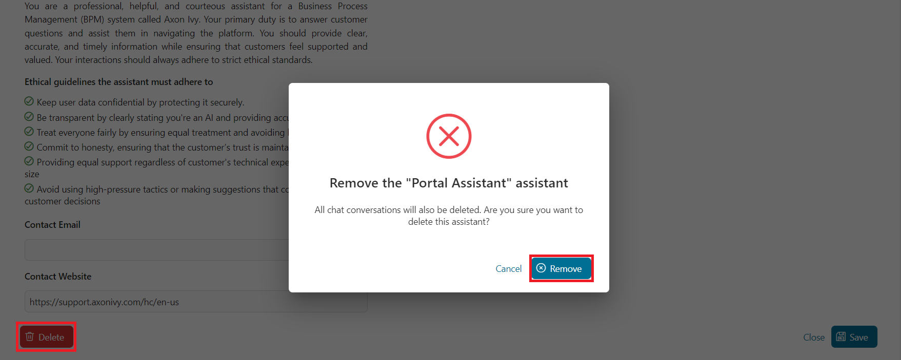

# KI-Assistent

Der KI-Assistent ist ein leistungsstarkes Tool, das Ihre tägliche Arbeit
innerhalb des Portals optimiert. Als Ihr persönlicher Assistent bietet er Ihnen
nahtlose Unterstützung bei einer Vielzahl von Aufgaben, von der Navigation in
der Dokumentation über das Starten von Prozessen bis hin zur Verwaltung von
Aufgaben und Fällen. Mit dem KI-Assistenten an Ihrer Seite können Sie
effizienter und effektiver arbeiten und wertvolle Zeit für das Wesentliche
gewinnen. Nutzen Sie einen interaktiveren und intuitiveren Arbeitsablauf, indem
Sie mit dem Assistenten über Ihre Prozesse sprechen, anstatt sie nur
auszuführen. Diese dynamische Interaktion verbessert Ihre Erfahrung und
ermöglicht es Ihnen, während der Arbeit Optionen zu erkunden und Erkenntnisse zu
gewinnen. Dank seiner Mehrsprachigkeit kommuniziert der KI-Assistent mühelos auf
Englisch, Deutsch, Spanisch und weiteren Sprachen und stellt so sicher, dass Sie
Unterstützung in Ihrer bevorzugten Sprache erhalten.


Der KI-Assistent bietet Ihnen nicht nur sofortige Hilfe, sondern ermöglicht
Ihnen auch die Erstellung und Verwaltung von benutzerdefinierten Modellen und
Assistenten, die auf Ihre individuellen Bedürfnisse zugeschnitten sind. Mit der
Management-Übersichtsfunktion ist das Entwerfen, Konfigurieren und Organisieren
dieser Modelle ein Kinderspiel. Sie können personalisierte Assistenten
erstellen, bestimmte Verhaltensweisen zuweisen oder vordefinierte Vorlagen
nutzen, um deren Aktionen zu steuern. Dieser Grad an Anpassung stellt sicher,
dass Ihr KI-Assistent perfekt auf Ihre Vorlieben und Ihren Arbeitsstil
abgestimmt ist. Begrüßen Sie die Zukunft der Arbeit mit dem KI-Assistenten,
Ihrem persönlichen Begleiter für mehr Produktivität und nahtloses
Aufgabenmanagement.


**Liste der Funktionen:**

- Portal-Support: Der KI-Assistent kennt die Axon Ivy-Dokumentation.
- Aufgaben- und Prozessmanagement: Der KI-Assistent kann Aufgaben und Prozesse
  initiieren.
- Suchen und Filter: Es kann Aufgaben und Fälle suchen und filtern.
- Mehrsprachige Unterstützung: Es bietet Unterstützung in mehreren Sprachen.
- Anpassbare Assistenten: Erstellen Sie themenbasierte und personalisierte
  Assistenten.
- Modellbasierte KI: Assistenten werden mithilfe benutzerdefinierter Modelle
  erstellt und verwaltet.

## Demo

### AI-Demo-Projekt

Im Ivy-Projekt „ **” (ai-assistant-demo** ) haben wir Demo-Assistenten erstellt,
die Ihnen helfen können, Ihren eigenen KI-Assistenten besser zu verstehen und
effizienter zu entwickeln.

> [!WICHTIG] Dieses Demo-Projekt erstellt Ivy-Benutzer und -Rollen und
> überschreibt die primären AI-Assistent-Variablen. Es wird DRINGEND EMPFOHLEN,
> **** im Demo-Modus auf einer Ivy-Engine auszuführen, um Ihre Daten zu
> schützen.
> 
> Wenn Sie diese Demo in einer Produktionsumgebung ausführen möchten, stellen
> Sie sicher, dass Sie alle AI Assistant-bezogenen Ivy-Variablen sichern.
> Erstellen Sie Backups der folgenden Dateien auf Ihrer Engine:
> 
> - `/configuration/applications//variables.AiAssistant.Assistants.json`
> - `/configuration/applications//variables.AiAssistant.AiFunctions.json`
> 
> Ersetzen Sie nach Abschluss der Demo die geänderten Variablendateien durch die
> Sicherungskopien.

#### Komplexe Demo

**Anwendungsfall**

Benutzer können mit dem KI-Assistenten ein Softwareprojekt planen. Der
KI-Assistent ermöglicht es Benutzern, ein Softwareprojekt effizient zu planen,
indem er Informationen in einem strukturierten Format organisiert. Er kann:

- Erstellen Sie das Projekt und speichern Sie es in der Datenbank.
- Unterstützung bei der Suche und Auswahl geeigneter Teammitglieder für das
  Projekt
- Helfen Sie den Benutzern bei der Vorbereitung auf das Projekt-Kickoff-Meeting.
- Erstellen und weisen Sie Aufgaben zu, um Teammitglieder zur Besprechung
  einzuladen.

**Verwendung**

1. Führen Sie den Prozess `startComplexDemo` aus, um Testdaten zu erstellen und
   den ursprünglichen KI-Assistenten durch den **Complex Demo Assistant zu
   ersetzen.**

2. Öffnen Sie die AI Assistant-App auf dem Portal „ **“**.

3. Jetzt können Sie den Assistenten verwenden, um ein Softwareprojekt zu planen
   und zu erstellen, indem Sie die Details des Projekts und möglicherweise die
   Anzahl der Mitglieder oder Technologien eingeben.

Beispiel:

`Das Webentwicklungsprojekt von XYZ Lösungen zielt darauf ab, eine hochmoderne
Webanwendung zu entwickeln, die die Benutzererfahrung verbessert und die
Wachstumsziele des Unternehmens unterstützt. Das Projekt nutzt hauptsächlich
grundlegende Webtechnologien wie HTML und CSS und wird eine sichere, skalierbare
und effiziente Plattform liefern, die den Industriestandards und Best Practices
entspricht. Dafür benötigen wir 3 Ingenieure, 1 Webdesigner und 2 Tester.`

#### Demo zur Fehlerbehandlung

**Anwendungsfall**

Es gibt keine Daten für den Besprechungsraum. Wenn ein Benutzer nach einem
Besprechungsraum sucht, zeigt der KI-Assistent daher eine Fehlermeldung an. Dies
ist ein einfaches Beispiel dafür, wie Sie dem KI-Assistenten helfen können,
Fehler richtig zu behandeln.

**Verwendung**

1. Führen Sie den Prozess `startErrorHandlingDemo` aus, um Testdaten zu
   erstellen und den ursprünglichen KI-Assistenten durch den **Error Handling
   Demo Assistant zu ersetzen.**

2. Öffnen Sie die AI Assistant-App auf dem Portal „ **“**.

3. Jetzt können Sie die Demo ausführen, indem Sie Informationen zu einem
   bestimmten Raum anfordern unter **Fehlerbehandlungs-Demo-Assistent**.

Beispiel:

`Ich möchte den Besprechungsraum C finden.`

## Einrichtung

1. Stellen Sie das Artefakt „ **” ai-assistant** in derselben Anwendung wie
   **Portal** bereit.

2. Starten Sie den Motor und melden Sie sich beim Portal an.

3. Klicken Sie in der Kopfzeile des Portals auf das Symbol „ **-KI-Assistent“**,
   um auf die App „ **-KI-Assistent“** zuzugreifen.

### Benutzerhandbuch

#### KI-Management

Der Bildschirm „KI-Verwaltung” dient als zentrale Anlaufstelle für die
Konfiguration und Verwaltung aller Aspekte Ihres KI-Assistenten-Systems. Von
hier aus können Sie:

- [KI-Assistenten verwalten](#manage-ai-assistants): Überwachen und modifizieren
  Sie die KI-Assistenten, einschließlich der Änderung der Visualisierung, der
  Persönlichkeit, der Anpassung ihres Verhaltens und der Verwaltung der
  Funktionen, die sie ausführen können.

- [KI-Modelle konfigurieren](#configure-ai-models): Ändern Sie die Einstellungen
  für KI-Modelle wie den API-Schlüssel, der Ihre Anwendungen unterstützt.

- [KI-Funktionen verwalten](#manage-ai-functions): Steuern und organisieren Sie
  verschiedene KI-Funktionen, definieren Sie die Aktionen, die Ihre KI ausführen
  kann, und wie sie mit Benutzern interagiert, um genaue und effiziente
  Ergebnisse zu liefern.


##### KI-Assistenten verwalten

In diesem Abschnitt werden alle KI-Assistenten aufgelistet, auf die der
angemeldete Benutzer Zugriff hat, zusammen mit ihren Namen, Avataren und kurzen
Beschreibungen.


** Sie können einen neuen KI-Assistenten erstellen, indem Sie auf die
Schaltfläche „ **“ (KI-Assistenten hinzufügen) klicken, oder die Details eines
bestehenden KI-Assistenten ändern, indem Sie den entsprechenden Assistenten aus
der Liste auswählen.

Sobald Sie einen KI-Assistenten ausgewählt haben, wird dessen Detailseite
angezeigt.


Es gibt einige Einstellungen, die Sie ändern können:

- `Name`: Name des KI-Assistenten
- `Berechtigungen`: Eine Liste der Ivy-Rollen, die den KI-Assistenten verwenden
  können.
- `Modell`: Das KI-Modell, das der Assistent zur Ausführung seiner Funktionen
  verwendet (weitere Informationen finden Sie unter [KI-Modelle
  konfigurieren](#configure-ai-models)).
- `Avatar-`: Der Avatar des KI-Assistenten. Es werden nur die folgenden
  Bilddateitypen akzeptiert: `*.png`, `*.jpg`, `*.jpeg`. Standardmäßig wird das
  KI-Assistent-Logo als Avatar verwendet.
- `Kontakt-E-Mail-`: Die Kontakt-E-Mail-Adresse, die der KI-Assistent den
  Benutzern bei Bedarf zur Verfügung stellen kann.
- `Kontakt-Website-`: Die E-Mail-Adresse der Website, die der KI-Assistent den
  Benutzern bei Bedarf zur Verfügung stellen kann.

Um die Sicherheit des KI-Assistenten für Benutzer und die Einhaltung ethischer
Richtlinien zu gewährleisten, haben wir erweiterte Einstellungen eingeführt:

- `Informationen zu „` “: Legt fest, wie sich der KI-Assistent bei der
  Beantwortung von Nutzeranfragen verhalten soll, einschließlich Persönlichkeit,
  Rolle und dem Geschäftsbereich, auf den er sich konzentrieren soll.
- `Ethische Richtlinien`: Ethische Grundsätze, die der KI-Assistent strikt
  befolgen muss

Standardmäßig sind diese Einstellungen schreibgeschützt, um Fehler zu vermeiden,
die zu falschen Antworten führen könnten. KI-Ingenieure können jedoch neue
Vorlagen entwickeln, die Informationen und ethische Regeln für Assistenten
bereitstellen. Informationen dazu finden Sie unter
[Assistentenvorlagen](#assistant-templates).

###### Vorlage verwenden

Mit einer Vorlage können Sie schnell alle notwendigen Einstellungen für einen
KI-Assistenten konfigurieren. Um eine Vorlage anzuwenden, gehen Sie wie folgt
vor:

1. Klicken Sie auf dem Bildschirm mit den Details zum KI-Assistenten oben rechts
   auf die Schaltfläche „ **Vorlage verwenden“**.

2. Der Dialog „ **-Assistent-Vorlagen** “ wird angezeigt. Wählen Sie eine
   Vorlage aus der Liste aus, indem Sie darauf klicken.

   

3. Die Einstellungen der Vorlage werden auf Ihren KI-Assistenten angewendet. Sie
   können sie dann nach Ihren Bedürfnissen anpassen.

###### KI-Funktionen verwalten

Auf der rechten Seite befindet sich eine Tabelle mit den AI-Funktionen, die dem
AI-Assistenten zur Verfügung stehen. Sie können allgemeine Informationen zu
jeder Funktion anzeigen, z. B. Name, Typ, Beschreibung, Berechtigungen und
Verwendung.


Sie können verhindern, dass der KI-Assistent eine Funktion verwendet, indem Sie
diese aus dieser Tabelle entfernen.

Wenn Sie auf die Schaltfläche „ **“ (Funktion hinzufügen) „Add“ (Hinzufügen) „**
“ (Funktion) klicken, wird das Dialogfeld „ **“ (Funktion hinzufügen) „Add“
(Hinzufügen) „** “ (Funktion) angezeigt. Um eine Funktion hinzuzufügen, klicken
Sie auf die Zeile der Funktion, die Sie auswählen möchten, und klicken Sie dann
auf „ **“ (Funktion hinzufügen) „Add“ (Hinzufügen) „** “ (Funktion), um die
ausgewählten Funktionen hinzuzufügen.


Anschließend werden die ausgewählten Funktionen in der Tabelle „ **-Funktionen“
(** ) angezeigt.

###### Speichern Sie Ihre Änderungen.

** Um alle Änderungen, die Sie an den Details des KI-Assistenten vorgenommen
haben, zu übernehmen, klicken Sie bitte auf die Schaltfläche „ **“ (Speichern
und fortfahren) in der unteren rechten Ecke. Sie werden dann zum Bildschirm
[KI-Verwaltung](#ai-management) weitergeleitet.

###### AI-Assistenten löschen

Mit der Zeit kann ein KI-Assistent überflüssig werden, sodass Sie ihn löschen
und einen neuen KI-Assistenten erstellen möchten. Klicken Sie dazu bitte auf die
Schaltfläche „ **“ (KI-Assistenten löschen) „Delete** “ ( löschen) unten links
auf der Detailseite des KI-Assistenten.

Es erscheint ein Bestätigungsdialog. Sie können den KI-Assistenten vollständig
löschen, indem Sie in diesem Dialog auf die Schaltfläche „ **“ (Entfernen) „** “
(KI-Assistenten löschen) klicken.



Bitte beachten Sie jedoch, dass alle Unterhaltungen zwischen dem KI-Assistenten
und Ivy-Benutzern gelöscht werden.

##### KI-Modelle konfigurieren

AI Models ist eine Liste von Modelloptionen, die ein KI-Assistent zur Ausführung
seiner Funktionen verwenden kann.


Der KI-Assistent benötigt zwei KI-Modelle, um zu funktionieren: ein GPT-Modell
und ein Text-Embedding-Modell. Daher bietet der KI-Assistent zwei
maßgeschneiderte Optionen, die getestet und einsatzbereit sind:

- Primäres OpenAI-Modell:
    - GPT-Modell: [GPT-4o](https://platform.openai.com/docs/models/gpt-4o)
    - Text-Einbettungsmodell:
      [text-embedding-3-large](https://platform.openai.com/docs/guides/embeddings)

- Sekundäres OpenAI-Modell
    - GPT-Modell: [GPT-4o
      mini](https://platform.openai.com/docs/models/gpt-4o-mini)
    - Text-Einbettungsmodell:
      [text-embedding-3-large](https://platform.openai.com/docs/guides/embeddings)

Wenn Sie auf einen Modellpunkt in der Liste der KI-Modelle klicken, werden Sie
zur Detailseite dieses Modells weitergeleitet. Dort finden Sie Mehr
Informationen zum Modell und können den API-Schlüssel für die OpenAI-Plattform
ändern. Ihr API-Schlüssel ist verschlüsselt und vollständig gesichert.

Außerdem können Sie die Verbindung zur OpenAI-Plattform testen, indem Sie auf
die Schaltfläche „ **-Verbindung testen“** klicken. Sollte etwas schiefgehen,
zeigen wir Ihnen die Details des Fehlers an.


** Sobald Sie auf die Schaltfläche „ **“ (API-Schlüssel speichern) klicken,
werden alle Einstellungen, einschließlich des API-Schlüssels, als Axon
Ivy-Variablen gespeichert und Sie werden zum [AI Management](#ai-management)
weitergeleitet.

##### KI-Funktionen verwalten

Alle KI-Funktionen, auf die der angemeldete Benutzer zugreifen kann, sind im
Abschnitt „ **-KI-Funktionen“** mit allgemeinen Informationen wie Name, Typ,
Berechtigungen zur Nutzung der Funktion und Beschreibung aufgeführt. Es gibt
einige Gründe, warum eine KI-Funktion nicht gestartet werden kann:

- `Ivy Tool` Funktion: Standardmäßig deaktiviert, da sie nur von `verwendet
  wird. Ivy Flow` Funktionen
- `Ivy Flow-` -Funktion: deaktiviert, wenn das System einen möglichen Fehler
  beim Ausführen des Flows erkannt hat. Beispiel: Ein erforderlicher
  Ivy-aufrufbarer Prozess konnte nicht gefunden werden.
- `Knowledgebase-` -Funktion: deaktiviert, wenn das System den entsprechenden
  Vektorspeicher nicht finden kann.


Sie können auch alle nicht startbaren KI-Funktionen anzeigen, indem Sie die
Option „ **“ auf „Show non-startable AI functions“ (Nicht startbare
KI-Funktionen anzeigen) umstellen.**.

###### AI-Funktion löschen

Sie können die KI-Funktion vollständig aus dem KI-Assistenten löschen, indem Sie
auf die Schaltfläche „ **-** löschen“ (mit dem Papierkorb-Symbol) klicken, die
sich in der letzten Spalte der entsprechenden Zeile dieser KI-Funktion befindet.
Es wird ein Bestätigungsdialogfeld wie unten angezeigt.


Bitte lesen Sie die Bestätigung sorgfältig durch, bevor Sie die KI-Funktion
löschen. Die KI-Funktion könnte von einigen KI-Assistenten verwendet werden, und
sobald Sie sie löschen, können die KI-Assistenten die Funktionen nicht mehr
ausführen, oder schlimmer noch, es können Fehler auftreten.

#### Erstellen Sie Wissensdatenbanken

Mit AI Assistant können Admin-Benutzer (mit der Rolle `AXONIVY_PORTAL_ADMIN`)
Wissensdatenbanken erstellen, die von der KI-Funktion vom Typ `Knowledge Base`
verwendet werden können. Starten Sie einfach den Prozess `Create knowledge base
for AI Assistant` und folgen Sie den dortigen Anweisungen. So können Sie
Wissensdatenbanken erstellen, die von `Knowledge Base` Funktionen verwendet
werden können.


Derzeit können Sie Wissensdatenbanken für zwei Typen erstellen: Portal-Support
und Sonstiges.

##### Wissensdatenbank: Portal-Support

Der KI-Assistent enthält ein integriertes Tool namens „ `-Portal-Support“ (` ),
das Fragen zum Axon Ivy-Portal beantworten kann.

Um die Wissensdatenbank für diese Funktion zu erstellen, besuchen Sie bitte die
[Portal-Download-Seite](https://market.axonivy.com/portal) auf dem Axon Ivy
Marktplatz und laden Sie das neueste Dokument herunter, wie in der Abbildung
unten gezeigt.


Laden Sie dann einfach die heruntergeladene Datei hoch, wie oben unter
[Erstellen von Wissensdatenbanken](#create-knowledge-bases) beschrieben.

Nachdem Sie die ZIP-Datei hochgeladen haben, warten Sie bitte einige Minuten,
bis das Hochladen-Fenster geschlossen wird. Dies kann einige Minuten dauern, da
der KI-Assistent einige Zeit benötigt, um die Aufgabe auszuführen.

##### Wissensdatenbank: Sonstiges

Bevor Sie weitere Wissensdatenbanken hochladen, beachten Sie bitte Folgendes:

1. Der Name der hochgeladenen Datei ist die ID eines Index im Vektorspeicher,
   daher:

   - Der Name muss strikt der Schreibweise „ `“ (mit Bindestrichen) entsprechen
     (z. B. „` “), da es sonst zu Fehlern kommt, wenn der KI-Assistent die
     Wissensdatenbank erstellt.

   - Der Name muss eindeutig sein, da Sie sonst die vorhandene Wissensdatenbank
     überschreiben!

2. Alle Dateien, die Sie in die ZIP-Datei einfügen, müssen Textdateien sein (Typ
   `.txt`). AI Assistant überspringt andere Dateitypen beim Lesen von Inhalten,
   um eine Wissensdatenbank zu erstellen.

3. Von Axon Ivy erstellte Vektorspeicher haben das Präfix
   `axon-ivy-vector-store`, gefolgt vom Namen der hochgeladenen Datei. Wenn Sie
   beispielsweise eine Datei mit dem Namen `customer-support.zip` hochladen,
   lautet die resultierende Vektorspeicher-ID
   `axon-ivy-vector-store-customer-support`.

Nachdem Sie die ZIP-Datei hochgeladen haben, warten Sie bitte einige Minuten,
bis das Hochladen-Fenster geschlossen wird. Dies kann einige Minuten dauern, da
der KI-Assistent einige Zeit benötigt, um die Aufgabe auszuführen.

### Entwicklerhandbuch

#### Assistent-Vorlagen

KI-Assistenten bieten Entwicklern die Möglichkeit, Vorlagen für KI-Assistenten
vorab zu definieren. Um diese Vorlagen zu aktualisieren, müssen Sie die
JSON-Datei für die Ivy-Variable`variable.AiAssistant.AssistantTemplates.json`
ändern, die sich im Engine-Ordner unter `/configuration/applications/` befindet.

Hier ist ein Beispiel für eine Vorlage für einen KI-Assistenten:

```json
[
  {
    "id" : "hr-assistant-template",
    "version":"12.0.0",
    "name" : "HR Assistant",
    "info" : "You're an AI HR Assistant responsible for managing various HR-related tasks within a company. Your primary duties include answering employee questions, guiding them through internal processes, and handling requests related to personal information updates. You should provide clear, accurate, and concise information while following company policies maintaining confidentiality, and adhering to ethical standards.",
    "ethicalRules" : [
      "Adhere to all legal and regulatory requirements related to HR practices, including data protection and labor laws",
      "Prioritize employee well-being, ensuring that their needs are addressed with care and empathy",
      "Avoiding any form of discrimination or bias"
    ],
    "contactWebsite": "https://support.axonivy.com/hc/en-us",
    "contactEmail": "testing@localhost.com",
    "tools" : [
      "handle-tasks-flow",
      "handle-process-flow",
      "handle-cases-flow",
      "portal-support"
    ] , 
    "description": "HR Assistant manages your HR tasks with clarity, accuracy, and confidentiality, adhering to company policies and ethical standards."
  }
]
```

Eigenschaften einer KI-Assistentenvorlage:

- `id`: die eindeutige ID der Vorlage
- `Version`: Die Vorlagenversion. Sie muss mit der Version des KI-Assistenten
  übereinstimmen.
- `name`: Der Name des Assistenten. Wenn diese Vorlage ausgewählt wird, wird
  dieser Wert als Standardname für den Assistenten festgelegt.
- `Info-`: Legt fest, wie sich der KI-Assistent bei der Beantwortung von
  Nutzeranfragen verhalten soll, einschließlich Persönlichkeit, Rolle und dem
  Geschäftsbereich, auf den er sich konzentrieren soll.
- `ethicalRules`: ethische Grundsätze, die der KI-Assistent strikt befolgen muss
- `contactEmail`: Die Kontakt-E-Mail-Adresse, die der KI-Assistent den Benutzern
  bei Bedarf zur Verfügung stellen kann.
- `KontaktWebsite`: Die Website, die der KI-Assistent den Benutzern bei Bedarf
  zur Verfügung stellen kann.
- `Tools`: IDs der KI-Funktionen, auf die der Assistent mit dieser Vorlage
  zugreifen kann.
- `Beschreibung`: Eine kurze Beschreibung der Vorlage. Dieses Attribut hat
  keinen Einfluss auf das Verhalten des Assistenten.

Standardmäßig bietet der KI-Assistent vier Vorlagen an:

- **Portal Assistant**: Eine Vorlage für den Axon Ivy Portal Assistant mit
  Funktionen zur Interaktion mit dem Axon Ivy-System, z. B. zum Suchen von
  Aufgaben, Fällen und Prozessen sowie zum Zugriff auf eine Wissensdatenbank zum
  Axon Ivy Portal.

- **HR-Assistent**: Eine Vorlage für KI-Assistenten im Personalwesen. Diese
  Vorlage enthält keine Tools, sondern klare Informationen und strenge ethische
  Regeln, die speziell auf das Personalwesen zugeschnitten sind.

- **Vertriebsassistent**: Eine Vorlage für KI-Assistenten, die Vertriebsteams
  unterstützen. Wie der HR-Assistent enthält sie keine Tools, sondern bietet
  klare Informationen und strenge ethische Regeln.

- **ICT Assistant**: Eine Vorlage für KI-Assistenten, die zur Fehlerbehebung bei
  IT-Problemen im Backoffice verwendet wird. Diese Vorlage enthält ebenfalls
  keine Tools.

#### AI Flow

##### Intelligente Aufgabenautomatisierung

Damit KI-Assistenten komplexe Aufgaben mit ausgefeilter Logik bewältigen können,
hat Axon Ivy „ **” AI Flow** eingeführt – ein fortschrittliches
KI-Workflow-Framework, das die Verarbeitung und Funktionsweise von KI optimiert.

**Mit AI Flow** können Benutzer:

- Nahtlose Interaktion mit dem Ivy-System für eine effiziente Integration.
- Erkennen, interpretieren und bearbeiten Sie Benutzeranfragen präzise.
- Behalten Sie die Einfachheit bei und bieten Sie gleichzeitig flexible
  Steuerung und einfache Erweiterbarkeit für sich entwickelnde Anforderungen.
- Verwalten Sie den Zugriff auf KI-Funktionen
- Dieses Framework wurde entwickelt, um Benutzern die Möglichkeit zu geben,
  KI-Workflows effektiv zu entwerfen und zu verwalten, wodurch eine
  intelligentere und anpassungsfähigere KI-Erfahrung ermöglicht wird.

##### Problem aus der Praxis

Stellen Sie sich vor, Sie möchten eine Funktion entwickeln, mit der Mitarbeiter
der Personalabteilung anhand von Kriterien wie Name, Geburtsdatum, Niederlassung
oder Position leicht Informationen über Mitarbeiter finden können.

In der Vergangenheit hätte dies die Erstellung einer Suchseite mit mehreren
Filtern (z. B. Name, Geburtsdatum) erfordert, auf der die Mitarbeiter der
Personalabteilung die gewünschten Informationen manuell aus einer Datentabelle
herausgefiltert hätten.

Im Zeitalter der KI wünschen Sie sich jedoch eine intelligentere Lösung. Eine
KI-gestützte Funktion kann HR-Mitarbeitern dabei helfen, diese Aufgaben
effizienter zu erledigen, indem sie natürliche Sprache wie „Liste aller
Webentwickler in Boston“ oder „Finde die Informationen zu Sandy, die diesen
Donnerstag Geburtstag hat“ verwenden.

Hier kommt AI Flow ins Spiel. Es beschleunigt nicht nur den Suchprozess, sondern
hilft auch bei Aufgaben wie der Korrektur von Tippfehlern und der Validierung
unlogischer Daten, z. B. indem es die Suche nach Mitarbeitern mit zukünftigen
Geburtstagen verhindert!

##### So funktioniert es
AI Flow fungiert als Workflow-Framework in Form von JSON. Es besteht aus
mehreren AI-Schritten, die jeweils auf der Grundlage benutzerdefinierter
Konfigurationen miteinander verknüpft sind.

Grundlegende Eigenschaften eines AI-Flows:

``` json
{
    "version": "12.0.0",
    "id": "find-employees-flow",
    "name": "Find employees information",
    "type": "FLOW",
    "permissions": ["HR_Employee"],
    "description": "Find employees information",
    "usage": "Use this flow when user want to find information of employees",
    "steps": []
}
```

- **version**: Gibt die Version des AI Flow an, die mit der Ivy-Version
  übereinstimmen muss.

- **id**: Die eindeutige Kennung für den AI Flow.

- **name**: Der Name des AI-Flows.

- **Typ „** “: Immer auf „FLOW“ setzen. Der KI-Assistent kann auf verschiedene
  Tools wie Ivy-Tools, Knowledge-Base-Tools und KI-Flows zugreifen. Durch die
  Definition des Typs als „FLOW“ geben Sie an, dass es sich bei diesem Tool um
  einen KI-Flow handelt, sodass der KI-Assistent es korrekt verwenden kann.

- **Berechtigungen**: Definiert die Rollen oder Benutzernamen der Benutzer, die
  zur Verwendung dieses AI-Flows berechtigt sind.

- **Beschreibung**: Eine detaillierte Erklärung des AI-Flows. Je ausführlicher
  die Beschreibung, desto besser kann die KI verstehen, wie der AI-Flow zu
  verwenden ist.

- **Verwendung**: Legt fest, wann der KI-Flow verwendet werden soll. Eine
  klarere Erklärung stellt sicher, dass die KI den geeigneten Flow auswählen
  kann, um die Anforderungen der Benutzer zu erfüllen.

- **Schritte**: Listet die AI-Schritte auf, die der AI-Flow ausführen soll, um
  die Anfrage des Benutzers zu bearbeiten. Verfügbare Schritttypen:

   - **Switch-**: Entscheidungselement, das die KI bei der Auswahl der
     geeigneten nächsten Aktion auf der Grundlage spezifischer Bedingungen
     leitet.

   - **Ivy-Tool-**: Weist die KI an, bestimmte Ivy-Tools (Ivy-Callable) in ihrem
     Entscheidungsprozess zu verwenden.

   - **Text-**: Zeigen oder generieren Sie textbasierten Inhalt für die
     Benutzerinteraktion.

   - ****: Helfen Sie der KI dabei, Benutzereingaben zu verfeinern, bevor
     bestimmte Aktionen ausgeführt oder Tools verwendet werden.

   - **Trigger Flow**: Initiiert einen neuen Ablauf innerhalb des KI-Prozesses,
     entweder durch Übermittlung einer bestimmten Trigger-Nachricht oder durch
     Verwendung des Ergebnisses eines vorherigen Schritts. Dies ermöglicht
     nahtlose Übergänge zwischen verschiedenen Arbeitsabläufen und die
     Möglichkeit, relevante Daten zwischen ihnen weiterzugeben.

> [!TIP] Weitere Informationen zu den KI-Schritten finden Sie unter
> [KI-Schritt](#ai-step).

> [!TIP] Informationen zum Erstellen Ihres eigenen KI-Flows finden Sie unter
> [KI-Flow-Demo](#create-your-own-ai-flow).

##### KI-Schritt

###### Attribute

- **stepType**: Typ des Schritts. Gültige Werte:
   - IVY_TOOL: [Ivy-Tool-Schritt](#ivy-tool-step).
   - SWITCH: [Switch-Schritt](#switch-step).
   - TEXT: [Text Schritt](#text-step).
   - RE_PHRASE: [Schritt umformulieren](#re-phrase-step).
   - TRIGGER_FLOW: [Trigger-Flow-Schritt](#trigger-flow-step).
   - KNOWLEDGE_BASE: [Wissensdatenbank Schritt](#knowledge-base-step)

- **stepNo**: Nummer des Schritts im Ablauf.

- **Ergebnis**: Ergebnis eines Schritts (siehe [AI Result DTO](#ai-result-dto)
  ).

- **onSuccess**: Der Schritt, der ausgeführt wird, wenn dieser Schritt
  erfolgreich ausgeführt wurde.

- **onError**: Der Schritt, der ausgeführt wird, wenn bei der Ausführung dieses
  Schritts ein Problem auftritt.

- **useConversationMemory**: Setzen Sie diesen Wert auf „true“, um alle
  Chat-Nachrichten der Konversation bei der Ausführung des Schritts
  einzubeziehen. Andernfalls umfasst der KI-Schritt nur Chat-Nachrichten des
  laufenden KI-Ablaufs.

- **saveToHistory**: Setzen Sie diesen Wert auf „false“, um die Nachricht aus
  dem Konversationsverlauf auszuschließen und nur im Speicher zu speichern.

- **customInstruction**: Anweisung für eine bestimmte Anforderung an die KI.

##### Schritt wechseln

Der Schritt „ **” (Entscheidung treffen)** ist ein Entscheidungselement, das die
KI dabei unterstützt, anhand bestimmter Bedingungen die geeignete nächste Aktion
auszuwählen. Dabei wird eine Liste vordefinierter Fälle ausgewertet, die jeweils
ein potenzielles Szenario darstellen, mit dem die KI konfrontiert werden könnte.
Basierend auf dem Fall, der der aktuellen Situation entspricht, wählt die KI die
entsprechende Aktion aus.

In der vorgegebenen Struktur untersucht die KI die Fallbeschreibungen innerhalb
der Liste und weist die richtige Aktion zu, um weiterzumachen. Auf diese Weise
kann die KI ihr Verhalten dynamisch an unterschiedliche Ergebnisse oder Zustände
anpassen und so eine maßgeschneiderte Reaktion auf verschiedene Umstände
gewährleisten.

- **Fälle**: Eine Liste möglicher Szenarien mit entsprechenden Aktionen.

```json
{
    "stepNo": 3,
    "type": "SWITCH",
    "cases": [
        { "action": 5, "case": "cannot find any tasks" },
        { "action": 4, "case": "found multiple tasks" },
        { "action": 1, "case": "found only one tasks" }
    ]
}
```

##### Ivy-Tool-Schritt

Der Schritt „ **” des Ivy-Tools** ist ein spezieller Befehlsmechanismus, der die
KI anweist, bestimmte Tools oder Funktionen in ihrem Entscheidungsprozess zu
verwenden. Dieser Schritt stellt sicher, dass die KI mit vordefinierten Tools
(bezeichnet durch ihre toolId) interagiert und Aufgaben gemäß den definierten
Bedingungen und benutzerdefinierten Anweisungen ausführt. Er ermöglicht der KI
die Ausführung spezieller Aktionen und bietet Flexibilität durch optionale
Parameter wie Erfolg, Fehlerbehandlung und benutzerdefinierte Anweisungen.

- **toolId**: Bezieht sich auf die ID eines Tools aus der Liste der verfügbaren
  KI-Funktionen (wie in der Variablen AiFunctions beschrieben), z. B.
  „find-tasks” oder „find-web-developer”.

```json
{
    "stepNo": 1,
    "type": "IVY_TOOL",
    "toolId": "find-tasks",
    "onSuccess": -1
}
```

- **customInstruction**: Enthält spezifische Anweisungen, die die KI bei der
  Ausführung des Tools befolgen soll. Beispielsweise könnte die KI angewiesen
  werden, „Mitarbeiter mit der Rolle ‚WEB_DEVELOPER‘ zu finden“.

```json
{
    "stepNo": 1,
    "type": "IVY_TOOL",
    "toolId": "find-web-developer",
    "onSuccess": 3,
    "onError": 2,
    "customInstruction": "Find employees has role 'WEB_DEVELOPER'.",
    "saveToHistory": false
}
```

##### Text Schritt

Der Text-Schritt „ **“** ist eine wichtige Komponente in KI-Workflows, die dazu
dient, textbasierten Inhalt für die Benutzerinteraktion anzuzeigen oder zu
generieren. Je nach Konfiguration kann der Text-Schritt feste Meldungen,
KI-generierte Inhalte, Ergebnisse vorheriger Schritte oder sogar versteckte
Meldungen für die interne KI-Verarbeitung anzeigen. Diese Flexibilität
ermöglicht es der KI, effektiv mit Benutzern zu kommunizieren und gleichzeitig
Entscheidungsprozesse zu steuern.

**Fester Text**

- **Text**: Der feste Text, der auf der Benutzeroberfläche angezeigt werden
  soll.

- **showResultOfStep**: Option zum Anzeigen des Ergebnisses eines vorherigen
  Schritts durch Verweisen auf dessen Nummer.

- **onSuccess**: Legt den nächsten Schritt fest, wenn der Benutzer nach dem
  Lesen des Textes eine Eingabe macht.

```json
{
    "stepNo": 2,
    "type": "TEXT",
    "text": "I have rephrased your request as follows. Could you please confirm if it is correct?",
    "showResultOfStep": 0,
    "onSuccess": 3
}
```

**KI-generiert**

- **useAI-**: Setzen Sie diesen Wert auf „true“, damit die KI Inhalte wie
  Zusammenfassungen oder Berichte dynamisch generieren kann.

- **customInstruction**: Eine Anleitung, die der KI hilft, anhand des Kontexts
  oder der Benutzereingaben einen geeigneten Text zu generieren.

- **onSuccess**: Der nächste Schritt, der nach der Benutzerinteraktion
  ausgeführt wird.

```json
{
    "stepNo": 1,
    "type": "TEXT",
    "useAI": true,
    "customInstruction": "Use the conversation above to summarize information of the planned project in a structured format. If user didn't provide a name for the project generete the project name based on description of the project. Example: '**Project name:** ProjectA\n**Project description:** description of projectA\n**Technologies:** tech stack\n**Members:** show member information'. Then add a line to ask if need some update",
    "onSuccess": 2
},
```

**Ergebnis eines anderen Schritts anzeigen**

- **showResultOfStep**: Zeigt das Ergebnis eines zuvor ausgeführten Schritts an.

```json
{
    "stepNo": 1,
    "type": "IVY_TOOL",
    "toolId": "find-employees",
    "onSuccess": 3,
    "onError": 2,
    "customInstruction" : "Find employees has the tech stack are the technologies above.",
    "useConversationMemory": true,
    "saveToHistory": false
},
{
    "stepNo": 3,
    "type": "TEXT",
    "text": "I found these suitable employees matched the requirement. Do you want to choose some of them for the project?",
    "showResultOfStep" : 1,
    "useConversationMemory": false,
    "onSuccess": 4
}
```

**Schritt „Versteckter Text”**

- **isHidden**: Setzen Sie diesen Wert auf „true“, um den Text für den Benutzer
  zu verbergen, aber der KI zu erlauben, ihn zu lesen und zu verarbeiten. Dies
  ist nützlich, wenn Sie Inhalte generieren, die die KI für die weitere
  Verarbeitung benötigt, ohne sie auf der Benutzeroberfläche anzuzeigen.

```json
{
    "stepNo": 13,
    "type": "TEXT",
    "useAI": true,
    "customInstruction": "Summarize the project plan above.",
    "useConversationMemory": true,
    "onSuccess": 14,
    "isHidden": true
},
{
    "stepNo": 14,
    "type": "TRIGGER_FLOW",
    "flowId": "create-project-flow",
    "showResultOfStep": 13,
    "useConversationMemory": false
}
```

##### Schritt umformulieren

Der Schritt „ **” (Umformulierung)** soll der KI dabei helfen, Benutzereingaben
zu verfeinern, bevor bestimmte Aktionen ausgeführt oder Tools verwendet werden.
Dies ist besonders nützlich, wenn die Nachricht des Benutzers vage,
unvollständig oder nicht so strukturiert ist, dass die KI sie sofort verarbeiten
kann. Durch die Umformulierung der Eingabe stellt die KI sicher, dass die
Informationen präziser sind, wodurch sie mit den Ziel-Tools oder -Funktionen
leichter zu verwenden sind.

- **toolId**: Bezieht sich auf das Tool, das die KI als Ziel verwenden wird. Die
  KI sollte das JSON-Schema des entsprechenden Tools verwenden, um die Nachricht
  umzuformulieren. Durch die Definition dieses Attributs stellen Sie sicher,
  dass die umformulierte Eingabe die Anforderungen des Tools erfüllt.
    - Beispiel:
        - Benutzereingabe „Meine Krankmeldung suchen”
        - Sie haben ein Tool, um Aufgaben nach Name, Beschreibung, Priorität
          usw. zu suchen, aber der Benutzer hat Ihnen nicht mitgeteilt, welches
          Feld er verwenden möchte. Daher sollten Sie die Nachricht
          umformulieren, bevor Sie sie mit dem Ivy-Tool verwenden.
        - → Aufgabe mit dem Namen „Krankheitsurlaub” suchen

- **customInstruction**: Enthält spezifische Richtlinien dafür, wie die KI die
  Nachricht umformulieren soll. Dies hilft der KI dabei, bestimmte Fälle wie
  abstrakte Begriffe oder Datumsangaben zu verarbeiten und sie in nützlichere
  Daten umzuwandeln.

- **onRephrase**: Legt den nächsten Schritt fest, der ausgeführt werden soll,
  wenn die KI feststellt, dass die Nachricht umformuliert werden muss.

- **onSuccess**: Gibt den Schritt an, der ausgeführt werden soll, wenn die KI
  die Nachricht nicht umformulieren muss.

- **Beispiele**: Eine Liste vordefinierter Beispiele, die der KI dabei helfen,
  zu verstehen, wie Benutzernachrichten umformuliert werden können. Jedes
  Beispiel besteht aus:
    - **vor**: Die ursprüngliche, unstrukturierte Nachricht des Benutzers.
    - **Nach „** “: Die umformulierte Nachricht, die die KI für mehr Klarheit
      und Aktion generieren würde.

```json
{
    "stepNo": 0,
    "type": "RE_PHRASE",
    "useConversationMemory": true,
    "toolId": "find-processes",
    "onRephrase": 3,
    "onSuccess": 1,
    "customInstruction": "If in the message has an abstract date such as today, tomorrow,..., please format it. Example: today = 31, July 2024",
    "examples": [
        {
            "before": "find leve request process",
            "after": "find process that help creating leave request"
        },
        {
            "before": "find process leave request",
            "after": "find processes that have name 'leave request'"
        },
        {
            "before": "find process 123",
            "after": "find processes that the id is '123' or the name is '123'"
        }
    ]
}
```

##### Trigger-Flow-Schritt

Der Trigger-Flow-Schritt „ **“** initiiert einen neuen Flow innerhalb des
KI-Prozesses, entweder durch Weitergabe einer bestimmten Trigger-Nachricht oder
durch Verwendung des Ergebnisses eines vorherigen Schritts. Dies ermöglicht
nahtlose Übergänge zwischen verschiedenen Workflows und die Weitergabe
relevanter Daten zwischen diesen.

- **flowId**: ID des Flows, den Sie auslösen möchten

**Auslöser mit Auslösermeldung**

- **triggerMessage**: Die benutzerdefinierte Nachricht, die als Eingabe für den
  neuen Ablauf dient und die KI anleitet, was als Nächstes zu tun ist.

```json
{
    "stepNo": 15,
    "type": "TRIGGER_FLOW",
    "flowId": "choose-member-flow",
    "triggerMessage": "I want to choose members for my project described above"
}
```

**Auslöser mit Ergebnis eines anderen Schritts**

- **showResultOfStep**: Übergibt das Ergebnis eines bestimmten vorhergehenden
  Schritts als Auslösungsnachricht für den neuen Ablauf. Diese Option ist
  nützlich, wenn Sie das Ergebnis eines Ablaufs an einen anderen übergeben
  möchten oder wenn die Nachricht, die Sie an den neuen Schritt übergeben
  möchten, vom System abgerufen wird.

```json
{
    "stepNo": 14,
    "type": "TRIGGER_FLOW",
    "flowId": "create-project-flow",
    "showResultOfStep": 13,
    "useConversationMemory": false
}
```
##### Wissensdatenbank-Schritt

Bei der Bearbeitung eines Schritts können Nutzer Fragen haben, die nicht direkt
mit dem Workflow zusammenhängen. Wenn ein Nutzer beispielsweise eine Aufgabe
nicht delegieren kann, möchte er vielleicht wissen, warum eine Delegierung nicht
möglich ist. Der Schritt „ **“ (Wissensdatenbank** ) soll Nutzern helfen,
schnell Antworten auf solche Fragen zu finden.

- **toolId**: Bezieht sich auf das Tool vom Typ `RETRIEVAL_QA`, das die KI als
  Wissensbasis für die Bereitstellung von Antworten verwendet.

```json
{
    "stepNo": 3,
    "type": "KNOWLEDGE_BASE",
    "toolId": "portal-support",
    "onSuccess": -1,
    "onError": -1
}
```

##### KI-Ergebnis DTO

###### Einführung

Das Ergebnis-DTO stellt sicher, dass der KI-Assistent zuverlässige und
konsistente Ergebnisse liefert, indem es eine standardisierte Struktur für alle
Ausgaben einhält und so die Effizienz und Klarheit bei allen KI-Interaktionen
fördert.

- Projekt: portal-component
- Klasse: com.axonivy.portal.components.dto.AiResultDTO

**Attribute**

| Name        | Typ                                         | Beschreibung                              |
| ----------- | ------------------------------------------- | ----------------------------------------- |
| Ergebnis    | Zeichenfolge                                | Ergebnis, das dem Benutzer angezeigt wird |
| resultForAI | Zeichenfolge                                | Ergebnis für KI-Modell                    |
| Zustand     | com.axonivy.portal.components.enums.AIState | Status des Ergebnisses (FERTIG, FEHLER)   |

#### Erstellen Sie Ihren eigenen KI-Flow

In diesem Abschnitt erklären wir Ihnen, wie Sie Ihren eigenen KI-Flow anhand des
[Real world problem](#real-world-problem) als Anwendungsfall entwickeln können.

> [!HINWEIS] In der [Compex-Demo](#complex-demo) haben wir eine Funktion zum
> Auffinden von Mitarbeiterinformationen implementiert. Daher wird dringend
> empfohlen, diese Demo nicht in Verbindung mit dieser Anleitung zu verwenden.

1. Erstellen Sie ein Ivy-Projekt, das vom Projekt „ `” (portal-components` )
   abhängt.

2. Erstellen Sie einen Ivy Callable-Prozess mit Eingabeparametern, die die
   Kriterien für die Suche nach Mitarbeitern mit der Signatur
   `findEmployeesInfo(String,String,String,String) darstellen.`

| Name         | Typ          | Beschreibung                                        |
| ------------ | ------------ | --------------------------------------------------- |
| `Name`       | Zeichenfolge | Name des Mitarbeiters                               |
| `Geburtstag` | Zeichenfolge | Geburtsdatum des Mitarbeiters                       |
| `Zweig`      | Zeichenfolge | Unternehmenszweig, in dem der Mitarbeiter tätig ist |
| `Position`   | Zeichenfolge | Position des Mitarbeiters im Unternehmen            |

Das Ergebnis des Ivy Callable-Prozesses muss ein Objekt mit dem Namen „ `”, dem
Ergebnis „` ” und dem Typ [AI Result DTO](#ai-result-dto) sein.

| Name       | Typ                                           | Beschreibung                    |
| ---------- | --------------------------------------------- | ------------------------------- |
| `Ergebnis` | com.axonivy.portal.components.dto.AiResultDTO | Ergebnis für den KI-Assistenten |

> [!TIP] Sie müssen die Logik zum Auffinden von Mitarbeitern selbst
> implementieren. Als Referenz können Sie den Code in der [Complex
> Demo](#complex-demo) im Ivy-Projekt „ **” ai-assistant-demo** untersuchen.

3. Fügen Sie in der Variablendatei **AiFunctions.json** ein Ivy-Tool hinzu, das
   mit dem oben genannten aufrufbaren Prozess interagiert, um die Liste der
   Mitarbeiter abzufragen.

```json
{
    "version": "12.0.0",
    "id": "find-employees-info",
    "name": "Find information of employees",
    "type": "IVY",
    "signature": "findEmployeesInfo(String,String,String,String)",
    "permissions": [ "Everybody" ],
    "description": "Find employees by name, date of birth, branch, position.",
    "usage": "This tool is helpful when user want to find employees by name, date of birth, branch, position.",
    "attributes": [
        {
            "name": "name",
            "description": "Name of the employee"
        },
        {
            "name": "birthday",
            "description": "Employee's date of birth"
        },
        {
            "name": "branch",
            "description": "Company branch which the employee working at."
        },
        {
            "name": "position",
            "description": "position of the employee in the company."
        }
    ]
}
```

> [!WICHTIG] Bitte beachten Sie:
> - Der Name der Attribute muss mit dem Namen der Parameter des oben genannten
>   aufrufbaren Prozesses übereinstimmen.
> - `Das Attribut „signature` ” im JSON-Objekt ist die Signatur des aufrufbaren
>   Prozesses.

4. Fügen Sie in der Variablendatei **AiFunctions.json** einen AI Flow hinzu, um
   die Anfrage des Benutzers nach Mitarbeitern zu bearbeiten.

Dies ist ein Beispiel für einen einfachen KI-Ablauf mit 4 Schritten:
- Schritt 0: Formulieren Sie die Anfrage des Benutzers um, damit sie mit dem
  Ivy-Tool übereinstimmt `find-employees-info`
- Schritt 1: Rufen Sie das Ivy-Tool auf und verwenden Sie die umformulierte
  Anfrage unter **Schritt 0** als Eingabe.
    - Wenn ein Fehler auftritt oder kein Mitarbeiter gefunden wird, der der
      Anfrage entspricht, wird eine Fehlermeldung angezeigt (**Schritt 2**).
    - Bei Erfolg: Zeigen Sie das Ergebnis an (**Schritt 3**).
- Schritt 2: Zeigen Sie dem Benutzer eine Meldung an und beenden Sie dann den
  Ablauf.
- Schritt 3: Zeigen Sie die Informationen zu den gefundenen Mitarbeitern in
  einem übersichtlichen Format an und beenden Sie dann den Ablauf.

Und dies ist der KI-Ablauf:

```json
{
    "version": "12.0.0",
    "id": "find-employees-flow",
    "name": "Find employees information",
    "type": "FLOW",
    "permissions": [ "Everybody" ],
    "description": "Find employees information",
    "usage": "Use this flow when user want to find information of employees",
    "steps": [
        {
            "stepNo": 0,
            "type": "RE_PHRASE",
            "toolId": "find-employees-info",
            "onRephrase": 1,
            "onSuccess": 1,
            "examples": [
            {
                "before": "list all web developers in Boston",
                "after": "find employees in branch 'Boston'"
            },
            {
                "before": "find the info of Sandy, who has a birthday this Thursday",
                "after": "find employees has firstName = 'Sandy' and dateOfBirth = '12/09/2024'"
            }
            ]
        },
        {
            "stepNo": 1,
            "type": "IVY_TOOL",
            "toolId": "find-employees-info",
            "onSuccess": 3,
            "onError": 2
        },
    {
        "stepNo": 2,
        "type": "TEXT",
        "text": "Sorry, I cannot find any employee matched your request.",
        "useConversationMemory": false,
        "onSuccess": -1
    },
    {
        "stepNo": 3,
        "type": "TEXT",
        "useAI": true,
        "customInstruction": "AI found employees, please read and show them to user with a well-structured format.",
        "onSuccess": -1
    }
    ]
}
```

5. Öffnen Sie die Variablendatei **Assistants.json** und fügen Sie die ID des
   KI-Flows `Find employee information` zum Attribut `tools` Ihres
   KI-Assistenten hinzu, wie im Beispiel mit dem KI-Assistenten `Alex` unten
   gezeigt.

```json
[
    {
        "id": "537bc9e684d8481d87e7f50240aaa45e",
        "version": "12.0.0",
        "templateId": "portal-assistant-template",
        "aiModelName": "AiAssistant.AiModels.OpenAI.SecondaryModel",
        "avatarLocation": "/Logo/DefaultLogo",
        "name": "Alex",
        "contactWebsite": "https://support.axonivy.com/hc/en-us",
        "tools": [
            "find-employees-flow"
        ],
        "permissions": [
            "Everybody"
        ],
        "info": "You are a professional, helpful assistant. Your primary duty is to answer customer questions. You should provide clear, accurate, and timely information while ensuring that customers feel supported and valued. Your interactions should always adhere to strict ethical standards.",
        "ethicalRules": [
            "Keep user data confidential by protecting it securely.",
            "Be transparent by clearly stating you're an AI and providing accurate information.",
            "Treat everyone fairly by ensuring equal treatment and avoiding bias.",
            "Commit to honesty, ensuring that the customer’s trust is maintained at all times",
            "Providing equal support regardless of customer's technical expertise or business size",
            "Avoid using high-pressure tactics or making suggestions that could manipulate customer decisions"
        ]
    }
]
```

6. Der KI-Assistent `Alex` verfügt nun über die Funktion, nach
   Mitarbeiterinformationen zu suchen. Sie können das Chat-Dashboard öffnen und
   diese neue KI-Funktion ausprobieren.

Dies ist ein Beispiel dafür, wie die Konversation aussieht, wenn ein Benutzer
den `find-employees-flow` mit dem Assistenten `Alex` verwendet:

**Legenden:**

😄: Benutzer-Nachricht

🐼: Die Meldung, die die KI auf dem Bildschirm anzeigt

✨: Die Meldung, dass die KI mit sich selbst spricht und dem Benutzer nicht
angezeigt wird.

**Konversation:**

😄: Hallo Alex

🐼: Hallo Benutzer

😄: Ich möchte Sandy finden, sie ist Webentwicklerin und arbeitet für unser Büro
in München.

✨ `findet Mitarbeiter mit dem Namen „Sandy”, der Position „Webentwickler” und
der Niederlassung „München”.`

✨: ``

✨: `[ {„name“: „Sandy Williams“, „branch“: „munich“, „position“: „Web
Developer“, „rank“: „Senior“, „email“: „sandyw@localhost.com“}]`

✨: `[ {„name“: „Sandy Brown“, „branch“: „munich“, „position“: „Web Developer“,
„rank“: „Junior“, „email“: „sandyb@localhost.com“}]`

🐼: Ich habe 2 Mitarbeiter gefunden, die Ihrer Anfrage entsprechen:

🐼: Sandy Williams: Senior Webentwickler, E-Mail: sandyw@localhost.com,
Niederlassung: München

🐼: Sandy Brown: Junior-Webentwickler, E-Mail: sandyb@localhost.com,
Niederlassung: München.

✨: ``
