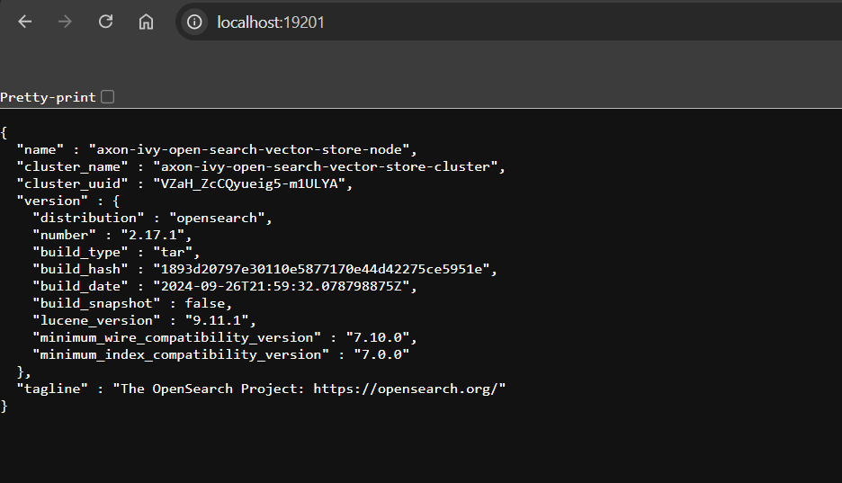
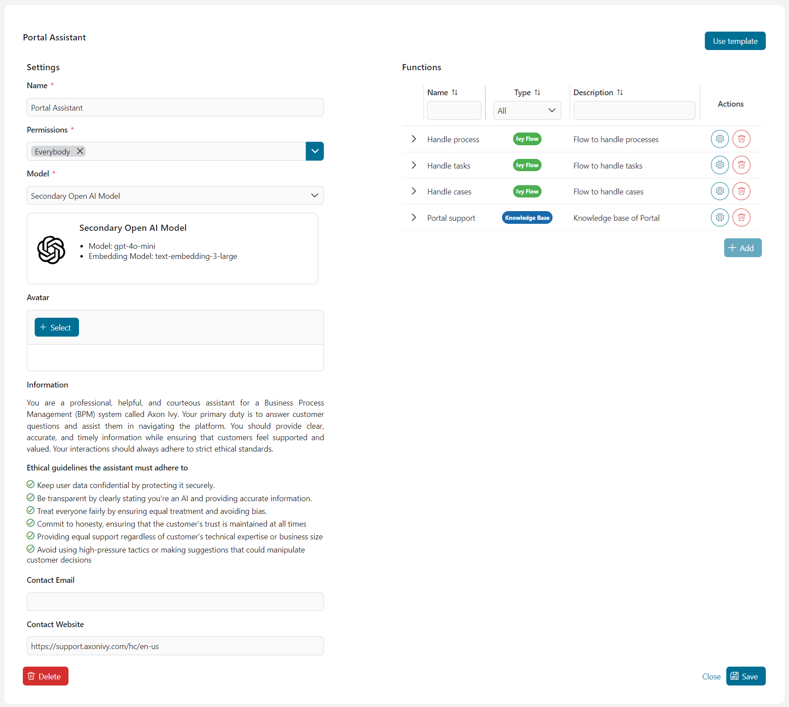
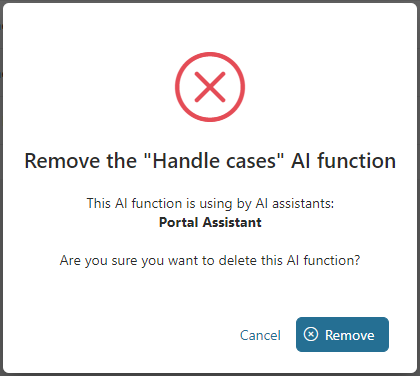

# ai-assistant

Der **KI-Assistent** ist ein leistungsstarkes Werkzeug, das entwickelt wurde, um Ihre tägliche Arbeit im Portal zu optimieren.

Als Ihr persönlicher Assistent bietet er nahtlose Unterstützung bei einer Vielzahl von Aufgaben, von der Navigation durch Dokumentationen über das Starten von Prozessen bis hin zur Verwaltung von Aufgaben und Fällen. Mit dem KI-Assistenten an Ihrer Seite können Sie effizienter und effektiver arbeiten und wertvolle Zeit für das widmen, was wirklich wichtig ist.

Treten Sie in einen interaktiveren und intuitiveren Workflow ein, indem Sie mit dem Assistenten über Ihre Prozesse sprechen, anstatt sie lediglich auszuführen. Diese dynamische Interaktion verbessert Ihr Erlebnis, sodass Sie Optionen erkunden und Einblicke gewinnen können, während Sie arbeiten. Mit mehrsprachigen Fähigkeiten kommuniziert der KI-Assistent mühelos in Englisch, Deutsch, Spanisch und mehr, sodass Sie Unterstützung in Ihrer bevorzugten Sprache erhalten.


Über die unmittelbare Unterstützung hinaus ermöglicht Ihnen der KI-Assistent, benutzerdefinierte Modelle und Assistenten zu erstellen und zu verwalten, die auf Ihre individuellen Bedürfnisse zugeschnitten sind. Mit der Verwaltungsübersicht ist es ein Kinderspiel, diese Modelle zu entwerfen, zu konfigurieren und zu organisieren. Sie können personalisierte Assistenten erstellen, spezifische Verhaltensweisen zuweisen oder vordefinierte Vorlagen verwenden, um deren Aktionen zu steuern. Dieses Maß an Anpassung stellt sicher, dass Ihr KI-Assistent perfekt auf Ihre Vorlieben und Arbeitsweise abgestimmt ist.


**Liste der Funktionen**

- Portal-Suppport: Der KI-Assistent kennt die Axon Ivy Dokumentation. Füge darüberhinaus eigene Dokumentations hinzu. 
- Aufgaben- und Prozessmanagement: Der KI-Assistent kann Aufgaben und Prozesse starten.
- Suche und Filter: Er kann Aufgaben und Fälle durchsuchen und filtern.
- Mehrsprachige Unterstützung: Unterstützung in mehreren Sprachen.
- Anpassbare Assistenten: Erstelle themenbasierte und personalisierte Assistenten.
- Modellbasierte KI: Assistenten werden anhand benutzerdefinierter Modelle erstellt und verwaltet.
- Eigene Ivy KI Flows: Erstellen eigene KI-Logiken die in der Axon Ivy Umgebung einen Mehrwert liefern. 

## Demo

### Demoprojekt

Im **ai-assistant-demo** Ivy-Projekt haben wir einen Demo-Assistenten entwickelt, der dir dabei hilft, das Konzept der KI-Assistenten besser zu verstehen. Er bietet dir wertvolle Unterstützung, damit du deine eigenen KI-Assistenten einfacher entwickeln und optimal konfigurieren kannst.

> [!IMPORTANT]
> Dieses Demoprojekt erstellt Ivy-Benutzer und -Rollen und überschreibt die primären Variablen des KI-Assistenten. Es wird **DRINGEND EMPFOHLEN**, das Projekt im Demomodus auf einer Ivy-Engine auszuführen, um deine eigenen Daten und Konfigurationen zu schützen und beizubehalten.
>
> Falls du diese Demo in einer Produktionsumgebung ausführen möchtest, stelle sicher, dass du alle mit dem KI-Assistenten verbundenen Ivy-Variablen sicherst. Erstelle dazu Sicherungskopien der folgenden Dateien auf deiner Engine:
>
> - `<engine folder>/configuration/applications/<application folder>/variables.AiAssistant.Assistants.json`
> - `<engine folder>/configuration/applications/<application folder>/variables.AiAssistant.AiFunctions.json`
>
> Nach Abschluss der Demo ersetze die modifizierten Variablendateien durch die zuvor erstellten Sicherungskopien.

#### Complex Demo

**Use Case**

Der Benutzer kann mit Hilfe des KI-Assistenten ein Softwareprojekt effizient planen und strukturieren. Der Assistent organisiert die Informationen in einem übersichtlichen Format und bietet folgende Unterstützung:

- Erstellung und Speicherung des Projekts in der Datenbank
- Hilfe bei der Suche und Auswahl geeigneter Teammitglieder für das Projekt
- Unterstützung bei der Vorbereitung des Kick-off-Meetings
- Erstellung und Zuweisung von Aufgaben, um Teammitglieder zum Meeting einzuladen

**Ausführung der Demo**

1. Führe den Prozess `startComplexDemo` aus, um Testdaten zu erstellen und den ursprünglichen KI-Assistenten durch den **Complex Demo Assistant** zu ersetzen

2. Öffne im **Portal** den Chat für den KI-Assistenten

3. Jetzt kannst du den Assistenten nutzen, um ein Softwareprojekt zu planen und zu erstellen, indem du die Projektdetails eingibst, wie die Anzahl der Teammitglieder oder die verwendeten Technologien.

**Beispiel**

`Das XYZ Solutions Web Development Project zielt darauf ab, eine erstklassige Webanwendung zu entwickeln, die die Benutzererfahrung verbessert und die Wachstumsziele des Unternehmens unterstützt. Hauptsächlich mit grundlegenden Webtechnologien wie HTML und CSS wird das Projekt eine sichere, skalierbare und effiziente Plattform liefern, die den Branchenstandards und bewährten Methoden entspricht. Dafür benötigen wir 3 Ingenieure, 1 Webdesigner und 2 Tester.`

#### Fehlerbehandlung der Demo

**Use Case**

Da keine Daten für Besprechungsräume vorhanden sind, zeigt der KI-Assistent jedes Mal einen Fehler an, wenn der Benutzer nach einem Besprechungsraum sucht. Dies ist ein einfaches Beispiel dafür, wie der KI-Assistent Fehler ordnungsgemäß handhaben kann.

**Wie man vorgeht**

1. Führe den Prozess `startErrorHandlingDemo` aus, um Testdaten zu erstellen und den ursprünglichen KI-Assistenten durch den **Error Handling Demo Assistant** zu ersetzen.

2. Öffne im **Portal** den Chat für den KI-Assistenten.

3. Nun kannst du die Demo starten, indem du mit dem **Error Handling Demo Assistant** Informationen zu einem Raum anforderst.

Beispiel:

`Ich möchte den Besprechungsraum C finden.`

## Einrichtung

### Einrichtung der ai-assistant-Anwendung

1. Deploye das **ai-assistant** Artefakt in derselben Anwendung indem sich auch das **Portal** befindet.

2. Starte die Engine und melden dich im Portal an.

3. Klicke in der Kopfzeile des Portals auf das **KI-Assistent** Symbol, um auf den Chat des **KI-Assistenten** zuzugreifen.

### Einrichtung des Vektorspeichers

#### Installiere OpenSearch

Der KI-Assistent verwendet OpenSearch 2.17.1 als Vektorspeicher, der alle Wissensdatenbanken speichert. Informationen zur Einrichtung findest du unter [OpenSearch 2.17.1](https://opensearch.org/versions/opensearch-2-17-1.html).

Nachdem du OpenSearch erfolgreich installiert hast, stelle bitte sicher:

- dass das Plugin `opensearch-knn` installiert ist,
- und dass deine OpenSearch-Instanz einen RESTful-Endpoint hat.

Für eine schnelle Einrichtung auf deinem Rechner folge einer dieser Anleitungen:

- [Schnelle Einrichtung von OpenSearch auf Windows](#schnelle-einrichtung-von-opensearch-auf-windows)
- [Schnelle Einrichtung von OpenSearch auf Linux und macOS](#schnelle-einrichtung-von-opensearch-auf-linux-und-macos)

Die einzige Voraussetzung ist, dass auf deinem System eine Docker-Distribution wie [DockerDesktop](https://www.docker.com/products/docker-desktop/) oder [RancherDesktop](https://rancherdesktop.io/) installiert ist.

##### Schnelle Einrichtung von OpenSearch auf Windows

Schnelle Einrichtung von OpenSearch auf Windows. In dieser Anleitung verwenden wir den Ordner `C:\axon-ivy-vector-store`, um alle Protokolle und Dateien der OpenSearch-Instanz zu speichern. Du kannst diesen Speicherort bei Bedarf anpassen.

**Schritt 1**

- Stelle sicher, dass auf dem System eine Docker-Distribution wie [DockerDesktop](https://www.docker.com/products/docker-desktop/) oder [RancherDesktop](https://rancherdesktop.io/) läuft.
- Kopiere das PowerShell-Skript [run-vector-store.ps1](./doc/files/run-vector-store.ps1) in den Ordner `C:\axon-ivy-vector-store`.

**Schritt 2**

Führe das PowerShell-Skript `run-vector-store.ps1` aus. Dieses Skript wird:

- einen Docker-Container für den Axon Ivy Vektorspeicher erstellen, benannt als `axon-ivy-open-search-vector-store`,
- die erforderlichen Konfigurationsdateien generieren:
    + `.env`: Enthält das Standardpasswort.
    + `docker-compose.yml`: Definiert die Docker-Einrichtung für `axon-ivy-open-search-vector-store`.
    + Ordner `opensearch-logs`: Speichert alle Protokolle des Vektorspeichers.
    + Ordner `opensearch-data`: Speichert alle Daten des Vektorspeichers.

    

- den Docker-Container `axon-ivy-open-search-vector-store` herunterladen und starten.

Der RESTful-Endpunkt des Containers wird unter `http://localhost:19300/` verfügbar sein.

> [!TIP]
> Wenn du auf ein Berechtigungsproblem stößt, während du das Skript `run-vector-store.ps1` ausführst, öffne Windows PowerShell als Administrator und führe den Befehl `Set-ExecutionPolicy Unrestricted` aus.
> Führe anschließend das Skript `run-vector-store.ps1` erneut aus.

**Schritt 3**

Warte ein paar Minuten, bis der Docker-Container gestartet ist. Du kannst überprüfen, ob der OpenSearch-Container bereit ist, indem du `http://localhost:19300/` in einem Webbrowser öffnest. Wenn die Seite OpenSearch-Ergebnisse anzeigt, ist dein Vektorspeicher einsatzbereit.



**Schritt 4**

Um den Docker-Container für den Axon Ivy Vektorspeicher zu konfigurieren, passe die Datei `docker-compose.yml` nach Bedarf an.

##### Schnelle Einrichtung von OpenSearch auf Linux und macOS

Der Einrichtungsprozess ist fast identisch mit dem auf Windows. Der einzige Unterschied besteht darin, dass du das Bash-Skript [run-vector-store.sh](./doc/files/run-vector-store.sh) anstelle des PowerShell-Skripts ausführst.

#### Konfiguration des AI-Assistant-Projekts

Standardmäßig verbindet sich der KI-Assistent mit dem RESTful-Endpunkt des Vektorspeichers unter `http://localhost:19300`. Falls du den Standardhost in der Datei `docker-compose.yml` geändert hast, musst du die Variable `AiAssistant.OpenSearchVectorStoreUrl` ebenfalls anpassen, um deinen neuen RESTful-Endpunkt widerzuspiegeln.

### Benutzerhandbuch des KI-Assistenten

#### KI-Management

Der Tab KI-Management dient als zentrale Anlaufstelle für die Konfiguration und Verwaltung aller Aspekte des KI-Assistenten.

Von hier aus kannst du:

- [KI-Assistenten verwalten](#ki-assistenten-verwalten): Überwache und modifiziere die KI-Assistenten, einschließlich der Anpassung ihrer Visualisierung, Persönlichkeit und ihres Verhaltens sowie der Verwaltung der Funktionen, die sie ausführen können.

- [KI-Modelle konfigurieren](#ki-modelle-konfigurieren): Ändere Einstellungen für deine KI-Modelle, wie z. B. den API-Key, der für die Verbindung zur Drittapplikation des KI-Modells erforderlich ist.

- [KI-Funktionen verwalten](#ki-funktionen-verwalten):Kontrolliere und organisiere die verschiedenen KI-Funktionen, definiere die Aktionen, die die KI ausführen kann, und lege fest, wie sie mit Benutzern interagiert, um präzise und effiziente Ergebnisse zu liefern.


##### KI-Assistenten verwalten

In diesem Abschnitt werden alle KI-Assistenten aufgelistet, auf die der eingeloggte Benutzer Zugriff hat, zusammen mit ihren Namen, Avataren und kurzen Beschreibungen.


Du kannst einen neuen KI-Assistenten erstellen, indem du auf die Schaltfläche **Neuen Assistenten hinzufügen** klickst, oder die Details eines vorhandenen KI-Assistenten ändern, indem du den entsprechenden Assistenten aus der Liste auswählst.

Sobald du einen KI-Assistenten ausgewählt hast, wird dessen Detailseite angezeigt.



Für den KI-Assistenten können folgende Werte und Einstellungen konfiguriert werden:

- `Name`: Name des KI-Assistenten
- `Berechtigungen`: Eine Liste von Ivy-Rollen, die den KI-Assistenten verwenden dürfen
- `Modell`: Das KI-Modell, das der Assistent verwendet, um seine Funktionen auszuführen (weitere Informationen findest du unter **KI-Modelle konfigurieren**)
- `Avatar`: Der Avatar des KI-Assistenten. Es werden nur die folgenden Bilddateitypen akzeptiert: *.png, *.jpg, *.jpeg. Standardmäßig wird das KI-Assistenten-Logo als Avatar verwendet.
- `Kontakt E-Mail`: Die Kontakt E-Mail, die der KI-Assistent bei Bedarf den Benutzern zur Verfügung stellen kann.
- `Kontakt Website`: Die Website, die der KI-Assistent bei Bedarf den Benutzern zur Verfügung stellen kann.

Um die Sicherheit des KI-Assistenten für die Benutzer und die Einhaltung ethischer Richtlinien zu gewährleisten, haben wir erweiterte Einstellungen eingeführt:

- `Informationen`: Definiert, wie der KI-Assistent sich bei der Beantwortung von Anfragen verhalten soll, einschließlich Persönlichkeit, Rolle und dem Geschäftsbereich, auf den er sich konzentrieren soll.
- `Ethische Richtlinien`: Ethische Prinzipien, denen der KI-Assistent strikt folgen muss.

Standardmäßig sind diese Einstellungen schreibgeschützt, um Fehler zu vermeiden, die zu falschen Antworten führen könnten. KI-Ingenieure können jedoch neue Vorlagen entwickeln, die Informationen und ethische Regeln für Assistenten bereitstellen. Um zu erfahren, wie das funktioniert, siehe hier: [Assistentenvorlagen](#assistentenvorlagen).

###### Vorlage verwenden

Du kannst schnell alle erforderlichen Einstellungen für einen KI-Assistenten mit einer Vorlage konfigurieren. Gehe wie folgt vor, um eine Vorlage anzuwenden:

1. Klicke im Detailbildschirm des KI-Assistenten oben rechts auf die Schaltfläche Vorlage verwenden.
2. Der Dialog Assistentenvorlagen wird angezeigt. Wähle eine Vorlage aus der Liste aus. 

    

3. Die Einstellungen der Vorlage werden auf den KI-Assistenten angewendet. Diese können anschließend nach Bedarf angepasst werden.

###### KI-Funktionen verwalten

Auf der rechten Seite befindet sich eine Tabelle, die die dem KI-Assistenten verfügbaren KI-Funktionen auflistet. Du kannst allgemeine Informationen zu jeder Funktion einsehen, wie Name, Typ, Beschreibung, Berechtigungen und Nutzung.


Du kannst verhindern, dass der KI-Assistent eine Funktion verwendet, indem du diese aus der Tabelle entfernst.

Wenn du auf die Schaltfläche **Hinzufügen** klickst, erscheint der Dialog **Funktion hinzufügen**. Um eine Funktion hinzuzufügen, klicke auf die Zeile der gewünschten Funktion und dann auf **Hinzufügen**, um die ausgewählten Funktionen hinzuzufügen.


Anschließend erscheinen die ausgewählten Funktionen in der **Funktionen** Tabelle.

###### Änderungen speichern

Um alle Änderungen, die du an den Details des KI-Assistenten vorgenommen hast, zu übernehmen, klicke bitte auf die Schaltfläche **Speichern** in der unteren rechten Ecke. Du wirst dann zum Bildschirm [KI-Management](#ki-management) weitergeleitet.

###### KI-Assistent löschen

Mit der Zeit kann ein KI-Assistent veraltet sein und du möchtest ihn möglicherweise löschen und einen neuen erstellen. Um dies zu tun, klicke auf die Schaltfläche **Löschen** unten links auf der Detailseite des KI-Assistenten.

Ein **Bestätigungsdialog** wird angezeigt, in dem du den KI-Assistenten vollständig löschen kannst. Klicke auf die Schaltfläche Entfernen, um den KI-Assistenten zu entfernen.


Bitte beachte, dass dabei alle Gespräche zwischen dem KI-Assistenten und dem Ivy-Benutzern gelöscht werden.

##### KI-Modelle konfigurieren

**KI-Modelle** ist eine Liste von Modelloptionen, die ein KI-Assistent verwenden kann, um seine Funktionen auszuführen.


Der KI-Assistent benötigt zwei KI-Modelle, um zu funktionieren: ein GPT-Modell und ein Text-Embedding-Modell. Daher bietet der KI-Assistent zwei maßgeschneiderte, getestete und einsatzbereite Optionen an:

- Primäres OpenAI-Modell:
    - GPT-Modell: [GPT-4o](https://platform.openai.com/docs/models/gpt-4o)
    - Text-Embedding-Modell: [text-embedding-3-large](https://platform.openai.com/docs/guides/embeddings)

- Sekundäres OpenAI-Modell:
    - GPT-Modell: [GPT-4o mini](https://platform.openai.com/docs/models/gpt-4o-mini)
    - Text-Embedding-Modell: [text-embedding-3-large](https://platform.openai.com/docs/guides/embeddings)

Wenn du auf ein Modell in der Liste der KI-Modelle klickst, wirst du zur Detailseite dieses Modells weitergeleitet. Dort findest du weitere Informationen zum Modell und kannst den API-Key für die OpenAI-Plattform ändern. Dein API-Key ist verschlüsselt und vollständig gesichert.

Darüber hinaus kannst du die Verbindung zur OpenAI-Plattform testen, indem du auf die Schaltfläche **Verbindung testen** klickst. Wenn ein Fehler auftritt, werden die Details des Fehlers angezeigt.


Sobald du auf die Schaltfläche **Speichern** klickst, werden alle Einstellungen, einschließlich des API-Keys, als Axon Ivy-Variablen gespeichert und du wirst zurück zum [KI-Management](#ki-management) weitergeleitet.

##### KI-Funktionen verwalten

Alle **KI-Funktionen**, auf die der eingeloggte Benutzer zugreifen kann, sind im Abschnitt **KI-Funktionen** aufgelistet, zusammen mit allgemeinen Informationen wie `Name`, `Typ`, `Berechtigungen zur Nutzung` der Funktion und `Beschreibung`. 

Es gibt einige Gründe, warum eine KI-Funktion nicht startbar ist:

- `Ivy Tool` Funktion: standardmäßig deaktiviert, da sie nur von Ivy Flow-Funktionen verwendet wird.
- `Ivy Flow` Funktion: deaktiviert, wenn das System feststellt, dass ein Fehler beim Ausführen des Flows auftreten könnte, z. B., wenn ein erforderlicher Ivy-Aufrufprozess nicht gefunden wurde.
- `Wissensbasis` Funktion: deaktiviert, wenn das System den entsprechenden Vektorspeicher nicht finden kann.


Du kannst auch alle nicht startbaren KI-Funktionen anzeigen, indem du die Option **Nicht startbare KI-Funktionen anzeigen** umschaltest.

###### KI-Funktion löschen

Du kannst die KI-Funktion vollständig aus dem KI-Assistenten löschen, indem du auf die Schaltfläche Löschen (mit dem Mülleimer-Symbol) in der letzten Spalte der entsprechenden Zeile dieser KI-Funktion klickst. Ein Bestätigungsdialog wird wie unten angezeigt:



Bitte lies die Bestätigung sorgfältig, bevor du die KI-Funktion löschst. Die KI-Funktion könnte von einigen KI-Assistenten verwendet werden und sobald du sie löschst, können die KI-Assistenten die Funktion nicht mehr ausführen oder es können Fehler auftreten.

#### Wissensdatenbanken erstellen

Der **KI-Assistent** ermöglicht es **Administratorbenutzern** (mit der Rolle `AXONIVY_PORTAL_ADMIN`), Wissensdatenbanken zu erstellen, die von der **KI-Funktion** des Typs **Wissensdatenbank** verwendet werden können.

Starte einfach den Prozess **Wissensdatenbank für KI-Assistenten erstellen** und folge den Anweisungen dort, um eine neue Wissensdatenbanken zu erstellen, die von Funktionen des Typs Wissensdatenbank genutzt werden können.


Derzeit kannst du Wissensdatenbanken für zwei Typen erstellen: `Portal-Unterstützung` und `Sonstiges`.

##### Wissensdatenbank: Portal-Unterstützung

Der KI-Assistent enthält ein integriertes Tool namens `Portal support`, das Fragen zum Axon Ivy Portal beantworten kann.

Um die Wissensdatenbank für diese Funktion zu erstellen, besuche bitte die [Portal-Downloadseite](https://market.axonivy.com/portal) auf dem Axon Ivy Market und lade das neueste Dokument herunter, wie im untenstehenden Bild gezeigt.


Anschließend lädst du die heruntergeladene Datei wie in  [Wissensdatenbanken erstellen](#wissensdatenbanken-erstellen) oben beschrieben hoch.

Nach dem Hochladen der ZIP-Datei warte bitte einige Minuten, bis sich das Upload-Fenster schließt. Dies kann etwas dauern, da der KI-Assistent Zeit benötigt, um die Aufgabe zu erledigen.

##### Wissensdatenbank: Sonstiges

Bevor du andere Wissensdatenbanken hochlädst, beachte bitte:
  
1. Der Name der hochgeladenen Datei wird zur ID eines Indexes im Vektorspeicher. Daher gilt:

    - Der Name muss strikt dem Dash-Case-Format folgen, sonst treten Fehler auf, wenn der KI-Assistent die Wissensdatenbank erstellt.

    - Der Name muss einzigartig sein, sonst überschreibst du eine bestehende Wissensdatenbank!

2. Alle Dateien, die du in die ZIP-Datei einfügst, müssen Textdateien (Typ `.txt`) sein. Der KI-Assistent wird andere Dateitypen beim Einlesen des Inhalts zur Erstellung der Wissensdatenbank überspringen.

3. Die von Axon Ivy erstellten Vektorspeicher haben das Präfix `axon-ivy-vector-store`, gefolgt vom Namen der hochgeladenen Datei. Wenn du beispielsweise eine Datei mit dem Namen `customer-support.zip` hochlädst, lautet die resultierende Vektorspeicher-ID `axon-ivy-vector-store-customer-support`

Nach dem Hochladen der ZIP-Datei warte bitte einige Minuten, bis sich das Upload-Fenster schließt. Dies kann etwas dauern, da der KI-Assistent Zeit benötigt, um die Aufgabe zu erledigen.

### Entwicklerhandbuch

#### Assistentenvorlagen

Der KI-Assistent bieten Entwicklern die Möglichkeit, Vorlagen für KI-Assistenten vorab zu definieren. Um diese Vorlagen zu aktualisieren, musst du die JSON-Datei für die Ivy-Variable `variable.AiAssistant.AssistantTemplates.json` im Engine-Ordner unter `<engine folder>/configuration/applications/<application folder>` ändern.

Hier ist ein Beispiel für eine KI-Assistenten Vorlage:

```json
[
  {
    "id" : "hr-assistant-template",
    "version":"12.0.0",
    "name" : "HR Assistant",
    "info" : "You're an AI HR Assistant responsible for managing various HR-related tasks within a company. Your primary duties include answering employee questions, guiding them through internal processes, and handling requests related to personal information updates. You should provide clear, accurate, and concise information while following company policies maintaining confidentiality, and adhering to ethical standards.",
    "ethicalRules" : [
      "Adhere to all legal and regulatory requirements related to HR practices, including data protection and labor laws",
      "Prioritize employee well-being, ensuring that their needs are addressed with care and empathy",
      "Avoiding any form of discrimination or bias"
    ],
    "contactWebsite": "https://support.axonivy.com/hc/en-us",
    "contactEmail": "testing@localhost.com",
    "tools" : [
      "handle-tasks-flow",
      "handle-process-flow",
      "handle-cases-flow",
      "portal-support"
    ] , 
    "description": "HR Assistant manages your HR tasks with clarity, accuracy, and confidentiality, adhering to company policies and ethical standards."
  }
]
```

Attribute einer KI-Assistenten Vorlage:

- `id`: die eindeutige ID der Vorlage
- `version`: die Versionsnummer der Vorlage. Sie muss mit der Version des KI-Assistenten übereinstimmen
- `name`: der Name des Assistenten. Wenn diese Vorlage ausgewählt wird, wird dieser Wert als Standardname für den Assistenten festgelegt
- `info`: definiert, wie der KI-Assistent sich bei der Beantwortung von Benutzern verhalten soll, einschließlich Persönlichkeit, Rolle und dem Geschäftsbereich, auf den er sich konzentrieren soll
- `ethicalRules`: ethische Prinzipien, denen der KI-Assistent strikt folgen muss
- `contactEmail`: die Kontakt-E-Mail, die der KI-Assistent bei Bedarf den Benutzern zur Verfügung stellen kann
- `contactWebsite`: die Website, die der KI-Assistent bei Bedarf den Benutzern zur Verfügung stellen kann
- `tools`: IDs der KI-Funktionen, auf die der Assistent mit dieser Vorlage zugreifen kann
- `description`: eine kurze Beschreibung der Vorlage. Dieses Attribut beeinflusst nicht das Verhalten des Assistenten

Standardmäßig bietet der **KI-Assistent** vier Vorlagen an:

- **Portal-Assistent**: Eine Vorlage für den Axon Ivy Portal-Assistenten, mit Funktionen zur Interaktion mit dem Axon Ivy-System, wie das Finden von Aufgaben, Fällen und Prozessen sowie dem Zugriff auf eine Wissensdatenbank zum Axon Ivy-Portal.

- **HR-Assistent**: Eine Vorlage für KI-Assistenten im Bereich Human Resources. Diese Vorlage enthält keine Tools, bietet jedoch klare Informationen und eine starke ethische Regelung, die speziell auf HR zugeschnitten ist.

- **Sales-Assistent**: Eine Vorlage für KI-Assistenten, die Vertriebsteams unterstützen soll. Wie der HR-Assistent enthält auch diese Vorlage keine Tools, bietet jedoch klare Informationen und eine starke ethische Regelung und einen optimierten Kundenfokus.

- **ICT-Assistent**: Eine Vorlage für KI-Assistenten, die zur Fehlerbehebung von IT-Problemen im Backoffice eingesetzt werden kann. Diese Vorlage enthält ebenfalls keine Tools.

#### AI Flow

##### Intelligente Aufgabenautomatisierung fördern

Um die KI-Assistenten in die Lage zu versetzen, komplexe Aufgaben mit ausgeklügelter Logik zu bewältigen, hat Axon Ivy die **AI Flows** eingeführt – ein fortschrittliches KI-Workflow-Framework, das darauf ausgelegt ist, die Abläufe von KI-Prozessen zu optimieren.

**AI Flow** ermöglicht es den Benutzern:

- Nahtlos mit dem Ivy-System zu interagieren und eine effiziente Integration sicherzustellen.
- Benutzeranfragen präzise zu erkennen, zu interpretieren und zu bearbeiten.
- Einfachheit beizubehalten und gleichzeitig flexible Kontrolle und einfache Erweiterbarkeit für sich ändernde Anforderungen zu bieten.
- Den Zugriff auf KI-Funktionen zu verwalten.
- Dieses Framework wurde entwickelt, um Benutzer dabei zu unterstützen, KI-Workflows effektiv zu entwerfen und zu verwalten und ein intelligenteres, anpassungsfähigeres KI-Erlebnis zu ermöglichen.

##### Reales Anwendungsbeispiel

Stell dir vor, du möchtest eine Funktion entwickeln, die es HR-Mitarbeitern ermöglicht, Informationen über Mitarbeiter anhand von Kriterien wie Name, Geburtsdatum, Niederlassung oder Position leicht zu finden.

Früher hätte dies den Aufbau einer Suchseite mit mehreren Filtern (z. B. Name, Geburtsdatum) erfordert, auf der HR-Mitarbeiter die gewünschten Informationen manuell aus einer Datentabelle herausfiltern mussten.

Im Zeitalter der KI möchtest du jedoch eine intelligentere Lösung. Eine KI-gestützte Funktion kann HR-Mitarbeitern dabei helfen, diese Aufgaben effizienter mit natürlichen Sprachabfragen wie „Liste alle Webentwickler in Boston auf“ oder „Finde die Informationen zu Sandy, die diesen Donnerstag Geburtstag hat“ zu erledigen.

Hier kommt AI Flow ins Spiel. Es beschleunigt nicht nur den Suchprozess, sondern hilft auch bei Aufgaben wie der Korrektur von Tippfehlern und der Validierung unlogischer Daten, indem es beispielsweise verhindert, dass nach Mitarbeitern mit zukünftigen Geburtstagen gesucht wird!

##### So funktioniert es

AI Flow funktioniert als Workflow-Framework in Form von JSON. Es besteht aus mehreren AI-Schritten, die jeweils auf benutzerdefinierten Konfigurationen basierend miteinander verknüpft sind.

Grundlegende Attribute eines AI Flow:

``` json
{
    "version": "12.0.0",
    "id": "find-employees-flow",
    "name": "Find employees information",
    "type": "FLOW",
    "permissions": ["HR_Employee"],
    "description": "Find employees information",
    "usage": "Use this flow if a user want to find information of specific employees",
    "steps": []
}
```

- **version**: Gibt die Version des AI Flows an, die mit der Ivy-Version übereinstimmen muss.

- **id**: Der eindeutige Bezeichner für den AI Flow.

- **name**: Der Name des AI Flows.

- **type**: Muss immer auf "FLOW" gesetzt sein. Der KI-Assistent kann auf verschiedene Tools wie `Ivy-Tools`, `Wissensdatenbank-Tools` und `AI Flows` zugreifen. Durch die Festlegung des Typs als `FLOW` wird angegeben, dass dieses Tool ein **AI Flow** ist, sodass der KI-Assistent es korrekt verwenden kann.

- **permissions**: Definiert die Rollen oder Benutzernamen der Nutzer, die berechtigt sind, diesen AI Flow zu verwenden.

- **description**: Eine ausführliche Erklärung des AI Flows. Je detaillierter die Beschreibung ist, desto besser kann die KI verstehen, wie der AI Flow verwendet werden soll.

- **usage**: Gibt an, wann der AI Flow verwendet werden soll. Eine klarere Erklärung stellt sicher, dass die KI den entsprechenden Flow genau auswählen kann, um Benutzeranfragen zu erfüllen.

- **steps**: Listet die KI-Schritte auf, die der **AI Flow** ausführen soll, um die Anfrage des Benutzers zu bearbeiten. Verfügbare Schrittarten:

    - **Switch**: Entscheidungselement, dass der KI hilft, die geeignete nächste Aktion basierend auf bestimmten Bedingungen auszuwählen.

    - **Ivy** Tool: Weist die KI an, bestimmte Ivy-Tools (Ivy callable) im Entscheidungsprozess zu verwenden.

    - **Text**: Zeigt textbasierte Inhalte an oder generiert diese für die Benutzerinteraktion.

    - **Re-phrase**: Hilft der KI, die Benutzereingaben zu verfeinern, bevor spezifische Aktionen ausgeführt oder Tools verwendet werden.

    - **Trigger Flow**: Startet einen neuen Flow innerhalb des KI-Prozesses, entweder durch Übermittlung einer spezifischen Auslöse-Nachricht oder durch Nutzung des Ergebnisses eines vorherigen Schritts. Dies ermöglicht nahtlose Übergänge zwischen verschiedenen Workflows und die Weitergabe relevanter Daten zwischen ihnen.

> [!TIP]
> Um mehr über die AI-Schritte zu erfahren, siehe [AI-Schritt](#ai-schritt).

> [!TIP]
> Um zu erfahren, wie Sie Ihren eigenen AI Flow erstellen können, siehe [AI Flow-Demo](#erstellen-sie-ihren-eigenen-ai-flow).

##### AI-Schritt

###### Attribute

- **stepType**: Art des Schritts. Gültige Werte:
    - IVY_TOOL: [Ivy-Tool-Schritt](#ivy-tool-schritt).
    - SWITCH: [Switch-Schritt](#switch-schritt).
    - TEXT: [Text-Schritt](#text-schritt).
    - RE_PHRASE: [Rephrase-Schritt](#rephrase-schritt).
    - TRIGGER_FLOW: [Trigger-Flow-Schritt](#trigger-flow-schritt).
    - KNOWLEDGE_BASE: [Knowledge-Base-Schritt](#trigger-flow-schritt).

- **stepNo**: Nummer des Schritts im Flow.

- **result**: Ergebnis eines Schritts (siehe AI Result DTO).

- **onSuccess**: Der Schritt, der ausgeführt wird, wenn dieser Schritt erfolgreich ausgeführt wird.

- **onError**: Der Schritt, der ausgeführt wird, wenn bei der Ausführung dieses Schritts ein Problem auftritt.

- **useConversationMemory**: Auf „true“ setzen, um alle Chat-Nachrichten des Gesprächs beim Ausführen des Schritts einzubeziehen. Andernfalls werden nur die Chat-Nachrichten des laufenden AI Flows einbezogen.

- **saveToHistory**: Auf „false“ setzen, um die Nachricht von der Gesprächshistorie auszuschließen, sie wird nur im Speicher gespeichert.

- **customInstruction**: Anweisung für eine spezifische Anforderung an die KI.

##### Switch-Schritt

Der **Switch-Schritt** ist ein Entscheidungselement, das darauf ausgelegt ist, der KI zu helfen, die geeignete nächste Aktion basierend auf spezifischen Bedingungen auszuwählen. Er funktioniert, indem er eine Liste vordefinierter Fälle auswertet, von denen jeder ein potenzielles Szenario darstellt, dem die KI begegnen könnte. Basierend auf dem Fall, der mit der aktuellen Situation übereinstimmt, wählt die KI die entsprechende Aktion aus.

In der bereitgestellten Struktur prüft die KI die Fallbeschreibungen innerhalb der Liste und weist die richtige Aktionsnummer zu, um fortzufahren. Dadurch kann die KI ihr Verhalten dynamisch an verschiedene Ergebnisse oder Zustände anpassen und stellt sicher, dass eine maßgeschneiderte Reaktion für verschiedene Umstände erfolgt.

- **cases**: Eine Liste möglicher Szenarien mit entsprechenden Aktionen.

```json
{
    "stepNo": 3,
    "type": "SWITCH",
    "cases": [
        { "action": 5, "case": "cannot find any tasks" },
        { "action": 4, "case": "found multiple tasks" },
        { "action": 1, "case": "found only one tasks" }
    ]
}
```

##### Ivy-Tool-Schritt

Der **Ivy-Tool-Schritt** ist ein spezialisierter Anweisungsmechanismus, der die KI anweist, bestimmte Tools oder Funktionen in ihrem Entscheidungsprozess zu verwenden. Dieser Schritt stellt sicher, dass die KI mit vordefinierten Tools (bezeichnet durch ihre toolId) interagiert und Aufgaben gemäß den festgelegten Bedingungen und benutzerdefinierten Anweisungen ausführt. Er ermöglicht der KI, spezialisierte Aktionen auszuführen und bietet Flexibilität durch optionale Parameter wie Erfolg, Fehlerbehandlung und benutzerdefinierte Anweisungen.

- **toolId**: Bezieht sich auf die ID eines Tools aus der Liste der verfügbaren KI-Funktionen (wie in der Variablen AiFunctions beschrieben), zum Beispiel "find-tasks" oder "find-web-developer".

```json
{
    "stepNo": 1,
    "type": "IVY_TOOL",
    "toolId": "find-tasks",
    "onSuccess": -1
}
```

- **customInstruction**: Bietet spezifische Anweisungen, die die KI bei der Ausführung desTools befolgen soll. Zum Beispiel könnte die KI angewiesen werden, "Find employees has role 'WEB_DEVELOPER'.' zu finden".

```json
{
    "stepNo": 1,
    "type": "IVY_TOOL",
    "toolId": "find-web-developer",
    "onSuccess": 3,
    "onError": 2,
    "customInstruction": "Find employees has role 'WEB_DEVELOPER'.",
    "saveToHistory": false
}
```

##### Text-Schritt

Der **Text-Schritt** ist eine zentrale Komponente in KI-Workflows, die darauf ausgelegt ist, textbasierte Inhalte für die Benutzerinteraktion anzuzeigen oder zu generieren. Abhängig von seiner Konfiguration kann der Text-Schritt feste Nachrichten, KI-generierte Inhalte, Ergebnisse vorheriger Schritte oder sogar versteckte Nachrichten für die interne KI-Verarbeitung anzeigen. Diese Flexibilität ermöglicht es der KI, effektiv mit den Benutzern zu kommunizieren und gleichzeitig Entscheidungsprozesse zu steuern.

**Fester Text**

- **text**: Der feste Text, der in der Benutzeroberfläche angezeigt werden soll.

- **showResultOfStep**: Option, das Ergebnis eines vorherigen Schritts anzuzeigen, indem auf dessen Nummer verwiesen wird.

- **onSuccess**: Definiert den nächsten Schritt, wenn der Benutzer nach dem Lesen des Textes eine Eingabe macht.

```json
{
    "stepNo": 2,
    "type": "TEXT",
    "text": "I have rephrased your request as follows. Could you please confirm if it is correct?",
    "showResultOfStep": 0,
    "onSuccess": 3
}
```

**KI-generiert**

- **useAI**: Auf „true“ setzen, um der KI zu erlauben, Inhalte dynamisch zu generieren, wie beispielsweise Zusammenfassungen oder Berichte.

- **customInstruction**: Eine Leit-Anweisung, um der KI zu helfen, passenden Text basierend auf dem Kontext oder den Benutzereingaben zu erstellen.

- **onSuccess**: Der nächste Schritt, der nach der Benutzerinteraktion ausgeführt werden soll.

```json
{
    "stepNo": 1,
    "type": "TEXT",
    "useAI": true,
    "customInstruction": "Use the conversation above to summarize information of the planned project in a structured format. If user didn't provide a name for the project generete the project name based on description of the project. Example: '**Project name:** ProjectA\n**Project description:** description of projectA\n**Technologies:** tech stack\n**Members:** show member information'. Then add a line to ask if need some update",
    "onSuccess": 2
},
```

**Ergebnis eines anderen Schritts anzeigen**

- **showResultOfStep**: Zeigt das Ergebnis eines zuvor ausgeführten Schritts an.

```json
{
    "stepNo": 1,
    "type": "IVY_TOOL",
    "toolId": "find-employees",
    "onSuccess": 3,
    "onError": 2,
    "customInstruction" : "Find employees has the tech stack are the technologies above.",
    "useConversationMemory": true,
    "saveToHistory": false
},
{
    "stepNo": 3,
    "type": "TEXT",
    "text": "I found these suitable employees matched the requirement. Do you want to choose some of them for the project?",
    "showResultOfStep" : 1,
    "useConversationMemory": false,
    "onSuccess": 4
}
```

**versteckter Text Schritt**

- **isHidden**: Auf „true“ setzen, um den Text vor dem Benutzer zu verbergen, aber der KI zu erlauben, ihn zu lesen und zu verarbeiten. Dies ist nützlich, wenn Inhalte generiert werden, die die KI für die weitere Verarbeitung benötigt, ohne sie in der Benutzeroberfläche anzuzeigen.

```json
{
    "stepNo": 13,
    "type": "TEXT",
    "useAI": true,
    "customInstruction": "Summarize the project plan above.",
    "useConversationMemory": true,
    "onSuccess": 14,
    "isHidden": true
},
{
    "stepNo": 14,
    "type": "TRIGGER_FLOW",
    "flowId": "create-project-flow",
    "showResultOfStep": 13,
    "useConversationMemory": false
}
```

##### Rephrase-Schritt

Der **Rephrase-Schritt** ist dazu gedacht, der KI zu helfen, Benutzereingaben zu verfeinern, bevor spezifische Aktionen ausgeführt oder Tools verwendet werden. Dies ist besonders nützlich, wenn die Nachricht des Benutzers unklar, unvollständig oder nicht in einer Weise strukturiert ist, die die KI sofort verarbeiten kann. Durch die Umformulierung der Eingabe stellt die KI sicher, dass die Informationen präziser sind und sich besser für die Verwendung mit Zielwerkzeugen oder -funktionen eignen.

- **toolId**: Bezieht sich auf das Tool, das die KI als Ziel verwenden wird. Die KI sollte das JSON-Schema des entsprechenden Tools verwenden, um die Nachricht umzuformulieren. Durch die Definition dieses Attributs stellst du sicher, dass die umformulierte Eingabe mit den Anforderungen des Tools kompatibel ist.
    - Beispiel:
        - Benutzereingabe: „find my sick leave task“
        - Sie haben ein Tool, um Aufgaben nach Name, Beschreibung, Priorität usw. zu finden, aber der Benutzer hat nicht angegeben, welches Feld er verwenden möchte. Daher solltest du die Nachricht umformulieren, bevor Sie sie mit dem Ivy-Tool verwenden.
        - → „find the task with the name ‘sick leave’“
- **customInstruction**: Bietet spezifische Richtlinien dafür, wie die KI die Nachricht umformulieren soll. Dies hilft der KI, besondere Fälle wie abstrakte Begriffe oder Datumsangaben zu behandeln und sie in nützlichere Datenformate zu bringen.

- **onRephrase**: Definiert den nächsten Schritt, der ausgeführt wird, wenn die KI feststellt, dass die Nachricht umformuliert werden muss.

- **onSuccess**: Gibt den Schritt an, der ausgeführt werden soll, wenn die KI die Nachricht nicht umformulieren muss.

- **examples**: Eine Liste vordefinierter Beispiele, die der KI helfen, zu verstehen, wie Benutzernachrichten umformuliert werden sollen. Jedes Beispiel besteht aus:
    - **before**: Die ursprüngliche, unstrukturierte Nachricht des Benutzers.
    - **after**: Die umformulierte Nachricht, die die KI erzeugen würde, um mehr Klarheit und Handlungsfähigkeit zu gewährleisten.

```json
{
    "stepNo": 0,
    "type": "RE_PHRASE",
    "useConversationMemory": true,
    "toolId": "find-processes",
    "onRephrase": 3,
    "onSuccess": 1,
    "customInstruction": "If in the message has an abstract date such as today, tomorrow,..., please format it. Example: today = 31, July 2024",
    "examples": [
        {
            "before": "find leve request process",
            "after": "find process that help creating leave request"
        },
        {
            "before": "find process leave request",
            "after": "find processes that have name 'leave request'"
        },
        {
            "before": "find process 123",
            "after": "find processes that the id is '123' or the name is '123'"
        }
    ]
}
```

##### Trigger-Flow-Schritt

Der **Trigger-Flow-Schritt** startet einen neuen Flow innerhalb des KI-Prozesses, entweder durch Übermittlung einer spezifischen Auslöse-Nachricht oder durch Nutzung des Ergebnisses eines vorherigen Schritts. Dies ermöglicht nahtlose Übergänge zwischen verschiedenen Workflows und die Weitergabe relevanter Daten zwischen ihnen.

- **flowId**: ID des Flows, den du auslösen möchtest.

**Auslösen mit Auslöse-Nachricht**

- **triggerMessage**: Die benutzerdefinierte Nachricht, die als Eingabe für den neuen Flow dient und die KI anleitet, was als Nächstes zu tun ist.

```json
{
    "stepNo": 15,
    "type": "TRIGGER_FLOW",
    "flowId": "choose-member-flow",
    "triggerMessage": "I want to choose members for my project described above"
}
```

**Auslösen mit dem Ergebnis eines anderen Schritts**

- **showResultOfStep**: Übermittelt das Ergebnis eines bestimmten vorhergehenden Schritts als Auslöse-Nachricht für den neuen Flow. Diese Option ist nützlich, wenn du das Ergebnis eines Flows an einen anderen weitergeben oder die Nachricht, die du an den neuen Schritt übergeben möchtest, vom System abrufen möchtest.
```json
{
    "stepNo": 14,
    "type": "TRIGGER_FLOW",
    "flowId": "create-project-flow",
    "showResultOfStep": 13,
    "useConversationMemory": false
}
```

##### Knowledge-Base-Schritt

Beim Arbeiten an einem Schritt können Benutzer Fragen haben, die nicht direkt mit dem Arbeitsablauf zusammenhängen. Wenn ein Benutzer beispielsweise eine Aufgabe nicht delegieren kann, möchte er möglicherweise wissen, warum die Delegation nicht möglich ist. Der **Knowledge-Base-Schritt** wurde entwickelt, um Benutzern zu helfen, schnell Antworten auf solche Fragen zu finden.

- **toolId**: Bezieht sich auf das Tool vom Typ `RETRIEVAL_QA`, das die KI als Knowledge Base zur Beantwortung der Fragen verwendet.

```json
{
    "stepNo": 3,
    "type": "KNOWLEDGE_BASE",
    "toolId": "portal-support",
    "onSuccess": -1,
    "onError": -1
}
```

##### KI-Ergebnis-DTO

###### Einführung

Das Ergebnis-DTO stellt sicher, dass der KI-Assistent zuverlässige und konsistente Ergebnisse liefert, indem es eine standardisierte Struktur für alle Ausgaben einhält, was Effizienz und Klarheit bei allen KI-Interaktionen fördert.

- Projekt: portal-component

- Klasse: com.axonivy.portal.components.dto.AiResultDTO

**Attribute**

| Name | Typ | Beschreibung |
| --- | --- | --- |
| result | String | Ergebnis, das dem Benutzer angezeigt wird |
| resultForAI | String | Ergebnis für das KI-Modell |
| state | com.axonivy.portal.components.enums.AIState | Status des Ergebnisses (DONE, ERROR) |

#### Erstelle deinen eigenen AI Flow

In diesem Abschnitt erklären wir, wie du deinen eigenen AI Flow entwickeln kannst, wobei das [Reales Anwendungsbeispiel](#reales-anwendungsbeispiel) als Use Case dient.

> [!NOTE]
> In der [Komplexen Demo](#komplexe-demo) haben wir eine Funktion implementiert, um Mitarbeiterinformationen zu finden. Daher wird dringend empfohlen, diese Demo nicht in Verbindung mit dieser Anleitung zu verwenden.

1. Erstelle ein Ivy-Projekt, das vom Projekt `portal-components` abhängt.

2. Erstelle einen Ivy-Callable-Prozess mit Eingabeparametern, die die Kriterien zur Suche nach Mitarbeitern darstellen, mit der Signatur `findEmployeesInfo(String,String,String,String)`.

| Name | Typ | Beschreibung |
| --- | --- | --- |
| `name` | String | Name des Mitarbeiters |
| `birthday` | String | Geburtsdatum des Mitarbeiters |
| `branch` | String | Unternehmensniederlassung, in der der Mitarbeiter arbeitet |
| `position` | String | Position des Mitarbeiters im Unternehmen |

Das Ausgaberesultat des Ivy-Callable-Prozesses muss ein Objekt mit dem Namen result und dem Typ [KI-Ergebnis-DTO](#ki-ergebnis-dto) sein.

| Name | Typ | Beschreibung |
| --- | --- | --- |
| result | com.axonivy.portal.components.dto.AiResultDTO | Ergebnis für den KI-Assistenten |

> [!TIP]
> Du musst die Logik zur Mitarbeitersuche selbst implementieren. Zur Orientierung kannst du den Code in der [Complex Demo](#complex-demo) im **ai-assistant-demo** Ivy-Projekt anschauen.

3. Füge in der Variablendatei **AiFunctions.json** ein Ivy-Tool hinzu, das mit dem oben genannten Callable-Prozess interagiert, um eine Liste von Mitarbeitern abzufragen.

```json
{
    "version": "12.0.0",
    "id": "find-employees-info",
    "name": "Find information of employees",
    "type": "IVY",
    "signature": "findEmployeesInfo(String,String,String,String)",
    "permissions": [ "Everybody" ],
    "description": "Find employees by name, date of birth, branch, position.",
    "usage": "This tool is helpful when user want to find employees by name, date of birth, branch, position.",
    "attributes": [
        {
            "name": "name",
            "description": "Name of the employee"
        },
        {
            "name": "birthday",
            "description": "Employee's date of birth"
        },
        {
            "name": "branch",
            "description": "Company branch which the employee working at."
        },
        {
            "name": "position",
            "description": "position of the employee in the company."
        }
    ]
}
```

[!IMPORTANT]
> Bitte beachte:
> - Die Namen der Attribute müssen mit den Namen der Parameter des oben genannten Callable-Prozesses übereinstimmen.
> - Das Attribut `signature` im JSON-Objekt ist die Signatur des Callable-Prozesses.

4. Füge in der Variablendatei **AiFunctions.json** einen AI Flow hinzu, um die Anfrage des Benutzers zur Suche nach Mitarbeitern zu bearbeiten.

Dies ist ein Beispiel für einen einfachen **AI Flow** mit 4 Schritten:

- Schritt 0: Formuliere die Anfrage des Benutzers um, damit sie mit dem Ivy-Tool `find-employees-info` übereinstimmt.
- Schritt 1: Rufe das Ivy-Tool auf und verwende die umformulierte Anfrage aus **Schritt 0** als Eingabe.
    - Wenn ein Fehler auftritt oder keine Mitarbeiter gefunden werden, die der Anfrage entsprechen, zeige eine Fehlermeldung an (**Schritt 2**).
    - Bei Erfolg: Zeige das Ergebnis an (**Schritt 3**).
Schritt 2: Zeige dem Benutzer eine Nachricht an und beende dann den Flow.
Schritt 3: Zeige die Informationen der gefundenen Mitarbeiter in einem gut strukturierten Format an und beende dann den Flow.

So kann der entsprechende AI-Flow aussehen:

```json
{
    "version": "12.0.0",
    "id": "find-employees-flow",
    "name": "Find employees information",
    "type": "FLOW",
    "permissions": [ "Everybody" ],
    "description": "Find employees information",
    "usage": "Use this flow when user want to find information of employees",
    "steps": [
        {
            "stepNo": 0,
            "type": "RE_PHRASE",
            "toolId": "find-employees-info",
            "onRephrase": 1,
            "onSuccess": 1,
            "examples": [
            {
                "before": "list all web developers in Boston",
                "after": "find employees in branch 'Boston'"
            },
            {
                "before": "find the info of Sandy, who has a birthday this Thursday",
                "after": "find employees has firstName = 'Sandy' and dateOfBirth = '12/09/2024'"
            }
            ]
        },
        {
            "stepNo": 1,
            "type": "IVY_TOOL",
            "toolId": "find-employees-info",
            "onSuccess": 3,
            "onError": 2
        },
    {
        "stepNo": 2,
        "type": "TEXT",
        "text": "Sorry, I cannot find any employee matched your request.",
        "useConversationMemory": false,
        "onSuccess": -1
    },
    {
        "stepNo": 3,
        "type": "TEXT",
        "useAI": true,
        "customInstruction": "AI found employees, please read and show them to user with a well-structured format.",
        "onSuccess": -1
    }
    ]
}
```

5. Öffne die Variablendatei **Assistants.json** und füge die ID des AI Flows `Find employees information` dem Attribut `tools` deines KI-Assistenten hinzu, wie im Beispiel mit dem KI-Assistenten `Alex` unten gezeigt.

```json
[
    {
        "id": "537bc9e684d8481d87e7f50240aaa45e",
        "version": "12.0.0",
        "templateId": "portal-assistant-template",
        "aiModelName": "AiAssistant.AiModels.OpenAI.SecondaryModel",
        "avatarLocation": "/Logo/DefaultLogo",
        "name": "Alex",
        "contactWebsite": "https://support.axonivy.com/hc/en-us",
        "tools": [
            "find-employees-flow"
        ],
        "permissions": [
            "Everybody"
        ],
        "info": "You are a professional, helpful assistant. Your primary duty is to answer customer questions. You should provide clear, accurate, and timely information while ensuring that customers feel supported and valued. Your interactions should always adhere to strict ethical standards.",
        "ethicalRules": [
            "Keep user data confidential by protecting it securely.",
            "Be transparent by clearly stating you're an AI and providing accurate information.",
            "Treat everyone fairly by ensuring equal treatment and avoiding bias.",
            "Commit to honesty, ensuring that the customer’s trust is maintained at all times",
            "Providing equal support regardless of customer's technical expertise or business size",
            "Avoid using high-pressure tactics or making suggestions that could manipulate customer decisions"
        ]
    }
]
```

6. Der KI-Assistent `Alex` hat nun die Funktion, nach Mitarbeiterinformationen zu suchen. Nun kannst du das Chat-Dashboard öffnen und diese neue KI-Funktion ausprobieren.

So könnte ein Beispielgespräch aussehen, wenn der Benutzer den `find-employees-flow` mit dem Assistenten `Alex` verwendet:

**Legenden:**

😄: Nachricht des Benutzers

🐼: Die Nachricht, die die KI auf dem Bildschirm anzeigt

✨: Die Nachricht, die die KI zu sich selbst spricht und dem Benutzer nicht angezeigt wird.

**Unterhaltung:**

😄: Hello Alex

🐼: Hi User

😄: I want to find Sandy, she is a web developer working for our office in munich

✨ `find employee has name ‘Sandy’, position ‘web developer’, and work at branch ‘Munich’`

✨: `<use Ivy Tool find-employees to find employees>`

✨: `[ {“name”: “Sandy Williams“, “branch”: “munich”,”position”: “Web Developer”, “rank”:“Senior”, “email”: “sandyw@localhost.com”}]`

✨: `[ {“name”: “Sandy Brown“, “branch”: “munich”,”position”: “Web Developer”, “rank”:“Junior”, “email”: “sandyb@localhost.com”}]`

🐼: I found 2 employees matched your request:

🐼: Sandy Williams: Senior Web developer, email: sandyw@localhost.com,  branch: Munich

🐼: Sandy Brown: Junior Web developer, email: sandyb@localhost.com,  branch: Munich.

✨: `<end the flow>`
